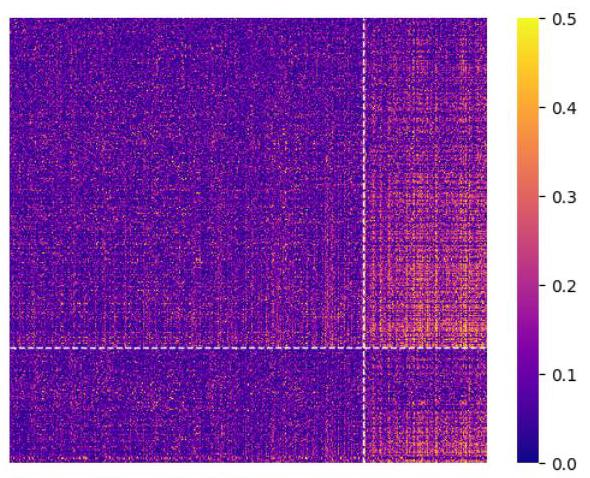
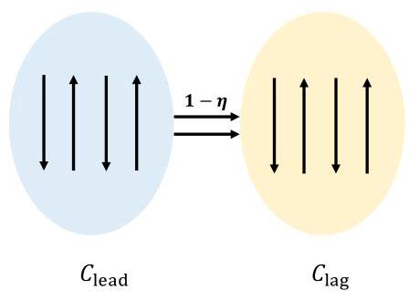
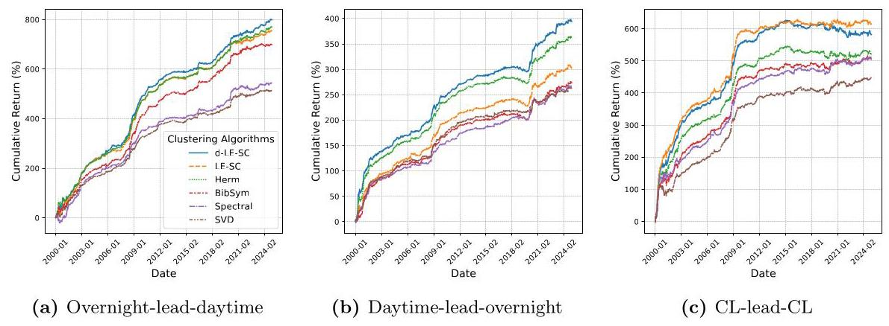
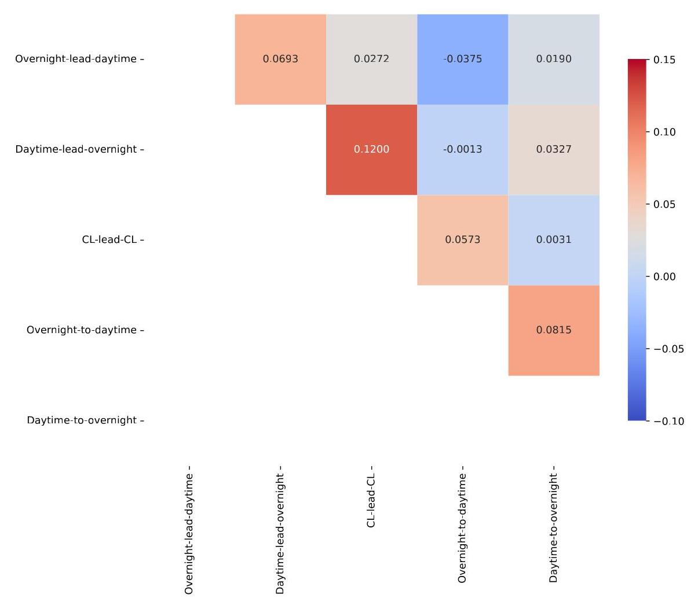
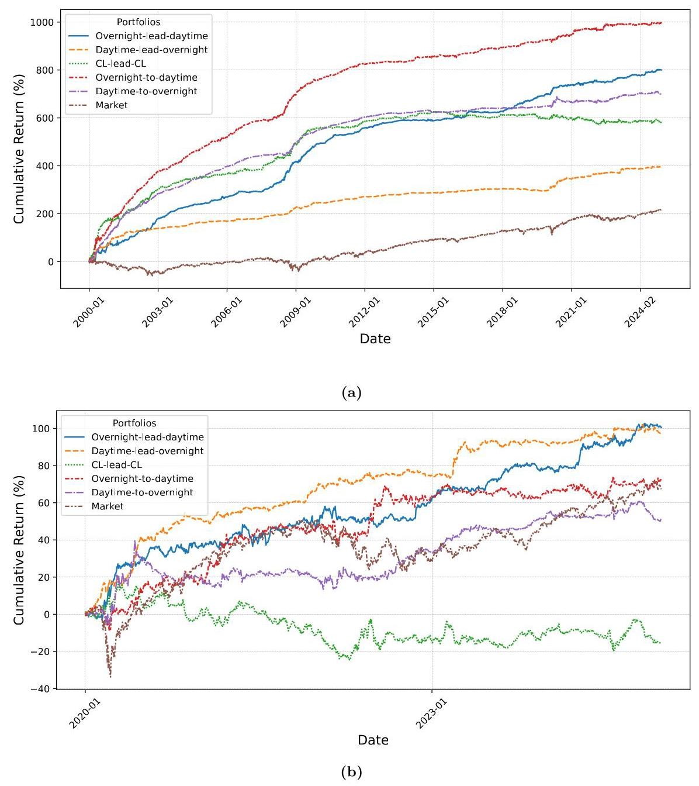

# A tug of war across the market: overnight-vs-daytime lead-lag networks and clustering-based portfolio strategies

Yutong Lu ${}^{*1}$ , Ning Zhang ${}^{1}$ , Gesine Reinert ${}^{1,2}$ , and Mihai Cucuringu ${}^{1,2,3,4}$

${}^{1}$ Department of Statistics, University of Oxford

${}^{2}$ The Alan Turing Institute

${}^{3}$ Oxford-Man Institute of Quantitative Finance, University of Oxford

${}^{4}$ Department of Mathematics, University of California Los Angeles

September 16, 2025

## Abstract

In this research, we show that the tug of war is not only at individual stock level but also a networked trading behaviour across the entire market. By decomposing daily returns into overnight and daytime components, we construct directed networks to capture the lead-lag relations between overnight speculations and daytime price corrections, and vice versa, across stocks. We originate a novel clustering-based framework to construct portfolios to capture the cross-stock tug of war. In order to identify disjoint leader and lagger groups in directed lead-lag networks, we develop a specialized spectral clustering algorithm. By generating trading signals exclusively from the leader stocks to predict and trade lagger stocks, we isolate pure cross-stock interactions from autocorrelation within individual stocks. Our empirical results support the conclusion that both noise traders and arbitrageurs trade at the portfolio level and disseminate the tug of war across stocks. With backtests spanning from 2000-01-03 to 2024-12-31, the cross-stock lead-lag portfolios generate remarkable returns and significant alphas on top of portfolios representing firm-level tug-of-war reversals and other the pricing factors. Moreover, the performance of cross-stock lead-lag portfolios grow in recent years, while the stock-specific reversals decay.

## 1 Introduction

The tug-of-war phenomenon in US equity markets is well-documented, which posits a negative correlation between overnight and intraday returns. Gains accrued overnight are frequently reversed during the trading day. Lou et al. (2019) demonstrate that, at the individual stock level, persistent overnight returns systematically predict intraday reversals, indicating a clash between overnight noise-trader speculation and intraday arbitrage corrections (Lou et al., 2019; Akbas et al., 2021).

Despite evidence for this pattern within individual equities, little is known about how these dynamics spill over stocks. Economic intuition suggests that noise traders and arbi-trageurs often operate over clusters of related equities, driven by sectorial positioning or portfolio-level strategies, leading to coordinated mispricing and correction that manifests via cross-sectional lead-lag effects (Shleifer and Summers, 1990; Scruggs, 2007; Avellaneda and Lee, 2010). In this research, we find evidence that the tug of war is a networked activity that transcends individual stocks and spills over the market. These interplays can be detected via data-driven clustering methods and exploited for profitable portfolio strategies.

---

*Email: yutong.lu@hotmail.com

---

As suggested by Cartea et al. (2023); Kelly et al. (2024), we use a portfolio approach to analyze the lead-lag relations and forecasting power of cross-stock overnight and daytime returns. In order to assess the proposed spillover of the tug of war, we innovate a three-step procedure to construct portfolios. Following Lou et al. (2019); Akbas et al. (2021), we decompose daily returns into overnight and daytime consignments. We begin with building networks representing lead-lag relations, using an adjacency matrix that consists of correlations between overnight (daytime) and daytime (overnight) of each pair of stocks. The portfolio construction process begins by forming daily lead-lag matrices, which are then clustered using a customized directed graph algorithm to identify groups of stocks with similar directional relationships. To ensure that the trading strategy captures true cross-stock lead-lag effects, rather than autocorrelation within individual stocks, we partition the stock universe into two disjoint clusters, leaders and laggers, based on the directed lead-lag matrix. Signals are extracted solely from the leader cluster and used to generate positions only within the lagger cluster. This separation prevents any stocks from both generating and receiving signals. Such construction ensures that the portfolio is driven purely by the cross-stock lead-lag relationships rather than trading on one stock's own autocorrelation.

To enhance directed clustering, we propose the d-LE-SC algorithm, an iterative spectral method customized for detecting directional lead-lag structures via flow-based criteria, enabling more precise and interpretable partitioning of the selected stocks. We show that this customized algorithm outperforms existing directed graph clustering benchmarks based on portfolio performance.

Our empirical results, spanning the period from 2000-01-03 to 2024-12-31, demonstrate that cross-stock tug of war carry economically meaningful lead-lag signals, particularly when overnight returns are used to forecast and trade subsequent daytime returns. A cross-stock strategy that exploits this directional lead-lag relationship by generating signals from leaders overnight and trading laggers during the daytime. This overnight-lead-daytime strategy achieves an annualized return of 32.11% and a Sharpe ratio of 2.37, significantly outperforming the reverse strategy based on daytime-lead-overnight signals. This asymmetry reflects the informational advantage of overnight returns, which incorporate news and price adjustments made while markets are closed (Glasserman et al., 2025). As a benchmark, we construct a strategy using lagged close-to-close returns, which is studied in existing research on lead-lag strategies. It also generates annualized returns of 23.35% over the entire sample period, though with higher volatility and greater drawdowns. As observed in previous studies, this close-to-close based strategy has experienced conspicuous decay in recent years. These findings underscore the consistence and economic value of cross-stock lead-lag relations between overnight and daytime returns.

Furthermore, we show that cross-stock return signals provide a distinct and economically meaningful source of alpha, separate from stock-specific tug of war documented by Lou et al. (2019); Akbas et al. (2021). By adapting their framework to a daily trading context, we construct reversal-based strategies that use lagged return rankings to trade across overnight and daytime periods. Our analysis reveals that portfolios, formed using cross-stock lead-lag signals, generate significant abnormal returns even after controlling for stock-level effects and common risk factors. Moreover, the low correlation between cross-stock and firm-level strategies and their opposing directional exposures in certain cases suggest that they capture different trading behaviors. These results highlight the predictive power of cross-stock signals and support their role in capturing broader arbitrage activities beyond individual-stock price corrections.

The temporal evolution of portfolio performance reveals a shift in trading behaviours. While stock-specific reversal strategies achieved substantial returns in the early 2000s, their performance has declined over the years. In contrast, cross-stock strategies exhibit more stable and persistent performance, with cross-stock portfolios outperforming their stock-specific counterparts in recent years. This trend suggests that the tug of war has evolved from firm-level speculation and arbitrage to cross-stock trading activities, possibly driven by more complex and fragmented portfolio strategies. These findings highlight the growing importance of cross-stock information in equity markets and the adaptive nature of hedging and arbitrage strategies in response to structural changes.

The remainder of this paper is organized as follows. Section 2 reviews the related literature and summarizes our contributions. Section 3 explains the construction of lead-lag networks. Section 4 introduces the clustering-based portfolio construction pipeline and proposes a specialized method for clustering the network. Section 5 presents the empirical results. In Section 6, we conduct additional robustness analyses. Finally, Section 7 summarizes our findings and suggests potential directions for future research.

## 2 Related literature

This paper contributes to three strands of literature. First, this paper extends the recent literature of overnight and daytime components of daily returns, the heterogeneity of clienteles and their tug of war. Lou et al. (2019) decompose asset returns into overnight and intraday components, revealing a persistent tug of war. Momentum profits are earned almost entirely overnight, while most other anomalies accrue intraday, often in opposite directions. They show that the smoothed spread between overnight and intraday returns for a strategy predicts its future close-to-close returns, positive for overnight-heavy and negative for intraday-heavy strategies. Finally, they link this pattern to investor heterogeneity. Retail noise traders tend to trade at the open, fueling overnight momentum, while institutional arbitrageurs trade at the close, reversing prices intraday.

Akbas et al. (2021) finds that months with frequent positive overnight returns followed by negative intraday reversals indicate more intensive tug of war between noise traders overnight and arbitrageurs during the day, and that this tug of war forecasts higher future cross-sectional stock returns. In addition, Hendershott et al. (2020) shows that asset returns and risk premia differ significantly between day and night, with most of the risk premium earned overnight. Bogousslavsky (2021) studies the cross-section of stocks and mispricing patterns of asset pricing factors during overnight and intraday sessions. A growing body of literature follows up on this topic, investigating its implications from various perspectives (Heyden and Heyden, 2021; Ham et al., 2022; Cheema et al., 2022; Ma et al., 2023; Lin et al., 2023; Bai et al., 2023; Kallinterakis and Karaa, 2023; Hajiyev et al., 2024; Zhao and Wese Simen, 2024; Kim and Goh, 2024; Bahcivan, 2025).

We contribute to this topic by investigating the tug of war across different stocks. Rather than studying the intensity and reversal patterns of returns components, we build networks of stocks based on correlation between overnight and daytime returns and show spillover of the mispricing and correction over the entire market. By expanding the tug-of-war concept beyond individual equities, this study enhances our understanding of how investor behaviour and information flow shape price dynamics across the equity cross-section, offering a novel lens on market efficiency and portfolio construction.

Second, our research contributes to the literature on financial market networks and community detection. Financial networks have become a powerful tool for modeling inter-asset dependencies and identifying market segmentation, contagion channels, and systemic vulnerabilities. A foundational study by Mantegna (1999) constructed a correlation-based distance network filtered through a minimum spanning tree (MST). Since then, various link definitions have been developed, including return correlations (Tumminello et al., 2007; Di Matteo et al., 2010), Granger causality (Billio et al., 2012), mutual information (Fiedor, 2014), and co-jump events (Ding et al., 2021), while alternative filtering methods encompass random matrix theory (Plerou et al., 2000), Potts-model clustering (Kullmann et al., 2000), planar maximally filtered graphs (Tumminello et al., 2005; Massara et al., 2016), and threshold-based pruning (Huang et al., 2009; Namaki et al., 2011). Network construction has also extended beyond price data to incorporate alternative sources, such as competition graphs derived from corporate disclosures (Zhang et al., 2023a).

Community detection is frequently conducted to reveal market topology, from hierarchical clustering in MST-based networks (Mantegna, 1999) to spectral clustering using novel similarity metrics. Lu et al. (2023), building on Lu et al. (2024), utilized co-occurrence in limit-order trades to extract dynamic US equity communities. However, most of these approaches assume undirected, unsigned networks.

In contrast, our study constructs signed, directed, and time-varying networks based on overnight versus intraday return correlations, and applies our d-LE-SC algorithm to detect communities in such networks. Our method not only uncovers new structural insights but also generalizes to directed community-detection tasks within financial networks.

Third, our research contributes to the literature on lead-lag relationships within stock markets. Early studies link lead-lag effects to firm characteristics. Lo and MacKin-lay (1990) find that large-cap stocks lead small caps, formulating contrarian strategies based on negative autocorrelation; Hou (2007) show that such effects are largely industry-specific; Chordia and Swaminathan (2000) document that high-trading-volume stocks lead low-volume ones; and Badrinath et al. (1995) demonstrate that shares held by informed institutional investors tend to lead those held by uninformed retail investors. More recent work has shifted toward data-driven techniques: Cartea et al. (2023) introduce a method using pairwise Lévy-area (Gyurkó et al., 2013; Lyons, 2014) and rank-based clustering to detect nonlinear lead-lag relationships and build long-short portfolios, revealing that these relations extend beyond firm characteristics. Meanwhile, Bennett et al. (2022), Li et al. (2021), Zhang et al. (2023c), Zhang et al. (2023b), and Shi et al. (2023) develop statistical and network-based clustering methods for identifying lead-lag clusters, though typically without distinguishing the sign of the relationships.

We extend this stream by focusing specifically on lead-lag relations derived from return decomposition. Our approach integrates both the direction and sign of lead-lag edges within network clustering and portfolio construction, offering better interpretability. Furthermore, we explain the diminishing profitability of prior lead-lag strategies. Despite their success in early years, the performance of lead-lag portfolios based on lead-lag relations among close-to-close returns decline substantially in recent years. By linking this performance decay to evolving tug-of-war dynamics, we demonstrate the value of separately trading during overnight and daytime periods.

## 3 Overnight and daytime networks

### 3.1 Data

Our empirical study incorporates US stocks listed on the New York Stock Exchange (NYSE), American Stock Exchange (AMEX), and NASDAQ over the period from 2000- 01-03 to 2024-12-31.

We source daily price and volume data from the Center for Research in Security Prices (CRSP) database. To ensure the liquidity and tradability of our strategies, we select stocks based on market capitalization, which we calculate as the product of shares outstanding and the daily closing price. Specifically, on each trading day, we include only those stocks ranking in the top 10% by market capitalization and having fewer than 10% missing data points over the preceding 60-day lookback window (Cartea et al., 2023). On average, this selection yields approximately 630 stocks per day.

In addition, we obtain daily factor return data from Kenneth R. French's online Data Library. These factors include the market return (MKT), size (SMB), value (HML), profitability (RMW), investment (CMA), and momentumn (MOM), as introduced by Fama and French (1992, 1993, 2015); Carhart (1997).

### 3.2 Overnight-vs-daytime lead-lag networks

We decompose the daily stock return into the overnight and daytime components. Let the daily return of stock $i$ on day $t$ be defined as

$$
{r}_{i, t}^{\text{close-to-close }} = \frac{{P}_{i, t}^{{adj}.\text{ close }}}{{P}_{i, t - 1}^{{adj}.\text{ close }}} - 1,
$$

where ${P}_{i, t}^{{adj}.\text{ close }}$ denotes the adjusted closing price. The daytime return is defined as

$$
{r}_{i, t}^{\text{daytime }} = \frac{{P}_{i, t}^{\text{close }}}{{P}_{i, t}^{\text{open }}} - 1,
$$

where ${P}_{i, t}^{\text{open }}$ and ${P}_{i, t}^{\text{close }}$ are open and close prices. The overnight return is then

$$
{r}_{i, t}^{\text{overnight }} = \frac{1 + {r}_{i, t}^{\text{close-to-close }}}{1 + {r}_{i, t}^{\text{daytime }}} - 1.
$$

In order to study the tug of war across the whole market, we construct lead-lag networks, using correlations of time series a pair of returns, to capture the relationships of daily returns across the market. Specifically, for assets $i$ and $j$ , the correlation between overnight returns and the following daytime return is given by

$$
{\rho }_{i, j}^{\text{overnight-lead-daytime }} = \operatorname{Corr}\left( {\left\{  {r}_{i, t}^{\text{overnight }}\right\}  ,\left\{  {r}_{j, t}^{\text{daytime }}\right\}  }\right) ,
$$

where $\operatorname{Corr}\left( \cdot \right)$ denotes the Pearson correlation. Using these pairwise correlations, we construct the overnight-lead-daytime matrix ${\mathbf{M}}_{t}^{\text{overnight-lead-daytime }}$ with entries

$$
{\left( {\mathbf{M}}_{t}^{\text{overnight-lead-daytime }}\right) }_{i, j} = {\rho }_{i, j}^{\text{overnight-lead-daytime }},
$$

yielding an asymmetric matrix that encodes the lead-lag structure among stock returns.

Similarly, we also construct the daytime-lead-overnight matrix as, ${\mathbf{M}}_{t}^{\text{daytime-lead-overnight }}$ , where each element is

$$
{\left( {\mathbf{M}}_{t}^{\text{daytime-lead-overnight }}\right) }_{i, j} = \operatorname{Corr}\left( \left\{  {\left\{  {r}_{i, t - 1}^{\text{daytime }}\right\}  ,\left\{  {r}_{j, t}^{\text{overnight }}\right\}  }\right\}  \right) .
$$

As a benchmark in the empirical studies below, we follow the same idea and build lead-lag relations between multiple types of returns, for example ${\mathbf{M}}_{t}^{{CL}\text{-lead-CL }}$ represents the matrix between current and lagged close-to-close returns. In this study, we estimate these correlations using a rolling lookback window of 60 trading days and compute the lead-lag matrix on each trading day.

#### 3.2.1 A lead-lag network

Figure 1 demonstrates the overnight-lead-daytime network for January 3, 2001, as an example. To quantify the strength of the lead-lag relationship, we consider the absolute value of each entry in the adjacency matrix ${\mathbf{M}}_{{2001} - {01} - {03}}^{\text{overnight-lead-daytime }}$ . Thus, lighter color indicates higher magnitude of correlation in the figure. We apply d-LE-SC, a spectral clustering algorithm (detailed in Section 4.2), to identify two groups, separated by the dotted line in Figure 1. The figure reveals clear structures that the upper-right block contains more light-colored elements, providing evidence of directional lead-lag relations among the stocks.

In the following sections, we analyze these observed cluster structures and leverage the findings to conduct portfolio analysis, spanning the entire sample period of 2000-01-03 to 2020-12-31.

Figure 1: A lead-lag network.

This figure visualizes the overnight-lead-daytime network on 2001-01-03, with adjacency matrix $\left| {\mathbf{M}}_{{2001} - {01} - {03}}^{\text{overnight-lead-daytime }}\right|$ . Each element represents the absolute value of pairwise correlations between overnight return and the subsequent daytime return. Lighter color indicates higher correlation.

## 4 Cluster-driven portfolio construction

In this section, we first explain the three-step procedure of forming the trading strategy based on the lead-lag matrices, which applies a directed clustering algorithm to identify stock groups, and builds long-short portfolios based on inter-cluster lead-lag signals. Next, we propose a specialized algorithm for directed clustering in detecting communities in stock networks, and demonstrate its superior portfolio performance compared with existing methods.

Figure 2: Pipeline of portfolio construction.

This figure illustrates the procedure for constructing lead-lag strategies, which consists of three main steps. First, we construct the network by calculating similarity matrices of stock returns using a moving window approach. Second, we apply a graph-based clustering algorithm to identify leaders and laggers among stocks. Third, we generate directional signals from the leader group and form long-short portfolios within the laggers group.

### 4.1 Portfolio formation

Figure 2 illustrates the pipeline of portfolio construction. At every day $t$ , we separate stocks into two disjoint groups, leaders and laggers. To ensure the portfolio only captures cross-stock relations, we derive signals from the leaders group and only trade the laggers group.

The split is based on the aforementioned lead-lag networks. We take the selected type of returns as input and lead-lag construct networks as described in Section 3.2. To identify groups of leaders and laggers, we apply a clustering algorithm to the lead-lag matrix. Since the matrix ${\mathbf{M}}_{t}$ is both directed and signed (containing both positive and negative values), standard clustering methods cannot be directly applied.

To address this, we take the element-wise absolute value of the lead-lag matrix to obtain the directed adjacency matrix ${\mathbf{A}}_{t}$ ,

$$
{\left( {\mathbf{A}}_{t}\right) }_{i, j} = \left| {\left( {\mathbf{M}}_{t}\right) }_{i, j}\right| .
$$

This transformation preserves the magnitude of the lead-lag relationships while discarding their sign, allowing the use of clustering algorithms that require non-negative edge weights.

We then apply a directed graph clustering algorithm to ${\mathbf{A}}_{t}$ , which accounts for the directionality of the edges when forming clusters. The algorithm produces a partition of the stocks into $K$ disjoint clusters, denoted as ${C}_{1},{C}_{2},\ldots ,{C}_{K}$ . Stocks within the same cluster tend to exhibit similar lead or lag behavior relative to stocks in other clusters.

This partitioning enables us to analyze and model the lead-lag structure at the group level, resulting in more interpretable and potentially more robust findings.

Building on the clustering of stocks derived from the directed lead-lag matrix, we construct a cross-sectional trading strategy that exploits persistent inter-cluster lead-lag relationships.

For each trading day $t$ , we compute the lead-lag score between clusters to identify which groups tend to lead or lag others. Specifically, for any pair of clusters $\left( {{C}_{a},{C}_{b}}\right)$ , we define the average lead-lag score from cluster ${C}_{a}$ to ${C}_{b}$ as:

$$
{S}_{a \rightarrow  b}\left( t\right)  = \frac{1}{\left| {C}_{a}\right| \left| {C}_{b}\right| }\mathop{\sum }\limits_{{i \in  {C}_{a}}}\mathop{\sum }\limits_{{j \in  {C}_{b}}}{\left( {\mathbf{A}}_{t}\right) }_{i, j}.
$$

We identify the leading-lagging cluster pair based on the most recent lead-lag structure:

$$
\left( {{C}_{\text{lead }},{C}_{\text{lag }}}\right)  = \arg \mathop{\max }\limits_{{a \neq  b}}{S}_{a \rightarrow  b}\left( t\right) .
$$

To generate a trading signal for day $t + 1$ , we compute the row-sum of ${\mathbf{A}}_{t}$ for each stock in the leading cluster to quantify their overall lead influence:

$$
{\operatorname{LeadScore}}_{i}\left( t\right)  = \mathop{\sum }\limits_{j}{\left( {\mathbf{A}}_{t}\right) }_{i, j},\;i \in  {C}_{\text{lead }}.
$$

We then select the top ${50}\%$ of stocks in ${C}_{\text{lead }}$ by LeadScore ${}_{i}\left( t\right)$ and compute the average return among them on day $t$ :

$$
\operatorname{Signal}\left( t\right)  = \frac{1}{\left| {\mathcal{T}}_{\text{lead }}\right| }\mathop{\sum }\limits_{{i \in  {\mathcal{T}}_{\text{lead }}}}{r}_{i, t}
$$

where ${\mathcal{T}}_{\text{lead }}$ denotes the subset of leading stocks with the highest lead scores.

We then construct a long-short portfolio within the lagging cluster ${C}_{\text{lag }}$ to be executed on day $t + 1$ . For each stock $j \in  {C}_{\text{lag }}$ , we compute its lead-lag score using the signed

matrix ${\mathbf{M}}_{t}$ :

$$
{\operatorname{LagScore}}_{j}\left( t\right)  = \mathop{\sum }\limits_{{i \in  {C}_{\text{lead }}}}{\left( {\mathbf{M}}_{t}\right) }_{i, j}.
$$

This score reflects the directional influence each stock receives from the leading cluster.

We sort the stocks in ${C}_{\text{lag }}$ by ${\operatorname{Score}}_{j}\left( t\right)$ in descending order and divide them into quantiles. If $\operatorname{Signal}\left( t\right)  > 0$ , we go long the top ${20}\%$ and short the bottom ${20}\%$ of stocks in ${C}_{\text{lag }}$ . If $\operatorname{Signal}\left( t\right)  < 0$ , we reverse the positions.

Let ${\mathcal{T}}_{\text{top }}$ and ${\mathcal{T}}_{\text{bottom }}$ denote the top and bottom ${20}\%$ of stocks in ${C}_{\text{lag }}$ , ranked by ${\text{Score}}_{j}\left( t\right)$ . The long-short portfolio is constructed based on the sign of the signal as follows:

$$
{R}_{t + 1}^{\text{port }} = \operatorname{sgn}\left( {\operatorname{Signal}\left( t\right) }\right) \left( {\frac{1}{\left| {\mathcal{T}}_{\text{top }}\right| }\mathop{\sum }\limits_{{j \in  {\mathcal{T}}_{\text{top }}}}{r}_{j, t + 1} - \frac{1}{\left| {\mathcal{T}}_{\text{bottom }}\right| }\mathop{\sum }\limits_{{j \in  {\mathcal{T}}_{\text{bottom }}}}{r}_{j, t + 1}}\right) ,
$$

where $\operatorname{sgn}\left( \cdot \right)$ denotes the sign function.

This strategy combines structural information about inter-cluster lead-lag dynamics with a directional signal derived from the most influential stocks in the leading group. It aims to capture delayed reactions and information spillovers by trading on the relative positioning of stocks in the laggers cluster.

Figure 3: Directed SBM with a lead and a lag community

### 4.2 d-LE-SC algorithm for lead-lag clustering

Clustering based on the directed adjacency matrix ${\mathbf{A}}_{t}$ has long been of interest and explored from various perspectives Malliaros and Vazirgiannis (2013). Recently, Zhang et al. (2025) demonstrated that likelihood estimation-based methods, such as LE-SC, outperform existing baselines in identifying lead-lag clusters. Motivated by this, we extend such estimation-based methodology to detect cluster structures in lead-lag networks proposed in Section 3. Unlike Zhang et al. (2025), where the clustering method jointly considers both density and directionality, our specialization, d-LE-SC, focuses exclusively on clustering based on edge directionality. This shift in emphasis allows for improved interpretability and robustness in lead-lag inference tasks. In the remainder of this section, we first briefly introduce the directed SBM, a random graph model with planted lead and lag communities, and demonstrate its alignment with lead-lag structures. We then present our algorithm d-LE-SC to cluster stocks into lead and lag groups.

Directed SBM with lead-lag communities We consider directed stochastic block models (SBMs), which are probabilistic models for generating directed graphs. In our study, we focus on the case with two planted clusters: a lead cluster and a lag cluster (see Figure 3). In the directed SBM with parameter $\eta$ , each possible edge is generated independently based on the community membership of its endpoints. If two vertices belong to the same cluster, the direction of the edge between them is random and unbiased; If one vertex lies in the lead cluster and the other in the lag cluster, the edge is more likely to point from lead to lag, with probability $1 - \eta$ . The parameter $\eta  \in  \left\lbrack  {0,{0.5}}\right\rbrack$ controls the amount of noise in this directional structure: smaller values of $\eta$ correspond to a stronger and clearer "lead-lag" signal across clusters, while larger values make the directions more random.

Recall that in lagged correlation matrices ${\mathbf{M}}_{t}$ , each entry ${\left( {\mathbf{M}}_{t}\right) }_{i, j}$ represents the lag-1 correlation between asset $i$ and $j$ , i.e., ${\left( {\mathbf{M}}_{t}\right) }_{i, j} = \operatorname{Corr}\left( {\left\{  {r}_{i, t}\right\}  ,\left\{  {r}_{j, t - 1}\right\}  }\right)$ . If the return of asset $i$ leads those of asset $j$ , then $\left| {\left( {\mathbf{M}}_{t}\right) }_{i, j}\right|$ tends to have large values than $\left| {\left( {\mathbf{M}}_{t}\right) }_{j, i}\right|$ . Such asymmetry in correlation encodes a sense of "who leads and who follows" among assets, which naturally aligns with the planted lead-lag communities in directed SBMs. From this perspective, the lagged correlation matrix can be viewed as a continuous analogue of realizations from directed SBMs.

Clustering methodology The d-LE-SC algorithm (Algorithm 1) is an iterative spectral clustering method grounded in maximum likelihood estimation (MLE) on the directed SBM that encodes lead-lag structure. The MLE objective can be reformulated in terms of two flow-based quantities between the leading and lagging communities:

- Net flow, which captures the directional imbalance of edges:

$$
\mathbf{{NF}}\left( {{C}_{\text{lead }},{C}_{\text{lag }}}\right)  = \mathop{\sum }\limits_{{i \in  {C}_{\text{lead }}, j \in  {C}_{\text{lag }}}}{\mathbf{A}}_{ij} - {\mathbf{A}}_{ji}
$$

- Total flow, which measures the overall connectivity regardless of direction:

$$
\mathbf{{TF}}\left( {{C}_{\text{lead }},{C}_{\text{lag }}}\right)  = \mathop{\sum }\limits_{{i \in  {C}_{\text{lead }}, j \in  {C}_{\text{lag }}}}{\mathbf{A}}_{ij} + {\mathbf{A}}_{ji}
$$

These flows are weighted by informativeness parameters estimated from the directed SBM, and the MLE problem reduces to maximizing the objective

$$
\mathop{\max }\limits_{{{C}_{\text{lead }},{C}_{\text{lag }}}}\log \left( \frac{1 - \eta }{\eta }\right) \mathbf{{NF}}\left( {{C}_{\text{lead }},{C}_{\text{lag }}}\right)  + \log \left( \frac{1}{{4\eta }\left( {1 - \eta }\right) }\right) \mathbf{{TF}}\left( {{C}_{\text{lead }},{C}_{\text{lag }}}\right) .
$$

This flow-based optimization problem is approximated via spectral relaxation, reducing it to a simple and computationally efficient eigenvector decomposition followed by k-means clustering, with the parameter $\eta$ updated iteratively based on the current clustering (see Algorithm 1).

Algorithm 1: d-LE-SC for lead-lag detection

---

Input: Directed adjacency matrix ${\mathbf{A}}_{t}$ , number of iteration $m$ ;

2 Initialize: Randomly set initial values for directed SBM parameters $\eta$ ;

for $i = 1 : m$ do

	Compute the Hermitian matrix

					$\mathbf{H} = i\log \left( \frac{1 - \eta }{\eta }\right) \left( {{\mathbf{A}}_{t} - {\mathbf{A}}_{t}^{T}}\right)  + \log \left( \frac{1}{{4\eta }\left( {1 - \eta }\right) }\right) \left( {{\mathbf{A}}_{t} + {\mathbf{A}}_{t}^{T}}\right) .$

	Compute the top eigenvector ${\mathbf{v}}_{\mathbf{1}}$ of $\mathbf{H}$ ;

		Form the embedding $\left\lbrack  {\Re \left( {\mathbf{v}}_{1}\right) ,\Im \left( {\mathbf{v}}_{1}\right) }\right\rbrack$ and cluster into two communities ${C}_{\text{lead }}$

		and ${C}_{\text{lag }}$ via $k$ -means;

	Update the directed SBM parameter:

$$
\eta  \leftarrow  \min \left\{  {\frac{\left| {C}_{\text{lead }} \rightarrow  {C}_{\text{lag }}\right| }{\mathbf{{TF}}\left( {{C}_{\text{lead }},{C}_{\text{lag }}}\right) },\frac{\left| {C}_{\text{lag }} \rightarrow  {C}_{\text{lead }}\right| }{\mathbf{{TF}}\left( {{C}_{\text{lead }},{C}_{\text{lag }}}\right) }}\right\}  ,
$$

		where $\left| {{C}_{1} \rightarrow  {C}_{2}}\right|  = \mathop{\sum }\limits_{{i \in  {C}_{1}, j \in  {C}_{2}}}{\left( {\mathbf{A}}_{t}\right) }_{ij}$ denotes the total directed flow from

		community ${C}_{1}$ to ${C}_{2}$ .

end

Output: Lead-lag communities ${C}_{\text{lead }}$ and ${C}_{\text{lag }}$

---

### 4.3 Performance evaluation

We provide empirical evidence that our pipeline constructs economically valuable portfolios, and the proposed directed clustering algorithm outperforms existing methods.

#### 4.3.1 Evaluation metrics

We evaluate the performance of the trading strategy using three metrics, hit rate, Sharpe ratio and Calmar ratio. These metrics jointly assess the accuracy, profitability and stability of the trading strategies (Guo et al.,2025). Let ${R}_{t}^{\text{port }}$ denote the return of the long-short portfolio on day $t$ , as defined previously.

Hit rate The hit rate measures the proportion of days with positive portfolio returns,

defined as

$$
\text{ Hit rate } = \frac{1}{T}\mathop{\sum }\limits_{{t = 1}}^{T}\mathbb{I}\left( {{R}_{t}^{\text{port }} > 0}\right) ,
$$

where $\mathbb{I}\left( \cdot \right)$ is the indicator function and $T$ is the total number of trading days.

Sharpe ratio The Sharpe ratio (Sharpe, 1994) measures the risk-adjusted return of the portfolio and is defined as the mean return divided by the standard deviation of returns,

calculated as

$$
\text{ Sharpe } = \frac{\mathbb{E}\left\lbrack  {R}_{t}^{\text{port }}\right\rbrack  }{\operatorname{Std}\left( {R}_{t}^{\text{port }}\right) },
$$

where the expectation and standard deviation are computed over the evaluation period.

Calmar ratio The Calmar ratio evaluates the return relative to the maximum drawdown over the period. It is given by:

$$
\text{ Calmar } = \frac{\mathbb{E}\left\lbrack  {R}_{t}^{\text{port }}\right\rbrack  }{\mathop{\max }\limits_{{t}^{\prime }}\left( {\mathop{\max }\limits_{{s \leq  {t}^{\prime }}}{\mathrm{{NAV}}}_{s} - {\mathrm{{NAV}}}_{{t}^{\prime }}}\right) },
$$

where ${\mathrm{{NAV}}}_{t}$ is the cumulative net asset value at time $t$ , computed as:

$$
{\mathrm{{NAV}}}_{t} = \mathop{\prod }\limits_{{s = 1}}^{t}\left( {1 + {R}_{s}^{\text{port }}}\right) .
$$

#### 4.3.2 Portfolio performance

In Figure 4, we plot the cumulative return trajectories of portfolio strategies based on different clustering algorithms. In plots (a) and (b), we observe that d-LS-SC-based overnight-lead-daytime and daytime-lead-overnight portfolios constantly outperforms alternative methods throughout the entire sample period. In plot (c) the performance of the d-LS-SC-based portfolio is close to that of LS-SC, while outperforming all other methods.

Then we zoom into the quantitative evaluation of the portfolios. Table 1 reports the performance of portfolios constructed using various clustering-based strategies across overnight, daytime, and close-to-close trading periods. Appendix A provides an overview of the benchmark methods used for comparison. Across panels in Table 1, our d-LE-SC method consistently outperforms other spectral clustering algorithms.

Panel A displays the performance of overnight-lead-daytime portfolios. Among all methods, d-LE-SC achieves the best overall performance, with an annualized return of ${32.11}\%$ , a maximum drawdown of 17.44%, a hit rate of ${57.58}\%$ , a Sharpe ratio of 2.37, and a Calmar ratio of 1.84.

Similarly, among all daytime-lead-overnight portfolios traded during the overnight period, shown in Panel B, d-LE-SC-based portfolio achieves the highest annualized return of 15.79%, hit rate of 55.67%, Sharpe ratio of 2.09 and Calmar ratio of 1.42, indicating superior risk-adjusted performance.

Figure 4: This figure shows the cumulative returns of arbitrage portfolios of different clustering methods. The backtest spans the period from 2000-01-03 to 2024-12-31.

Table 1: Performance comparison of clustering-based strategies

This table shows the performance of lead-lag portfolios of different periods based on our d-LE-SC algorithm and benchmarks, including LE-SC, Hermitian, BibSym, spectral clustering and simple symmetrization. Column names indicate clustering algorithms. Each row contains a evaluation metric from annualized return, annualized volatility, maximum drawdown, hit rate, Sharpe ratio and Calmar ratio.

Panel A: Overnight-Lead-Daytime

<table><tr><td/><td>d-LE-SC</td><td>LE-SC</td><td>Herm</td><td>BibSym</td><td>Spectral</td><td>SVD</td></tr><tr><td>Annualized return (%)</td><td>32.11</td><td>30.20</td><td>30.92</td><td>28.08</td><td>21.81</td><td>20.58</td></tr><tr><td>Annualized volatility (%)</td><td>13.55</td><td>13.61</td><td>13.74</td><td>12.58</td><td>12.31</td><td>11.28</td></tr><tr><td>Maximum drawdown (%)</td><td>17.44</td><td>18.26</td><td>17.45</td><td>20.19</td><td>35.36</td><td>21.81</td></tr><tr><td>Hit Rate (%)</td><td>57.58</td><td>57.01</td><td>56.83</td><td>56.29</td><td>54.97</td><td>56.12</td></tr><tr><td>Sharpe ratio</td><td>2.37</td><td>2.22</td><td>2.25</td><td>2.23</td><td>1.77</td><td>1.82</td></tr><tr><td>Calmar ratio</td><td>1.84</td><td>1.65</td><td>1.77</td><td>1.39</td><td>0.62</td><td>0.94</td></tr></table>

Panel B: Daytime-Lead-Overnight

<table><tr><td/><td>d-LE-SC</td><td>LE-SC</td><td>Herm</td><td>BibSym</td><td>Spectral</td><td>SVD</td></tr><tr><td>Annualized return (%)</td><td>15.79</td><td>12.13</td><td>14.54</td><td>10.94</td><td>10.65</td><td>10.54</td></tr><tr><td>Annualized volatility (%)</td><td>7.55</td><td>6.59</td><td>7.42</td><td>6.51</td><td>5.91</td><td>6.05</td></tr><tr><td>Maximum drawdown (%)</td><td>11.12</td><td>15.18</td><td>14.51</td><td>13.43</td><td>13.93</td><td>10.62</td></tr><tr><td>Hit Rate (%)</td><td>55.67</td><td>55.51</td><td>54.95</td><td>54.95</td><td>55.11</td><td>55.16</td></tr><tr><td>Sharpe ratio</td><td>2.09</td><td>1.84</td><td>1.96</td><td>1.68</td><td>1.80</td><td>1.74</td></tr><tr><td>Calmar ratio</td><td>1.42</td><td>0.80</td><td>1.00</td><td>0.81</td><td>0.76</td><td>0.99</td></tr></table>

Panel C: CL-lead-CL

<table><tr><td/><td>d-LE-SC</td><td>LE-SC</td><td>Herm</td><td>BibSym</td><td>Spectral</td><td>SVD</td></tr><tr><td>Annualized return (%)</td><td>23.35</td><td>24.69</td><td>20.95</td><td>20.32</td><td>20.41</td><td>18.06</td></tr><tr><td>Annualized volatility (%)</td><td>15.00</td><td>15.05</td><td>14.23</td><td>13.16</td><td>14.32</td><td>12.54</td></tr><tr><td>Maximum drawdown (%)</td><td>53.97</td><td>26.22</td><td>43.83</td><td>29.05</td><td>24.50</td><td>36.41</td></tr><tr><td>Hit Rate (%)</td><td>53.85</td><td>54.35</td><td>53.63</td><td>54.05</td><td>53.38</td><td>53.92</td></tr><tr><td>Sharpe ratio</td><td>1.56</td><td>1.64</td><td>1.47</td><td>1.54</td><td>1.43</td><td>1.44</td></tr><tr><td>Calmar ratio</td><td>0.43</td><td>0.94</td><td>0.48</td><td>0.70</td><td>0.83</td><td>0.50</td></tr></table>

Finally, for the CL-lead-CL portfolios reported in Panel C, while LE-SC slightly edges out d-LE-SC in terms of the reported evaluation metrics, d-LE-SC maintains profitability and outperforms the remaining benchmark algorithms.

Overall, these results highlight the effectiveness of our d-LE-SC approach customized for the lead-lag structure at the cluster level in this specific task. The specialized method enhances lead-lag trading signals and generates superior returns. In the following sections, we use d-LS-SC for all clustering-based portfolio constructions.

## 5 Empirical results

### 5.1 lead-lag portfolio performance

Table 2 presents the performance of strategies constructed from cross-firm lead-lag signals. The results provide strong evidence that overnight (daytime) returns contain salient signals for predicting the subsequent daytime (overnight) returns across stocks. More specifically, strategies that use cross-stock overnight returns to predict and trade the following daytime returns, referred to as the overnight-lead-daytime strategy, exhibit the strongest performance, achieving an annualized return of 32.11%, a Sharpe ratio of 2.37, and a Calmar ratio of 1.84. In addition, the daytime-lead-overnight strategy yields a 15.79% annualized return and a Sharpe ratio of 2.09. It is noteworthy that the overnight-lead-daytime strategy exhibit higher returns that the daytime-lead-overnight. This asymmetric predictability is consistent with prior findings (Kim and Goh, 2024; Glasserman et al., 2025) documenting that overnight returns embed more informative signals due to the arrival of news and price adjustments when markets are closed, rendering them more effective predictors of the following daytime returns. We confirm that this asymmetry in information also spills over stocks.

In addition, the strategy based on lagged cross-stock close-to-close returns to forecast future close-to-close returns also performs well, generating an annualized return of 23.35%. However, its risk-adjusted performance is lower, with a Sharpe ratio of 1.56 and a significantly higher drawdown of 53.97%, indicating greater volatility and risk exposure.

Panel B reports alphas estimated from a range of factor models including CAPM, Fama-French 3-factor, FF3+Momentum, FF5, and FF5+Momentum. The overnight-lead-daytime strategy consistently delivers significant and positive alphas across all sets of factors, further supporting the economic significance and robustness of the lead-lag relationship. The daytime-lead-overnight and CL-lead-CL strategies also show statistically significant alphas, though of smaller magnitudes. Overall, the results indicate that the lead-lag signals are economically valuable and the cross-stock tug of war has not been priced in yet.

### 5.2 Cross-stock vs firm-level

The cross-stock clientele effects and arbitrage activities are uncorrelated with stock-specific tug-of-war dynamics, offering orthogonal sources of alpha.

To demonstrate this, we adapt the tug of war framework of Lou et al. (2019) to our daily trading setting by designing reversal-based strategies that leverage the negative correlations between overnight and daytime returns. Specifically, for each trading day, we rank stocks based on their past 60-day average daytime and overnight returns. To capture the cross-period return reversals in Lou et al. (2019), we construct two types of portfolios

Table 2: Performance of cross-stock lead-lag portfolios.

This table shows the performance and abnormal returns of cross-stock lead-lag portfolios, back-tested from 2000-01-03 to 2024-12-31. Panel A shows the performance of lead-lag portfolios indicated by column names. Each row contains a evaluation metric from annualized return, annualized volatility, maximum drawdown, hit rate, Sharpe ratio and Calmar ratio. Panel B documents the abnormal returns $\left( \alpha \right)$ cross-stock lead-lag long-short portfolios with respect to factor models. For

each cross-stock lead-lag portfolio, we run time series regressions on portfolio access returns against factors. The superscripts *** indicate statistical significance at 1%, and the corresponding t-values are reported in the parentheses.

Panel A: Portfolio Performance

<table><tr><td/><td>Overnight-lead-daytime</td><td>Daytime-lead-overnight</td><td>CL-lead-CL</td></tr><tr><td>Annualized return (%)</td><td>32.11</td><td>15.79</td><td>23.35</td></tr><tr><td>volatility (%)</td><td>13.55</td><td>7.55</td><td>15.00</td></tr><tr><td>Max drawdown (%)</td><td>17.44</td><td>11.12</td><td>53.97</td></tr><tr><td>Hit rate (%)</td><td>57.58</td><td>55.67</td><td>53.85</td></tr><tr><td>Sharpe ratio</td><td>2.37</td><td>2.09</td><td>1.56</td></tr><tr><td>Calmar ratio</td><td>1.84</td><td>1.42</td><td>0.43</td></tr></table>

Panel B: Portfolio Alpha

<table><tr><td/><td>Overnight-lead-daytime</td><td>Daytime-lead-overnight</td><td>CL-lead-CL</td></tr><tr><td rowspan="2">CAPM</td><td>${12.00}^{* *  * }$</td><td>${5.59}^{* *  * }$</td><td>${8.56}^{* *  * }$</td></tr><tr><td>(11.14)</td><td>(9.31)</td><td>(7.17)</td></tr><tr><td rowspan="2">FF3</td><td>${12.03}^{* *  * }$</td><td>${5.58}^{* *  * }$</td><td>${8.51}^{* *  * }$</td></tr><tr><td>(11.17)</td><td>(9.29)</td><td>(7.14)</td></tr><tr><td rowspan="2">FF3 + MOM</td><td>${12.05}^{* *  * }$</td><td>${5.64}^{* *  * }$</td><td>${8.57}^{* *  * }$</td></tr><tr><td>(11.18)</td><td>(9.39)</td><td>(7.19)</td></tr><tr><td rowspan="2">FF5</td><td>11.97***</td><td>5.72***</td><td>${8.29}^{* *  * }$</td></tr><tr><td>(11.10)</td><td>(9.53)</td><td>(6.94)</td></tr><tr><td rowspan="2">FF5 + MOM</td><td>${11.99}^{* *  * }$</td><td>${5.74}^{* *  * }$</td><td>${8.33}^{* *  * }$</td></tr><tr><td>(11.11)</td><td>(9.57)</td><td>(6.98)</td></tr></table>

1. Overnight-to-daytime: We use average overnight returns to rank and trade the subsequent daytime returns.

2. Daytime-to-overnight: We use average daytime returns to rank and the subsequent trade overnight returns.

Each day, stocks are sorted into quintiles based on the respective signals. According to the documented reversals, we construct long-short portfolios by going long the bottom quintile and short the top quintile. The daytime strategy enters positions at the market open and exits at the market close, while the overnight strategy holds positions from the close to the next morning's open. This design exploits persistent trading patterns of different clienteles and documented reversals across trading periods.

Figure 5 visualizes the correlations among cross-stock and firm-level portfolios. Most correlations are below 10%, with the exceptions of the daytime-lead-overnight and CL-lead-CL portfolios. Notably, the negative correlation between the overnight-lead-daytime and overnight-to-daytime strategies indicates that stock-specific and cross-stock arbitrage directions during the daytime tend to diverge. This suggests that while some arbitrageurs engage in price correction for overreacting individual stocks, others simultaneously hedge or speculate using broader sets of stocks.

Figure 5: Portfolio correlations.

This figure shows the correlation between pairs of portfolios. The correlations are calculated with daily returns spanning the period from 2000-01-03 to 2024-12-31.

We regress the returns of the cross-stock portfolios against the corresponding stock-specific portfolios from the same trading period. Table 3 reports the regression coefficients. The cross-stock portfolios exhibit significant abnormal returns that cannot be explained by the stock-specific tug of war. As expected, they also show significant exposure to the firm-specific portfolios, suggesting that the cross-stock signals are driven by the interaction between noise traders and arbitrageurs.

Table 3: Cross-stock vs firm-level portfolios.

This table documents the abnormal returns $\left( \alpha \right)$ and exposure of cross-stock lead-lag long-short portfolios with respect to firm-level reversal factors. For each cross-stock lead-lag portfolio, we run time series regressions on portfolio access returns against the firm-level portfolios. The superscripts ** and ** indicate statistical significance at $5\%$ and $1\%$ , and the corresponding t-values are reported in the parentheses.

<table><tr><td/><td>$\alpha$</td><td>daytime-to-overnight</td><td>overnight-to-daytime</td></tr><tr><td>Overnight-lead-daytime</td><td>0.1271*** (11.6053)</td><td/><td>-0.0462*** (-3.7324)</td></tr><tr><td>Overnight-lead-daytime</td><td>0.0549*** (9.0409)</td><td>0.0227** (2.5037)</td><td/></tr><tr><td>CL-lead-CL</td><td>0.0767*** (6.2617)</td><td>-0.0036 (-0.1999)</td><td>${0.0445}^{* *  * }$ (3.2424)</td></tr></table>

### 5.3 Temporal evolution of trading behaviours

In Figure 6, plot (a) presents the cumulative returns of the cross-stock portfolios, stock-specific portfolios, and the market portfolio over the sample period. The cumulative return curves of these strategies vary over time, with noticeable shifts in the slopes. Focusing on the recent period from 2020 to 2024 in Figure 6 (b), we observe that portfolios based on the cross-stock tug-of-war signals have remained consistently profitable. Especially, the slope of return curve of the Overnight-lead-daytime strategy increases. In contrast, the profitability of other strategies has decayed. These patterns motivate a closer examination of the temporal evolution of strategy performance.

Table 4 reports the annual Sharpe ratios of the five trading strategies from 2000 to 2024. Several key patterns emerge. First, all strategies exhibit strong performance in the early 2000s, with particularly high Sharpe ratios observed for the stock-specific portfolios, overnight-to-daytime and daytime-to-overnight, indicating that firm-level reversals were highly exploitable during this period. However, their performance decays more rapidly over time, suggesting a reduction in the strength or persistence of firm-specific mispricing, potentially due to increased market efficiency or greater competition among arbitrageurs.

In contrast, the cross-stock lead-lag strategies, overnight-lead-daytime and daytime-lead-overnight, demonstrate more stable performance over the years. Notably, in recent years, these strategies have outperformed the stock-specific ones, with the daytime-lead-overnight strategy often achieving the highest Sharpe ratios. This shift may reflect the growing complexity and fragmentation of speculations and arbitrage, where information diffuses not only within individual stocks but also across stocks. Cross-stock signals may now offer more persistent arbitrage opportunities as they are less directly observable and harder to arbitrage away.

Our empirical results suggest a decaying advantage in exploiting stock-level reversals, while cross-stock relationships have become increasingly valuable as a source of alpha.

Figure 6: Cumulative returns of portfolios.

These figures plots cumulative returns of six portfolios (a) from 2000-01-03 to 2024-12-31 and (b) from 2020-01-01 to 2024-12-31.

This transition likely mirrors the evolution of market structure, trading technology, and the adaptive behavior of arbitrage strategies. We also include the yearly hit rates and Calmar ratios of the portfolios in Table 7 and Table 8, which support our findings.

Table 4: Yearly Sharpe ratios of portfolios.

This table displays the Sharpe ratios of five portfolios on a yearly basis from 2000 to 2024. The first three columns represent cross-stock lead-lag portfolios traded during daytime, overnight, and close-to-close. The last two columns correspond to stock-specific portfolios that trade the reversals of overnight and daytime returns (and vice versa). Each year, the highest Sharpe ratio across the five portfolios is highlighted.

<table><tr><td>Year</td><td>Overnight-lead-daytime</td><td>Daytime-lead-overnight</td><td>CL-lead-CL</td><td>Overnight-to-daytime</td><td>Daytime-to-overnight</td></tr><tr><td>2000</td><td>2.23</td><td>4.65</td><td>5.30</td><td>3.83</td><td>5.97</td></tr><tr><td>2001</td><td>1.80</td><td>2.64</td><td>1.79</td><td>5.91</td><td>5.44</td></tr><tr><td>2002</td><td>5.20</td><td>2.60</td><td>4.01</td><td>8.29</td><td>4.39</td></tr><tr><td>2003</td><td>5.46</td><td>1.92</td><td>3.85</td><td>4.58</td><td>5.69</td></tr><tr><td>2004</td><td>3.03</td><td>3.11</td><td>1.52</td><td>6.18</td><td>7.78</td></tr><tr><td>2005</td><td>2.45</td><td>1.45</td><td>1.48</td><td>3.45</td><td>11.13</td></tr><tr><td>2006</td><td>2.59</td><td>1.73</td><td>1.13</td><td>5.13</td><td>6.55</td></tr><tr><td>2007</td><td>3.29</td><td>3.26</td><td>3.72</td><td>1.97</td><td>3.22</td></tr><tr><td>2008</td><td>4.23</td><td>3.90</td><td>3.33</td><td>3.96</td><td>2.41</td></tr><tr><td>2009</td><td>4.33</td><td>3.13</td><td>3.96</td><td>3.98</td><td>6.18</td></tr><tr><td>2010</td><td>4.64</td><td>2.75</td><td>0.67</td><td>3.98</td><td>5.78</td></tr><tr><td>2011</td><td>3.31</td><td>4.01</td><td>2.22</td><td>3.34</td><td>3.38</td></tr><tr><td>2012</td><td>2.65</td><td>2.32</td><td>1.66</td><td>1.66</td><td>3.50</td></tr><tr><td>2013</td><td>2.06</td><td>2.89</td><td>1.39</td><td>0.43</td><td>0.78</td></tr><tr><td>2014</td><td>0.08</td><td>0.55</td><td>2.02</td><td>1.92</td><td>0.45</td></tr><tr><td>2015</td><td>1.86</td><td>0.80</td><td>-1.27</td><td>0.21</td><td>0.35</td></tr><tr><td>2016</td><td>1.85</td><td>1.96</td><td>-0.51</td><td>1.76</td><td>1.27</td></tr><tr><td>2017</td><td>0.13</td><td>0.53</td><td>1.17</td><td>2.08</td><td>0.54</td></tr><tr><td>2018</td><td>3.75</td><td>-0.09</td><td>-0.18</td><td>2.11</td><td>0.48</td></tr><tr><td>2019</td><td>3.22</td><td>-1.52</td><td>-1.16</td><td>2.23</td><td>1.41</td></tr><tr><td>2020</td><td>2.24</td><td>3.64</td><td>0.13</td><td>1.01</td><td>0.88</td></tr><tr><td>2021</td><td>0.59</td><td>2.31</td><td>-0.91</td><td>1.70</td><td>-0.01</td></tr><tr><td>2022</td><td>1.19</td><td>1.20</td><td>-0.13</td><td>0.85</td><td>0.90</td></tr><tr><td>2023</td><td>1.86</td><td>1.91</td><td>0.14</td><td>0.12</td><td>2.17</td></tr><tr><td>2024</td><td>1.81</td><td>0.72</td><td>-0.27</td><td>0.64</td><td>-0.06</td></tr></table>

## 6 Robustness analysis

### 6.1 Tradability and transaction cost

This study focuses on the predictive power of cross-stock overnight and daytime return interactions. However, the practical viability of the proposed strategies depends on their tradability after accounting for transaction costs. To assess this, we evaluate portfolio turnover and show that the strategies remain implementable under realistic assumptions.

Strategies that trade exclusively on daytime (overnight) period typically execute twice per day at the market open and close, without holding overnight (daytime), resulting in turnover of ${200}\%$ . In contrast, our strategy is designed to trade twice per day, rebalancing at both the open and close of each session. This allows it to incorporate return signals from both market segments while maintaining controlled trading frequency.

We follow Cartea et al. (2023) and calculate turnover as below,

$$
{\operatorname{Turnover}}_{t} = \frac{\mathop{\sum }\limits_{{i = 1}}^{N}\left| {{w}_{i, t} - {w}_{i, t - 1}}\right| }{\mathop{\sum }\limits_{{i = 1}}^{N}\left| {w}_{i, t - 1}\right| }, \tag{1}
$$

where ${w}_{i, t}$ denotes the portfolio weight of stock $i$ at time $t$ .

As shown in Table 5, the average turnover of our strategy is 3.53. Assuming linear transaction costs of 3.5 basis points per one-way trade. The annualized return stays at 16.77% with a Sharpe ratio of 1.05 .

Table 5: Performance of open-close rebalanced strategy.

The table shows the performance of the strategy twice per day, at both market open and close, backtested from 2000-01-03 to 2024-12-31. Column names indicate the evaluation metrics.

<table><tr><td>Annualized return (%)</td><td>Annualized volatility (%)</td><td>Maximum drawdown (%)</td><td>Hit Rate (%)</td><td>Sharpe ratio</td><td>Calmar ratio</td><td>Average turnover</td></tr><tr><td>47.91</td><td>15.96</td><td>17.16</td><td>58.71</td><td>3.00</td><td>2.79</td><td>3.53</td></tr></table>

### 6.2 Alternative correlation measure

Table 6 demonstrates the performance of portfolios built with Pearson and Spearman correlations. Panel A presents the overnight-lead-daytime strategy, where portfolio performance is similar across both correlation measures for all evaluation metrics. In Panel B we display the daytime-lead-overnight strategy. We can observe relatively higher profitability for portfolios constructed using Spearman correlation, which suggests potential non-linearity in the lead-lag relation between daytime and subsequent overnight returns. Overall, our methodology and empirical results remain robust under the alternative correlation measure.

Table 6: Performance of portfolios constructed using different correlation measures. The table compares strategy performance based on lead-lag correlations calculated with Pearson and Spearman methods (as labeled in columns). Backtests cover the period from 2000-01-03 to 2024-12-31.

Panel A: Overnight-lead-daytime

<table><tr><td/><td>Pearson</td><td>Spearman</td></tr><tr><td>Annualized return (%)</td><td>32.11</td><td>29.59</td></tr><tr><td>Annualized volatility (%)</td><td>13.55</td><td>12.87</td></tr><tr><td>Maximum drawdown (%)</td><td>17.44</td><td>17.84</td></tr><tr><td>Hit rate (%)</td><td>57.58</td><td>57.29</td></tr><tr><td>Sharpe ratio</td><td>2.37</td><td>2.30</td></tr><tr><td>Calmar ratio</td><td>1.84</td><td>1.66</td></tr></table>

Panel B: Daytime-lead-overnight

<table><tr><td/><td>Pearson</td><td>Spearman</td></tr><tr><td>Annualized return (%)</td><td>15.79</td><td>22.56</td></tr><tr><td>Annualized volatility (%)</td><td>7.55</td><td>8.25</td></tr><tr><td>Maximum drawdown (%)</td><td>11.12</td><td>6.62</td></tr><tr><td>Hit rate (%)</td><td>55.67</td><td>57.76</td></tr><tr><td>Sharpe ratio</td><td>2.09</td><td>2.73</td></tr><tr><td>Calmar ratio</td><td>1.42</td><td>3.41</td></tr></table>

## 7 Conclusion and future directions

This research extends the tug of war on individual stocks to a cross-stock setting, revealing that overnight mispricing and intraday corrections often occur across clusters of related equities. We construct correlation networks to capture the lead-lag relations between overnight (daytime) and daytime (overnight) returns. Furthermore, we identify these clusters using d-LE-SC, a specialized spectral clustering method. This novel approach uncovers coherent tug-of-war clusters, where noise-trader speculation overnight leads to daytime reversals and vice versa, that span multiple stocks. Finally, we develop long-short portfolio strategies based on clustering, and demonstrate the economic value of understanding cross-stock tug of wars.

Our empirical analysis is based on cross-stock lead-lag portfolios. We demonstrate substantial returns and significant alphas of the overnight-lead-daytime and daytime-lead-overnight strategies. More importantly, the performances of these portfolios are consistent, in contrast to cross-stock strategy without decomposing overnight and daytime components and stock-specific reversals strategies have experienced decays over recent years.

These findings align with the emerging literature on overnight and daytime return dynamics by presenting evidence for intraday price pressure and reversal patterns across stocks. Our contribution is to explicitly map and exploit networked tug-of-war dynamics via clustering, thereby demonstrating that trading behaviours are inherently cross-stock and structured. This advances our understanding of interactions between overnight and daytime trading behaviours by illustrating how speculative and corrective forces operate across the market, beyond the individual stock level. Practically, our work suggests that trading strategies based on cross-stock tug-of-war signals can generate valuable complements to stock-specific price reversals.

The main focus of this paper is to uncover the spillover effects of the tug-of-war dynamics. The underlying phenomenon persists and can potentially be combined with other signals or strategies to enhance performance. However, after accounting for transaction costs, the aforementioned trading strategies may no longer be attractive on their own. We suggest future research directions on improving the tradability of the strategies. In Section 6, we observe a high average turnover when combining the two cross-stock strategies with twice-daily rebalancing. Further study on the dynamics of data-driven lead-lag clusters would be valuable. Additionally, one could improve the stability of temporal clusters by introducing clustering constraints that penalize deviations between consecutive clusters. Ensemble methods could also be adopted to enhance the robustness of clustering techniques (Strehl and Ghosh, 2002; Vega-Pons and Ruiz-Shulcloper, 2011).

## References

Ferhat Akbas, Ekkehart Boehmer, Chao Jiang, and Paul Koch. Overnight returns, daytime reversals, and future stock returns. Journal of Financial Economics, 2021.

Marco Avellaneda and Jeong-Hyun Lee. Statistical arbitrage in the us equities market. Quantitative Finance, 10(7):761-782, 2010.

Swaminathan G Badrinath, Jayant R Kale, and Thomas H Noe. Of shepherds, sheep, and the cross-autocorrelations in equity returns. The Review of Financial Studies, 8(2): 401-430, 1995.

Hulusi Bahcivan. Day and night expected returns under overnight information shocks: New tug-of-war pattern. Available at SSRN 5240716, 2025.

Fan Bai, Yaqi Zhang, Zhonglu Chen, and Yan Li. The volatility of daily tug-of-war intensity and stock market returns. Finance Research Letters, 55:103867, 2023.

Stefanos Bennett, Mihai Cucuringu, and Gesine Reinert. Lead-lag detection and network clustering for multivariate time series with an application to the us equity market. Machine Learning, 111(12):4497-4538, 2022.

Monica Billio, Mila Getmansky, Andrew W Lo, and Loriana Pelizzon. Econometric measures of connectedness and systemic risk in the finance and insurance sectors. Journal of Financial Economics, 104(3):535-559, 2012.

Vincent Bogousslavsky. The cross-section of intraday and overnight returns. Journal of Financial Economics, 141(1):172-194, 2021.

Mark M Carhart. On persistence in mutual fund performance. The Journal of Finance, 52(1):57-82, 1997.

Álvaro Cartea, Mihai Cucuringu, and Qi Jin. Detecting lead-lag relationships in stock returns and portfolio strategies. Available at SSRN 4599565, 2023.

Muhammad A Cheema, Mardy Chiah, and Yimei Man. Overnight returns, daytime reversals, and future stock returns: Is china different? Pacific-Basin finance journal, 74: 101809, 2022.

Tarun Chordia and Bhaskaran Swaminathan. Trading volume and cross-autocorrelations in stock returns. The Journal of Finance, 55(2):913-935, 2000.

Mihai Cucuringu, Huan Li, He Sun, and Luca Zanetti. Hermitian matrices for clustering directed graphs: insights and applications. In International Conference on Artificial Intelligence and Statistics, pages 983-992. PMLR, 2020.

Tiziana Di Matteo, Francesca Pozzi, and Tomaso Aste. The use of dynamical networks to detect the hierarchical organization of financial market sectors. The European Physical Journal $B,{73} : 3 - {11},{2010}$ .

Yi Ding, Yingying Li, Guoli Liu, and Xinghua Zheng. Stock co-jump networks. Available at SSRN, 2021.

Eugene F Fama and Kenneth R French. The cross-section of expected stock returns. The Journal of Finance, 47(2):427-465, 1992.

Eugene F Fama and Kenneth R French. Common risk factors in the returns on stocks and bonds. Journal of Financial Economics, 33(1):3-56, 1993.

Eugene F Fama and Kenneth R French. A five-factor asset pricing model. Journal of Financial Economics, 116(1):1-22, 2015.

Pawel Fiedor. Information-theoretic approach to lead-lag effect on financial markets. The European Physical Journal B, 87(8):1-9, 2014.

Paul Glasserman, Kriste Krstovski, Paul Laliberte, and Harry Mamaysky. Does overnight news explain overnight returns? arXiv preprint arXiv:2507.04481, 2025.

Zichuan Guo, Mihai Cucuringu, and Alexander Y Shestopaloff. Generalized factor neural network model for high-dimensional regression. arXiv preprint arXiv:2502.11310, 2025.

Lajos Gergely Gyurkó, Terry Lyons, Mark Kontkowski, and Jonathan Field. Extracting information from the signature of a financial data stream. arXiv preprint arXiv:1307.7244, 2013.

Aghamehman Hajiyev, Karl Ludwig Keiber, and Adalbert Luczak. Tug of war with noise traders? evidence from the g7 stock markets. The Quarterly Review of Economics and Finance, 95:234-243, 2024.

Hyuna Ham, Doojin Ryu, and Robert I Webb. The effects of overnight events on daytime trading sessions. International Review of Financial Analysis, 83:102228, 2022.

Terrence Hendershott, Dmitry Livdan, and Dominik Rösch. Asset pricing: A tale of night and day. Journal of Financial Economics, 138(3):635-662, 2020.

Kim J Heyden and Thomas Heyden. Market reactions to the arrival and containment of covid-19: An event study. Finance research letters, 38:101745, 2021.

Kewei Hou. Industry information diffusion and the lead-lag effect in stock returns. The review of financial studies, 20(4):1113-1138, 2007.

Wei-Qiang Huang, Xin-Tian Zhuang, and Shuang Yao. A network analysis of the chinese stock market. Physica A: Statistical Mechanics and its Applications, 388(14):2956-2964, 2009.

Vasileios Kallinterakis and Rabaa Karaa. From dusk till dawn (and vice versa): Overnight-versus-daytime reversals and feedback trading. International Review of Financial Analysis, 85:102443, 2023.

Bryan Kelly, Semyon Malamud, and Kangying Zhou. The virtue of complexity in return prediction. The Journal of Finance, 79(1):459-503, 2024.

Donghoon Kim and Jihoon Goh. Overnight returns, daytime reversals, and anchoring bias. Applied Economics Letters, pages 1-5, 2024.

L Kullmann, J Kertesz, and RN Mantegna. Identification of clusters of companies in stock indices via potts super-paramagnetic transitions. Physica A: Statistical Mechanics and its Applications, 287(3-4):412-419, 2000.

Yongli Li, Chao Liu, Tianchen Wang, and Baiqing Sun. Dynamic patterns of daily lead-lag networks in stock markets. Quantitative Finance, 21(12):2055-2068, 2021.

Chaonan Lin, Hui-Wen Chang, and Robin K Chou. Overnight versus intraday returns of anomalies in china. Pacific-Basin Finance Journal, 79:102007, 2023.

Andrew W. Lo and A. Craig MacKinlay. When are contrarian profits due to stock market overreaction? The Review of Financial Studies, 3(2):175-205, 1990. ISSN 08939454, 14657368. URL http://www.jstor.org/stable/2962020.

Dong Lou, Christopher Polk, and Spyros Skouras. A tug of war: Overnight versus intraday expected returns. Journal of Financial Economics, 134(1):192-213, 2019.

Yutong Lu, Gesine Reinert, and Mihai Cucuringu. Co-trading networks for modeling dynamic interdependency structures and estimating high-dimensional covariances in us equity markets. arXiv preprint arXiv:2302.09382, 2023.

Yutong Lu, Gesine Reinert, and Mihai Cucuringu. Trade co-occurrence, trade flow decomposition and conditional order imbalance in equity markets. Quantitative Finance, 24(6):779-809, 2024.

Terry Lyons. Rough paths, signatures and the modelling of functions on streams. arXiv preprint arXiv:1405.4537, 2014.

Feng Ma, MIM Wahab, Julien Chevallier, and Ziyang Li. A tug of war of forecasting the us stock market volatility: Oil futures overnight versus intraday information. Journal of Forecasting, 42(1):60-75, 2023.

Fragkiskos D Malliaros and Michalis Vazirgiannis. Clustering and community detection in directed networks: A survey. Physics reports, 533(4):95-142, 2013.

Rosario N Mantegna. Hierarchical structure in financial markets. The European Physical Journal B-Condensed Matter and Complex Systems, 11(1):193-197, 1999.

Guido Previde Massara, Tiziana Di Matteo, and Tomaso Aste. Network filtering for big data: Triangulated maximally filtered graph. Journal of complex Networks, 5(2):161- 178, 2016.

Ali Namaki, Amir H Shirazi, R Raei, and GR Jafari. Network analysis of a financial market based on genuine correlation and threshold method. Physica A: Statistical Mechanics and its Applications, 390(21-22):3835-3841, 2011.

Vasiliki Plerou, Parameswaran Gopikrishnan, Bernd Rosenow, LA Nunes Amaral, and H Eugene Stanley. A random matrix theory approach to financial cross-correlations. Physica A: Statistical Mechanics and its Applications, 287(3-4):374-382, 2000.

John T Scruggs. Noise trader risk: Evidence from the siamese twins. Journal of Financial Markets, 10(1):76-105, 2007.

William F Sharpe. The sharpe ratio. Journal of Portfolio Management, 21(1):49-58, 1994.

Danni Shi, Jan-Peter Calliess, and Mihai Cucuringu. Multireference alignment for lead-lag detection in multivariate time series and equity trading. In Proceedings of the Fourth ACM International Conference on AI in Finance, pages 507-515, 2023.

Andrei Shleifer and Lawrence H Summers. The noise trader approach to finance. Journal of Economic perspectives, 4(2):19-33, 1990.

Alexander Strehl and Joydeep Ghosh. Cluster ensembles-a knowledge reuse framework for combining multiple partitions. Journal of machine learning research, 3(Dec):583- 617, 2002.

Michele Tumminello, Tomaso Aste, Tiziana Di Matteo, and Rosario N Mantegna. A tool for filtering information in complex systems. Proceedings of the National Academy of Sciences, 102(30):10421-10426, 2005.

Michele Tumminello, Tiziana Di Matteo, Tomaso Aste, and Rosario N Mantegna. Correlation based networks of equity returns sampled at different time horizons. The European Physical Journal B, 55:209-217, 2007.

Sandro Vega-Pons and José Ruiz-Shulcloper. A survey of clustering ensemble algorithms. International Journal of Pattern Recognition and Artificial Intelligence, 25(03):337-372, 2011.

Ulrike Von Luxburg. A tutorial on spectral clustering. Statistics and Computing, 17(4): 395-416, 2007.

Ning Zhang, Xiaowen Dong, and Mihai Cucuringu. Spectral clustering for directed graphs via likelihood estimation on stochastic block models, 2025. URL https://arxiv.org/ abs/2403.19516.

Yanci Zhang, Yutong Lu, Haitao Mao, Jiawei Huang, Cien Zhang, Xinyi Li, and Rui Dai. Company competition graph. arXiv preprint arXiv:2304.00323, 2023a.

Yichi Zhang, Mihai Cucuringu, Alexander Y Shestopaloff, and Stefan Zohren. Dynamic time warping for lead-lag relationships in lagged multi-factor models. arXiv preprint arXiv:2309.08800, 2023b.

Yichi Zhang, Mihai Cucuringu, Alexander Y Shestopaloff, and Stefan Zohren. Robust detection of lead-lag relationships in lagged multi-factor models. arXiv preprint arXiv:2305.06704, 2023c.

Lei Zhao and Chardin Wese Simen. Market-level tug of war and asset pricing. Market-Level Tug of War and Asset Pricing (November 27, 2024), 2024.

## A Directed clustering methods

As a supplement to the baseline methods used for comparison in Section 5, we describe the implementation details of each spectral clustering algorithm used in this paper. In particular, we highlight the intuition behind each method to clarify why certain approaches are more efficient than others.

LE-SC. The LE-SC algorithm is derived from maximum likelihood estimation (MLE) on directed stochastic block models (SBMs). Unlike Section 4.2, where the directed SBM considers only communities informed by the directional parameter $\eta$ , Zhang et al. (2025) studies a more general setting in which the edge density between communities and the density within communities may differ. This community-dependent inhomogeneity is captured by edge-density parameters: $p$ , the probability of an edge within a community, and $q$ , the probability of an edge between communities. Based on MLE under this model, they propose a clustering method that analyzes the eigenspace of a Hermitian data matrix of the following form:

$$
\mathbf{H} = i\log \left( \frac{1 - \eta }{\eta }\right) \left( {\mathbf{A} - {\mathbf{A}}^{T}}\right)  + \log \left( \frac{{p}^{2}{\left( 1 - q\right) }^{2}}{{4\eta }\left( {1 - \eta }\right) {q}^{2}{\left( 1 - p\right) }^{2}}\right) \left( {\mathbf{A} + {\mathbf{A}}^{T}}\right)
$$

$$
+ 2\log \left( \frac{1 - p}{1 - q}\right) \left( {\mathbf{J} - \mathbf{I}}\right)
$$

$$
\triangleq  {w}_{i} \cdot  i\left( {\mathbf{A} - {\mathbf{A}}^{T}}\right)  + {w}_{r} \cdot  \left( {\mathbf{A} + {\mathbf{A}}^{T}}\right)  + {w}_{c} \cdot  \left( {\mathbf{J} - \mathbf{I}}\right) . \tag{2}
$$

Similarly, in each iteration of the LE-SC algorithm, the parameters ${w}_{r},{w}_{i}$ are re-estimated based on the current clustering, as described in Algorithm 2.

Note that in our study, the clustering task on the lead-lag matrix focuses primarily on communities defined by the directionality of edges, while the edge density (i.e., intensity of correlation) is less relevant. For this reason, we simplify the setting of Zhang et al. (2025) by assuming homogeneous edge density, i.e., letting $p = q$ , and thereby derive our specialized algorithm d-LE-SC, which induces stronger inductive bias on detecting directionality-informed communities.

Algorithm 2: LE-SC

---

1 Input: Directed adjacency matrix ${\mathbf{A}}_{t}$ , number of iteration $m$ ;

	2 Initialize: Randomly set initial values for directed SBM parameters $\eta$ ;

		for $i = 1 : m$ do

					Compute the Hermitian matrix ${\mathbf{H}}_{t} = {w}_{r}\left( {{\mathbf{A}}_{t} + {\mathbf{A}}_{t}^{T}}\right)  + i{w}_{i}\left( {{\mathbf{A}}_{t} - {\mathbf{A}}_{t}^{T}}\right)  + {w}_{c}\left( {\mathbf{J} - \mathbf{I}}\right)$ ;

				Compute the top eigenvector ${\mathbf{v}}_{\mathbf{1}}$ of $H$ ;

					Apply $k$ -means to the embedding $\left\lbrack  {\Re \left( {\mathbf{v}}_{\mathbf{1}}\right) ,\Im \left( {\mathbf{v}}_{\mathbf{1}}\right) }\right\rbrack$ to partition into two clusters:

					${\mathcal{C}}_{1}$ and ${\mathcal{C}}_{2}$ ;

				Update the directed SBM parameters;

							$p \leftarrow  \frac{\left| \mathcal{E}\right|  - \mathbf{{TF}}\left( {{\mathcal{C}}_{1},{\mathcal{C}}_{2}}\right) }{\left( \begin{matrix} \left| {\mathcal{C}}_{1}\right| \\  2 \end{matrix}\right)  + \left( \begin{matrix} \left| {\mathcal{C}}_{2}\right| \\  2 \end{matrix}\right) }$

							$q \leftarrow  \frac{\mathbf{{TF}}\left( {{\mathcal{C}}_{1},{\mathcal{C}}_{2}}\right) }{\left| {\mathcal{C}}_{1}\right|  \cdot  \left| {\mathcal{C}}_{2}\right| };$

							$\eta  \leftarrow  \min \left\{  {\frac{\left| {\mathcal{C}}_{1} \rightarrow  {\mathcal{C}}_{2}\right| }{\mathbf{{TF}}\left( {{\mathcal{C}}_{1},{\mathcal{C}}_{2}}\right) },\frac{\left| {\mathcal{C}}_{2} \rightarrow  {\mathcal{C}}_{1}\right| }{\mathbf{{TF}}\left( {{\mathcal{C}}_{1},{\mathcal{C}}_{2}}\right) }}\right\}  ;$

							Compute ${w}_{r},{w}_{i}$ and ${w}_{c}$ from $p, q,\eta$ by equation (2);

		end

		Return: Obtain lead-lag community from ${\mathcal{C}}_{1}$ and ${\mathcal{C}}_{2}$ .

---

Herm. The Hermitian clustering method Cucuringu et al. (2020) is based on analyzing the eigenspace of the skew-Hermitian matrix $\mathbf{H} = i\left( {\mathbf{A} - {\mathbf{A}}^{T}}\right)$ . This approach is effective at identifying pairs of clusters that exhibit strong directional imbalance in their edge connections.

Algorithm 3: Herm

---

Input: Directed adjacency matrix ${\mathbf{A}}_{t}$ ;

2 Compute the top eigenvector ${\mathbf{v}}_{\mathbf{1}}$ of $\mathbf{H} = i\left( {{\mathbf{A}}_{t} - {\mathbf{A}}_{t}^{T}}\right)$ ;

3 Apply $k$ -means to the embedding $\left\lbrack  {\Re \left( {\mathbf{v}}_{\mathbf{1}}\right) ,\Im \left( {\mathbf{v}}_{\mathbf{1}}\right) }\right\rbrack$ to partition into two clusters: ${\mathcal{C}}_{1}$

	and ${C}_{2}$ ;

4 Return: Obtain lead-lag community from ${\mathcal{C}}_{1}$ and ${\mathcal{C}}_{2}$ .

---

Sym. The naive symmetrization method considers the vertex embeddings using the eigenspace of the symmetrized matrix $\mathbf{A} + {\mathbf{A}}^{T}$ . This approach discards the directionality information of the data matrix, and clustering vertices under a min-cut style optimization heuristic Von Luxburg (2007).

Algorithm 4: Sym

---

		Input: Directed adjacency matrix ${\mathbf{A}}_{t}$ ;

2 Compute the top-2 eigenvectors ${\mathbf{v}}_{\mathbf{1}},{\mathbf{v}}_{\mathbf{2}}$ of symmetrized matrix ${\mathbf{A}}_{t} + {\mathbf{A}}_{t}^{T}$ ;

3 Apply $k$ -means to the embedding $\left\lbrack  {{\mathbf{v}}_{\mathbf{1}},{\mathbf{v}}_{\mathbf{2}}}\right\rbrack$ to partition into two clusters: ${\mathcal{C}}_{1}$ and ${\mathcal{C}}_{2}$ ;

	Return: Obtain lead-lag community from ${\mathcal{C}}_{1}$ and ${\mathcal{C}}_{2}$ .

---

BibSym. The bibliometric symmetrization method relies on the eigenspace of the matrix ${\mathbf{{AA}}}^{T} + {\mathbf{A}}^{T}\mathbf{A}$ . Spectral clustering based on this matrix implicitly groups vertices according to shared source and target connections, i.e., co-source and co-target patterns.

SVD. This singular vector decomposition (SVD) algorithm clusters vertices based on a joint embedding obtained by combining the left and right singular vectors of the directed graph's adjacency matrix.

Algorithm 5: BibSym

---

		1 Input: Directed adjacency matrix ${\mathbf{A}}_{t}$ ;

	2 Compute the top eigenvectors ${\mathbf{v}}_{\mathbf{1}}$ of symmetrized matrix ${\mathbf{A}}_{t}{\mathbf{A}}_{t}^{T} + {\mathbf{A}}_{t}^{T}{\mathbf{A}}_{t}$ ;

3 Apply $k$ -means to the embedding ${\mathbf{v}}_{\mathbf{1}}$ to partition into two clusters: ${\mathcal{C}}_{1}$ and ${\mathcal{C}}_{2}$ ;

4 Return: Obtain lead-lag community from ${\mathcal{C}}_{1}$ and ${\mathcal{C}}_{2}$ .

---

Algorithm 6: SVD

---

1 Input: Directed adjacency matrix ${\mathbf{A}}_{t}$ ;

	2 Compute the top left singular $\mathbf{v}$ of matrix ${\mathbf{A}}_{t}$ and the top right singular vector $\mathbf{u}$ ;

	3 Apply $k$ -means to the embedding $\left\lbrack  {\mathbf{v},\mathbf{u}}\right\rbrack$ to partition into two clusters: ${\mathcal{C}}_{1}$ and ${\mathcal{C}}_{2}$ ;

4 Return: Obtain lead-lag community from ${\mathcal{C}}_{1}$ and ${\mathcal{C}}_{2}$ .

---

## B Evolution of portfolio evaluation

As a supplement to Section 5.3, we provide the yearly hit rates and Calmar ratios of the portfolios in Table 7 and Table 8, respectively.

Table 7: Yearly hit rates of portfolios.

This table displays the hit rate of five portfolios on a yearly basis from 2000 to 2024. The first three columns represent cross-stock lead-lag portfolios traded during daytime, overnight, and close-to-close. The last two columns correspond to stock-specific portfolios that trade the reversals of overnight and daytime returns (and vice versa). Each year, the highest hit rate across the five portfolios is highlighted.

<table><tr><td/><td>Overnight-lead-daytime</td><td>Daytime-lead-overnight</td><td>CL-lead-CL</td><td>Overnight-to-daytime</td><td>Daytime-to-overnight</td></tr><tr><td>2000</td><td>58.73</td><td>61.90</td><td>64.29</td><td>61.90</td><td>73.02</td></tr><tr><td>2001</td><td>59.51</td><td>58.30</td><td>57.89</td><td>65.18</td><td>67.61</td></tr><tr><td>2002</td><td>63.89</td><td>57.14</td><td>63.10</td><td>71.43</td><td>65.08</td></tr><tr><td>2003</td><td>64.29</td><td>57.54</td><td>58.33</td><td>60.32</td><td>69.84</td></tr><tr><td>2004</td><td>61.51</td><td>58.33</td><td>52.38</td><td>63.10</td><td>73.41</td></tr><tr><td>2005</td><td>56.57</td><td>54.98</td><td>54.58</td><td>56.97</td><td>76.89</td></tr><tr><td>2006</td><td>54.22</td><td>54.22</td><td>54.62</td><td>56.63</td><td>66.27</td></tr><tr><td>2007</td><td>58.57</td><td>56.97</td><td>59.76</td><td>56.18</td><td>58.96</td></tr><tr><td>2008</td><td>64.00</td><td>60.40</td><td>60.80</td><td>59.20</td><td>54.80</td></tr><tr><td>2009</td><td>61.51</td><td>57.94</td><td>61.51</td><td>62.70</td><td>70.24</td></tr><tr><td>2010</td><td>61.51</td><td>57.54</td><td>54.76</td><td>60.32</td><td>70.24</td></tr><tr><td>2011</td><td>57.54</td><td>63.10</td><td>53.57</td><td>57.94</td><td>61.51</td></tr><tr><td>2012</td><td>54.62</td><td>57.03</td><td>53.01</td><td>56.22</td><td>64.66</td></tr><tr><td>2013</td><td>57.94</td><td>57.14</td><td>51.59</td><td>48.41</td><td>52.38</td></tr><tr><td>2014</td><td>51.98</td><td>52.78</td><td>55.95</td><td>55.56</td><td>62.30</td></tr><tr><td>2015</td><td>56.80</td><td>51.20</td><td>46.80</td><td>48.00</td><td>52.00</td></tr><tr><td>2016</td><td>53.57</td><td>51.59</td><td>50.40</td><td>53.97</td><td>56.35</td></tr><tr><td>2017</td><td>51.00</td><td>54.18</td><td>52.59</td><td>49.40</td><td>47.81</td></tr><tr><td>2018</td><td>61.35</td><td>52.19</td><td>51.00</td><td>55.38</td><td>50.60</td></tr><tr><td>2019</td><td>53.57</td><td>44.05</td><td>41.67</td><td>51.98</td><td>55.56</td></tr><tr><td>2020</td><td>57.31</td><td>61.26</td><td>49.80</td><td>50.20</td><td>44.27</td></tr><tr><td>2021</td><td>55.78</td><td>55.78</td><td>46.22</td><td>52.19</td><td>46.22</td></tr><tr><td>2022</td><td>54.58</td><td>53.39</td><td>53.39</td><td>51.00</td><td>52.99</td></tr><tr><td>2023</td><td>54.80</td><td>53.60</td><td>48.00</td><td>48.00</td><td>56.80</td></tr><tr><td>2024</td><td>54.37</td><td>49.21</td><td>50.40</td><td>50.79</td><td>50.00</td></tr></table>

Table 8: Yearly Calmar ratios of portfolios.

This table displays the Calmar ratios of five portfolios on a yearly basis from 2000 to 2024. The first three columns represent cross-stock lead-lag portfolios traded during daytime, overnight, and close-to-close. The last two columns correspond to stock-specific portfolios that trade the reversals of overnight and daytime returns (and vice versa). Each year, the highest Calmar ratio across the five portfolios is highlighted.

<table><tr><td/><td>Overnight-lead-daytime</td><td>Daytime-lead-overnight</td><td>CL-lead-CL</td><td>Overnight-to-daytime</td><td>Daytime-to-overnight</td></tr><tr><td>2000</td><td>4.97</td><td>12.57</td><td>14.69</td><td>9.04</td><td>18.80</td></tr><tr><td>2001</td><td>1.91</td><td>5.69</td><td>2.53</td><td>21.11</td><td>24.99</td></tr><tr><td>2002</td><td>11.83</td><td>4.88</td><td>9.93</td><td>15.61</td><td>6.49</td></tr><tr><td>2003</td><td>12.99</td><td>3.18</td><td>5.90</td><td>17.25</td><td>15.18</td></tr><tr><td>2004</td><td>6.84</td><td>4.35</td><td>2.55</td><td>21.00</td><td>27.60</td></tr><tr><td>2005</td><td>3.48</td><td>2.14</td><td>2.76</td><td>8.28</td><td>39.00</td></tr><tr><td>2006</td><td>3.63</td><td>3.65</td><td>1.42</td><td>15.69</td><td>25.83</td></tr><tr><td>2007</td><td>6.59</td><td>7.20</td><td>11.18</td><td>1.52</td><td>5.33</td></tr><tr><td>2008</td><td>9.74</td><td>11.05</td><td>5.70</td><td>13.96</td><td>4.70</td></tr><tr><td>2009</td><td>10.21</td><td>2.64</td><td>6.67</td><td>10.51</td><td>21.09</td></tr><tr><td>2010</td><td>9.18</td><td>4.18</td><td>0.66</td><td>16.80</td><td>14.44</td></tr><tr><td>2011</td><td>9.79</td><td>10.21</td><td>6.29</td><td>9.77</td><td>9.80</td></tr><tr><td>2012</td><td>4.98</td><td>5.01</td><td>2.97</td><td>3.32</td><td>9.91</td></tr><tr><td>2013</td><td>3.40</td><td>3.14</td><td>1.22</td><td>0.59</td><td>0.82</td></tr><tr><td>2014</td><td>0.09</td><td>0.87</td><td>4.12</td><td>3.44</td><td>0.33</td></tr><tr><td>2015</td><td>3.86</td><td>1.18</td><td>-0.75</td><td>0.28</td><td>0.39</td></tr><tr><td>2016</td><td>3.90</td><td>3.88</td><td>-0.64</td><td>2.26</td><td>2.27</td></tr><tr><td>2017</td><td>0.16</td><td>0.82</td><td>1.02</td><td>3.01</td><td>0.65</td></tr><tr><td>2018</td><td>9.66</td><td>-0.07</td><td>-0.22</td><td>4.17</td><td>0.86</td></tr><tr><td>2019</td><td>8.76</td><td>-0.73</td><td>-0.65</td><td>4.38</td><td>1.71</td></tr><tr><td>2020</td><td>6.36</td><td>9.95</td><td>0.10</td><td>1.57</td><td>0.82</td></tr><tr><td>2021</td><td>0.77</td><td>5.17</td><td>-0.72</td><td>4.20</td><td>-0.01</td></tr><tr><td>2022</td><td>1.40</td><td>2.38</td><td>-0.14</td><td>1.32</td><td>1.89</td></tr><tr><td>2023</td><td>3.80</td><td>3.03</td><td>0.12</td><td>0.14</td><td>4.25</td></tr><tr><td>2024</td><td>3.74</td><td>1.19</td><td>-0.25</td><td>1.12</td><td>-0.06</td></tr></table>

