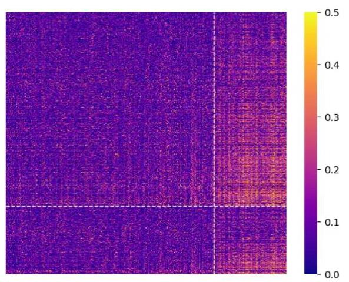
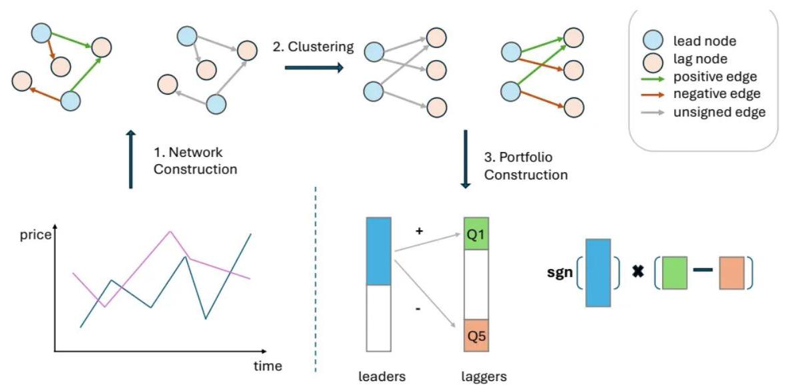

# 基于隔夜与日间的网络关系因子

作者: Yutong Lu、Ning Zhang、Gesine Reinert、Mihai Cucuringu

从个股“拔河”到全市场的“网络拔河”

"拔河效应" (tug of war) 最早由 Lou et al. (2019) 提出，指股票的隔夜收益与日间收益呈现显著负相关:

股票若在隔夜阶段上涨，往往在当日交易时段下跌。研究认为，这反映了两类投资者的冲突:噪声交易者在夜间推动价格偏离，而机构套利者在白天进行修正。

然而，已有文献几乎都停留在单一股票层面。在现实市场中，投资者的交易决策常常是组合化的、板块化的，套利与投机活动可能在多个股票间扩散。那么，这种“拔河”是否也在股票之间发生？是否存在一种“跨股票的网络拔河”现象？

本文正是围绕这一问题展开。作者指出:

“拔河”不仅存在于个股时间序列中，更体现为全市场的网络化行为。

研究目标是:通过构建跨股票的有向相关网络，揭示不同股票之间的Lead-Lag(领先-滞后)关系，并进一步设计基于聚类的投资组合策略，捕捉这种市场层面的动态互动。

研究思路:从网络构建到策略设计的三步框架

作者设计了一个清晰的三步框架，核心思想是一一

隔夜收益预测日间收益，通过网络视角捕捉跨股票信息流动。

收益分解:隔夜 vs. 日间

首先，将每日收益拆分为“隔夜”和“日间”两部分:

$$
\begin{gather} {r}_{i, t}^{cc} = \frac{{P}_{\text{close }, i, t}}{{P}_{\text{close }, i, t - 1}} - 1 \\ {r}_{i, t}^{day} = \frac{{P}_{\text{close }, i, t}}{{P}_{\text{open }, i, t}} - 1,\;{r}_{i, t}^{\text{overnight }} = \frac{1 + {r}_{i, t}^{cc}}{1 + {r}_{i, t}^{day}} - 1 \end{gather}
$$

通过这种分解，作者能够独立观察夜间与日间价格变动对后续市场的影响。

网络构建:跨股票 Lead-Lag 结构

对任意两只股票 $\mathrm{i}\text{、}\mathrm{j}$ ，定义:

$$
{\rho }_{i, j}^{\left( \text{overnight } \rightarrow  \text{ day }\right) } = \operatorname{Corr}\left( {{r}_{i, t}^{\text{overnight }},{r}_{j, t}^{\text{day }}}\right)
$$

这一定义反映股票 i 的隔夜收益是否能预测股票 j 的日间收益。由此形成一个有向加权矩阵 $\mathrm{M}\_ \mathrm{t}$ ，矩阵元素越大，表示“信息传递”越强。矩阵的不对称性自然捕捉了“谁领先、谁跟随”的市场结构。

Figure 1: A lead-lag network.

This figure visualizes the overnight-lead-daytime network on 2001-01-03, with adjacency matrix $\left| {\mathbf{M}}_{{2001} - {01} - {03}}^{\text{overnight-lead-daytime }}\right|$ . Each element represents the absolute value of pairwise correlations between overnight return and the subsequent daytime return. Lighter color indicates higher correlation.

## 聚类与投资组合构建

网络建立后，作者采用定向谱聚类算法 d-LE-SC (directed Likelihood Estimation Spectral Clustering) , 将股票划分为两组:

- Leader 群体:其收益在其他股票之前反应市场信息；

- Lagger 群体:受Leader群体影响而滞后反应。

在此基础上构建交易策略:

1、仅从Leader群体生成信号，避免单股自相关；

2、仅在Lagger群体内交易；

3、若Leader群体平均收益为正，则在Lagger中做多“受Leader正影响”的股票，做空“受Leader负影响” 的股票；反之方向相反。

Figure 2: Pipeline of portfolio construction.

This figure illustrates the procedure for constructing lead-lag strategies, which consists of three main steps. First, we construct the network by calculating similarity matrices of stock returns using a moving window approach. Second, we apply a graph-based clustering algorithm to identify leaders and laggers among stocks. Third, we generate directional signals from the leader group and form long-short portfolios within the laggers group.

核心算法:d-LE-SC 定向谱聚类

为了在复杂的有向网络中识别出"领涨群体 (Leader) "与"滞后群体 (Lagger) ", 作者提出了一种新的聚类算法 —— d-LE-SC (directed Likelihood-Estimation Spectral Clustering) 。

该算法基于有向随机区块模型 (Directed Stochastic Block Model, DSBM), 通过最大化网络中方向性信息流的似然估计来进行聚类。

## 算法动机:为什么不能用传统谱聚类?

在无向网络(例如相关矩阵)中，边的强度反映相似度；但在本文构建的 Lead-Lag 网络中，边是有方向的——从“领先者”指向“跟随者”。若直接用普通谱聚类，只能识别出相关性强的股票群，而无法揭示谁先动、谁后动的关系。因此作者重新定义了衡量聚类好坏的标准，用两个指标刻画网络的方向性特征:净流量 (NF) 与总流量 (TF)。

定义一:净流量 Net Flow (NF)

NF (Net Flow) 衡量两个群体之间的信息“单向性”。

设网络的邻接矩阵为 $A = \left\lbrack  {a}_{ij}\right\rbrack$ ，若节点 $i$ 属于群体 ${C}_{1}$ ，节点 $j$ 属于 ${C}_{2}$ ，则从 ${C}_{1}$ 指向 ${C}_{2}$ 的流量为:

$$
{F}_{1 \rightarrow  2} = \mathop{\sum }\limits_{{i \in  {C}_{1}}}\mathop{\sum }\limits_{{j \in  {C}_{2}}}{a}_{ij}
$$

而反向流量为:

$$
{F}_{2 \rightarrow  1} = \mathop{\sum }\limits_{{i \in  {C}_{2}}}\mathop{\sum }\limits_{{j \in  {C}_{1}}}{a}_{ij}
$$

则净流量定义为:

$$
{NF} = \left| {{F}_{1 \rightarrow  2} - {F}_{2 \rightarrow  1}}\right|
$$

直观理解:

- 若 ${NF}$ 大，说明一方(如 Leader 群体)对另一方(Lagger 群体)具有明显的方向性影响；

- 若 ${NF} \approx  0$ ，则信息流是双向均衡的，难以区分主次。

换句话说，NF 衡量的是“谁带动谁”的强度。

定义二: 总流量 Total Flow (TF)

TF (Total Flow) 则衡量两个群体之间的总体连接程度，即:

$$
{TF} = {F}_{1 \rightarrow  2} + {F}_{2 \rightarrow  1}
$$

它描述两群体之间交互的总体"粘连度"。

在聚类时，若两个群体间的 TF 太小，意味着它们之间几乎没有联系，聚类结构不显著；若 TF 很大， 但 NF 很小，则表明双方互动频繁但无明确方向。

目标函数:联合刻画方向性与连通性

算法希望在聚类结果中同时获得:

1、强方向性 (NF 大) —— 说明一方主导另一方；

2、强连通性 (TF 适中且显著) —— 说明两群体确实存在信息交换，而非噪声。

因此定义总体目标函数:

$$
\mathop{\max }\limits_{{{C}_{\text{lead }},{C}_{\text{lag }}}}\left\lbrack  {\log \left( \frac{1 - \eta }{\eta }\right)  \cdot  {NF} + \log \left( \frac{1}{{4\eta }\left( {1 - \eta }\right) }\right)  \cdot  {TF}}\right\rbrack
$$

其中 $\eta  \in  \left\lbrack  {0,{0.5}}\right\rbrack$ 为噪声参数:

- $\eta  \rightarrow  0$ 时方向性强 (更重视 NF)；

- $\eta  \rightarrow  {0.5}$ 时方向性弱 (更重视 TF)。

通过最大化该似然函数，算法在“方向性”和“连通性”之间找到平衡: 它既要求群体间信息流清晰(高 NF)，又确保群体内部稳定、关联紧密(合理 TF)。

## 谱松弛与求解过程

直接优化上述离散目标函数计算量极大，因此作者使用谱松弛 (spectral relaxation) 方法:

1、将邻接矩阵 A 转换为归一化的有向拉普拉斯矩阵;

2、计算其主特征向量，作为节点的潜在嵌入表示；

3、再用 k-means 对节点嵌入向量聚类，得到最终的 ${C}_{lead}$ 与 ${C}_{lag}$ 。

这种方法兼顾了可解释性与计算效率。

## 算法直观理解

可以把 d-LE-SC 想象为在“信息流网络”中寻找“主导路径”:

NF 决定了箭头方向；

TF 确保这条路径不是偶然的。

最终算法输出的结果，是一组具有显著信息流向的群体划分:

- ${C}_{\text{lead }}$ : 信息输出端 (领涨群体);

- ${C}_{lag}$ : 信息接收端(滞后群体)。

这为后续的投资组合构建(Portfolio Formation)奠定了结构性基础。

投资组合的形成 (Portfolio Formation)

在得到每日的 Lead-Lag 网络与聚类结果后，作者将其转化为可交易的投资组合策略。该部分是整篇论文的逻辑核心——从“网络结构”到“资金操作”的桥梁。

总体框架:信号与执行的分离

传统反转或动量策略往往依赖单只股票的自身收益序列，而本文的关键创新是通过信号与执行分离的机制，只捕捉跨股票的信息效应:

信号来源 (Signal Generation) : 仅从 Leader 群体提取信息;

执行载体 (Execution) : 仅在 Lagger 群体中进行多空交易。这种设计消除了单股自相关的干扰，使策略纯粹依赖群体间的因果结构。

Step 1: 识别 Leader 与 Lagger 群体

在每个交易日 $t$ ，基于60日滚动窗口计算出的 ${M}_{t}$ ，利用 d-LE-SC 聚类将所有股票划分为若干群体。由于 ${M}_{t}$ 既包含方向又包含正负值，算法首先取绝对值: ${A}_{t} = \left| {M}_{t}\right|$ 此矩阵代表领先关系的强度，用作网络的邻

接矩阵。

Step 2: 确定主导簇 (Cluster-Level Lead-Lag)

计算簇间平均信息流强度:

${S}_{a \rightarrow  b}\left( t\right)  = \frac{1}{\left| {C}_{a}\right| \left| {C}_{b}\right| }\mathop{\sum }\limits_{{i \in  {C}_{a}}}\mathop{\sum }\limits_{{j \in  {C}_{b}}}\left( {A}_{t}\right) i, j$ 取最大值对应的簇对:

$\left( {{C}_{\text{lead }},{C}_{\text{lag }}}\right)  = \arg \mathop{\max }\limits_{{a \neq  b}}{S}_{a \rightarrow  b}\left( t\right)$ 其中 ${C}_{\text{lead }}$ 为主导簇， ${C}_{\text{lag }}$ 为受影响簇。

Step 3: 从 Leader 群体提取信号

计算每只股票的“领导力得分” (Lead Score) :

$$
\text{LeadScore}i\left( t\right)  = \mathop{\sum }\limits_{j}\left( {A}_{t}\right) i, j,\;i \in  {C}_{\text{lead }}
$$

选取得分最高的前50%股票形成子集 ${T}_{\text{lead }}$ ，计算其平均收益:

$$
\operatorname{Signal}\left( t\right)  = \frac{1}{\left| {T}_{\text{lead }}\right| }\mathop{\sum }\limits_{{i \in  {T}_{\text{lead }}}}{r}_{i, t}
$$

${Signal}\left( t\right)$ 表示市场在该日的方向性信号:

- 若为正，则暗示隔夜Leader群体的上行动能可能带动滞后股票在日间上涨；

- 若为负，则相反。

Step 4: 在 Lagger 群体中执行多空交易

计算 Lagger 群体中每只股票的受影响程度 (Lag Score) :

LagScore $j\left( t\right)  = \sum {i \in  {C}_{lead}}{\left( {M}_{t}\right) }_{i, j}$ 根据该得分进行排序:

- 若 Signal > 0，则做多 LagScore 前20%，做空后20%；

- 若 Signal $< 0$ ，则方向相反。

最终组合的收益为:

$$
{R}^{\text{port }}t + 1 = \operatorname{sgn}\left( {\operatorname{Signal}\left( t\right) }\right) \left( {\frac{1}{\left| Ttop\right| }\mathop{\sum }\limits_{{j \in  {T}_{top}}}{r}_{j, t + 1}\frac{1}{\left| {T}_{\text{bottom }}\right| }\mathop{\sum }\limits_{{j \in  {T}_{\text{bottom }}}}{r}_{j, t + 1}}\right)
$$

这种设计实现了从信息流方向 $\rightarrow$ 交易信号 $\rightarrow$ 执行策略的完整闭环。

策略直观机制

这一策略可以理解为市场的“信息回声”:

1、部分股票 (Leader) 在夜间率先反应新闻或流动性冲击;

2、这些变化通过行业、主题或资金流影响其他股票;

3、滞后股票(Lagger)在日间逐步体现出价格反应。

策略利用这种时间错位，通过“领导者信号—跟随者交易”结构化地捕捉跨股票的价格传导。

实证结果

## 数据与样本

- 时间范围:2000年1月3日至2024年12月31日；

- 样本:NYSE、AMEX、NASDAQ市值前10%的流动股票(约630只/日)；

- 因子: Fama-French五因子 + 动量因子。

- Table 1 (Baseline portfolio performance) 呈现了主要交易策略 (Overnight-lead-daytime、 Daytime-lead-overnight、Close-to-close 等)的整体表现。结果显示:

Overnight $\rightarrow$ Daytime策略在年化收益率、Sharpe 比及 Calmar 比等指标上均显著优于其他策略， Sharpe 比达到 2.37, Calmar 比为 1.84, 验证了隔夜收益对日间收益的稳定预测力。

Panel A: Overnight-Lead-Daytime

<table><tr><td></td><td>d-LE-SC</td><td>LE-SC</td><td>Herm</td><td>BibSym</td><td>Spectral</td><td>SVD</td></tr><tr><td>Annualized return (%)</td><td>32.11</td><td>30.20</td><td>30.92</td><td>28.08</td><td>21.81</td><td>20.58</td></tr><tr><td>Annualized volatility (%)</td><td>13.55</td><td>13.61</td><td>13.74</td><td>12.58</td><td>12.31</td><td>11.28</td></tr><tr><td>Maximum drawdown (%)</td><td>17.44</td><td>18.26</td><td>17.45</td><td>20.19</td><td>35.36</td><td>21.81</td></tr><tr><td>Hit Rate (%)</td><td>57.58</td><td>57.01</td><td>56.83</td><td>56.29</td><td>54.97</td><td>56.12</td></tr><tr><td>Sharpe ratio</td><td>2.37</td><td>2.22</td><td>2.25</td><td>2.23</td><td>1.77</td><td>1.82</td></tr><tr><td>Calmar ratio</td><td>1.84</td><td>1.65</td><td>1.77</td><td>1.39</td><td>0.62</td><td>0.94</td></tr></table>

Panel B: Daytime-Lead-Overnight

<table><tr><td></td><td>d-LE-SC</td><td>LE-SC</td><td>Herm</td><td>BibSym</td><td>Spectral</td><td>SVD</td></tr><tr><td>Annualized return (%)</td><td>15.79</td><td>12.13</td><td>14.54</td><td>10.94</td><td>10.65</td><td>10.54</td></tr><tr><td>Annualized volatility (%)</td><td>7.55</td><td>6.59</td><td>7.42</td><td>6.51</td><td>5.91</td><td>6.05</td></tr><tr><td>Maximum drawdown (%)</td><td>11.12</td><td>15.18</td><td>14.51</td><td>13.43</td><td>13.93</td><td>10.62</td></tr><tr><td>Hit Rate (%)</td><td>55.67</td><td>55.51</td><td>54.95</td><td>54.95</td><td>55.11</td><td>55.16</td></tr><tr><td>Sharpe ratio</td><td>2.09</td><td>1.84</td><td>1.96</td><td>1.68</td><td>1.80</td><td>1.74</td></tr><tr><td>Calmar ratio</td><td>1.42</td><td>0.80</td><td>1.00</td><td>0.81</td><td>0.76</td><td>0.99</td></tr></table>

Panel C: CL-lead-CL

<table><tr><td></td><td>d-LE-SC</td><td>LE-SC</td><td>Herm</td><td>BibSym</td><td>Spectral</td><td>SVD</td></tr><tr><td>Annualized return (%)</td><td>23.35</td><td>24.69</td><td>20.95</td><td>20.32</td><td>20.41</td><td>18.06</td></tr><tr><td>Annualized volatility (%)</td><td>15.00</td><td>15.05</td><td>14.23</td><td>13.16</td><td>14.32</td><td>12.54</td></tr><tr><td>Maximum drawdown (%)</td><td>53.97</td><td>26.22</td><td>43.83</td><td>29.05</td><td>24.50</td><td>36.41</td></tr><tr><td>Hit Rate (%)</td><td>53.85</td><td>54.35</td><td>53.63</td><td>54.05</td><td>53.38</td><td>53.92</td></tr><tr><td>Sharpe ratio</td><td>1.56</td><td>1.64</td><td>1.47</td><td>1.54</td><td>1.43</td><td>1.44</td></tr><tr><td>Calmar ratio</td><td>0.43</td><td>0.94</td><td colspan="4">0.48</td></tr></table>

- Table 2 (Alpha regression with risk factors) 报告了在 CAPM、Fama-French 三因子及五因子框架下的回归结果。Overnight $\rightarrow$ Daytime 策略在所有模型中均保持显著正 $\alpha$ (年化约 12%),表明策略产生的超额收益并非传统因子风险的补偿。

Panel A: Portfolio Performance

<table><tr><td></td><td>Overnight-lead-daytime</td><td>Daytime-lead-overnight</td><td>CL-lead-CL</td></tr><tr><td>Annualized return (%)</td><td>32.11</td><td>15.79</td><td>23.35</td></tr><tr><td>volatility (%)</td><td>13.55</td><td>7.55</td><td>15.00</td></tr><tr><td>Max drawdown (%)</td><td>17.44</td><td>11.12</td><td>53.97</td></tr><tr><td>Hit rate (%)</td><td>57.58</td><td>55.67</td><td>53.85</td></tr><tr><td>Sharpe ratio</td><td>2.37</td><td>2.09</td><td>1.56</td></tr><tr><td>Calmar ratio</td><td>1.84</td><td>1.42</td><td>0.43</td></tr></table>

Panel B: Portfolio Alpha

<table><tr><td></td><td>Overnight-lead-daytime</td><td>Daytime-lead-overnight</td><td>CL-lead-CL</td></tr><tr><td rowspan="2">CAPM</td><td>12.00***</td><td>${5.59}^{* *  * }$</td><td>8.56***</td></tr><tr><td>(11.14)</td><td>(9.31)</td><td>(7.17)</td></tr><tr><td rowspan="2">FF3</td><td>12.03***</td><td>${5.58}^{* *  * }$</td><td>8.51***</td></tr><tr><td>(11.17)</td><td>(9.29)</td><td>(7.14)</td></tr><tr><td rowspan="2">FF3 + MOM</td><td>12.05***</td><td>${5.64}^{* *  * }$</td><td>${8.57}^{* *  * }$</td></tr><tr><td>(11.18)</td><td>(9.39)</td><td>(7.19)</td></tr><tr><td rowspan="2">FF5</td><td>11.97***</td><td>${5.72}^{* *  * }$</td><td>${8.29}^{* *  * }$</td></tr><tr><td>(11.10)</td><td>(9.53)</td><td>(6.94)</td></tr><tr><td>FF5 + MOM</td><td>11.99***   (11.11)</td><td colspan="2">5.74*** 8.33***</td></tr></table>

- Table 3 (Cross-stock vs firm-level portfolios) 比较了跨股票与个股层面策略的收益。结果显示，跨股票策略在控制个股反转因子后仍获得显著 $\alpha$ ，说明该收益源自股票之间的交互，而非个股自相关效应。

Table 3: Cross-stock vs firm-level portfolios.

This table documents the abnormal returns $\left( \alpha \right)$ and exposure of cross-stock lead-lag long-short portfolios with respect to firm-level reversal factors. For each cross-stock lead-lag portfolio, we run time series regressions on portfolio access returns against the firm-level portfolios. The superscripts ** and *** indicate statistical significance at $5\%$ and 1%, and the corresponding t-values are reported in the parentheses.

<table><tr><td></td><td>$\alpha$</td><td>daytime-to-overnight</td><td>overnight-to-daytime</td></tr><tr><td>Overnight-lead-daytime</td><td>0.1271*** (11.6053)</td><td></td><td>-0.0462***   (-3.7324)</td></tr><tr><td>Overnight-lead-daytime</td><td>0.0549***   (9.0409)</td><td>0.0227**   (2.5037)</td><td></td></tr><tr><td>CL-lead-CL</td><td>0.0767***   (6.2617)</td><td>-0.0036   (-0.1999)</td><td>0.0445***   (3.2424)</td></tr></table>

- Table 4 (Yearly Sharpe ratios of portfolios) 展示了 2000-2024 年间各策略的年度 Sharpe 比变化。2000 年代初个股层面反转策略 (Overnight-to-daytime、Daytime-to-overnight) 表现强劲，但在 2010 年后逐渐衰退；相比之下，跨股票策略的表现更稳定，尤其是 Overnight $\rightarrow$ Daytime 策略在 2020 年后收益显著上升。

Table 4: Yearly Sharpe ratios of portfolios.

This table displays the Sharpe ratios of five portfolios on a yearly basis from 2000 to 2024. The first three columns represent cross-stock lead-lag portfolios traded during daytime, overnight, and close-to-close. The last two columns correspond to stock-specific portfolios that trade the reversals of overnight and daytime returns (and vice versa). Each year, the highest Sharpe ratio across the five portfolios is highlighted.

<table><tr><td>Year</td><td>Overnight-lead-daytime</td><td>Daytime-lead-overnight</td><td>CL-lead-CL</td><td>Overnight-to-daytime</td><td>Daytime-to-overnight</td></tr><tr><td>2000</td><td>2.23</td><td>4.65</td><td>5.30</td><td>3.83</td><td>5.97</td></tr><tr><td>2001</td><td>1.80</td><td>2.64</td><td>1.79</td><td>5.91</td><td>5.44</td></tr><tr><td>2002</td><td>5.20</td><td>2.60</td><td>4.01</td><td>8.29</td><td>4.39</td></tr><tr><td>2003</td><td>5.46</td><td>1.92</td><td>3.85</td><td>4.58</td><td>5.69</td></tr><tr><td>2004</td><td>3.03</td><td>3.11</td><td>1.52</td><td>6.18</td><td>7.78</td></tr><tr><td>2005</td><td>2.45</td><td>1.45</td><td>1.48</td><td>3.45</td><td>11.13</td></tr><tr><td>2006</td><td>2.59</td><td>1.73</td><td>1.13</td><td>5.13</td><td>6.55</td></tr><tr><td>2007</td><td>3.29</td><td>3.26</td><td>3.72</td><td>1.97</td><td>3.22</td></tr><tr><td>2008</td><td>4.23</td><td>3.90</td><td>3.33</td><td>3.96</td><td>2.41</td></tr><tr><td>2009</td><td>4.33</td><td>3.13</td><td>3.96</td><td>3.98</td><td>6.18</td></tr><tr><td>2010</td><td>4.64</td><td>2.75</td><td>0.67</td><td>3.98</td><td>5.78</td></tr><tr><td>2011</td><td>3.31</td><td>4.01</td><td>2.22</td><td>3.34</td><td>3.38</td></tr><tr><td>2012</td><td>2.65</td><td>2.32</td><td>1.66</td><td>1.66</td><td>3.50</td></tr><tr><td>2013</td><td>2.06</td><td>2.89</td><td>1.39</td><td>0.43</td><td>0.78</td></tr><tr><td>2014</td><td>0.08</td><td>0.55</td><td>2.02</td><td>1.92</td><td>0.45</td></tr><tr><td>2015</td><td>1.86</td><td>0.80</td><td>-1.27</td><td>0.21</td><td>0.35</td></tr><tr><td>2016</td><td>1.85</td><td>1.96</td><td>-0.51</td><td>1.76</td><td>1.27</td></tr><tr><td>2017</td><td>0.13</td><td>0.53</td><td>1.17</td><td>2.08</td><td>0.54</td></tr><tr><td>2018</td><td>3.75</td><td>-0.09</td><td>-0.18</td><td>2.11</td><td>0.48</td></tr><tr><td>2019</td><td>3.22</td><td>-1.52</td><td>-1.16</td><td>2.23</td><td>1.41</td></tr><tr><td>2020</td><td>2.24</td><td>3.64</td><td>0.13</td><td>1.01</td><td>0.88</td></tr><tr><td>2021</td><td>0.59</td><td>2.31</td><td>-0.91</td><td>1.70</td><td>-0.01</td></tr><tr><td>2022</td><td>1.19</td><td>1.20</td><td>-0.13</td><td>0.85</td><td>0.90</td></tr><tr><td>2023</td><td>1.86</td><td>1.91</td><td>0.14</td><td></td><td></td></tr><tr><td>2024</td><td>1.81</td><td>0.72</td><td>-0.27</td><td></td><td>-0.06</td></tr></table>

- Table 5 (Performance of open-close rebalanced strategy) 验证了策略的可交易性。在假设单边交易成本 3.5 个基点的情况下，策略仍保持 16.77% 年化收益和1.05的夏普，平均换手率 3.53, 说明策略在实际操作中具备可行性。

Table 5: Performance of open-close rebalanced strategy.

The table shows the performance of the strategy twice per day, at both market open and close, backtested from 2000-01-03 to 2024-12-31. Column names indicate the evaluation metrics.

<table><tr><td colspan="7">Annualized return (%) ized volatility (%) Maximum drawdown (%) Hit Rate (%) Sharpe ratio / Calmar ratio - Average turnover</td></tr><tr><td>47.91</td><td>15.96</td><td>17.16</td><td></td><td></td><td></td><td>3.53</td></tr></table>

- Table 6 (Performance under Pearson vs Spearman correlation) 比较了不同相关性度量下的表现。结果显示，使用 Spearman 相关时，策略表现略有提升，暗示跨股票 Lead-Lag 关系中存在非线性结构。

Panel A: Overnight-lead-daytime

<table><tr><td></td><td>Pearson</td><td>Spearman</td></tr><tr><td>Annualized return (%)</td><td>32.11</td><td>29.59</td></tr><tr><td>Annualized volatility (%)</td><td>13.55</td><td>12.87</td></tr><tr><td>Maximum drawdown (%)</td><td>17.44</td><td>17.84</td></tr><tr><td>Hit rate (%)</td><td>57.58</td><td>57.29</td></tr><tr><td>Sharpe ratio</td><td>2.37</td><td>2.30</td></tr><tr><td>Calmar ratio</td><td>1.84</td><td>1.66</td></tr></table>

Panel B: Daytime-lead-overnight

<table><tr><td></td><td>Pearson</td><td>Spearman</td></tr><tr><td>Annualized return (%)</td><td>15.79</td><td>22.56</td></tr><tr><td>Annualized volatility (%)</td><td>7.55</td><td>8.25</td></tr><tr><td>Maximum drawdown (%)</td><td>11.12</td><td>6.62</td></tr><tr><td>Hit rate (%)</td><td>55.67</td><td>57.76</td></tr><tr><td>Sharpe ratio</td><td>2.09</td><td>2.73</td></tr><tr><td>Calmar ratio</td><td></td><td>1.42众号·量化投资与机器学3.41</td></tr></table>