股票网络与网络中心度因子研究

曹春晓 SAC NO:S1120520070003

杨国平 SAC NO: S1120520070002

2021年3月14日

请仔细阅读在本报告尾部的重要法律声明

## 目录

1. 基于Pearson相关系数构建股票连接网络

2. 股票网络中心度选股因子构建及测试

3. 风险提示

### 1.1 上市公司彼此之间相互关联共同构成复杂股票网络

上市公司之间由于宏观、中观、微观因素的相互影响，共同构成了股票市场网络，股票网络体现了上市公司经济活动产生的相互依存和相互影响关系。

$>$ 同行业的上市公司，由于受到宏观经济周期、行业景气周期的波动影响，存在着一定的同向性趋势;

> 同行业的上市公司又因为彼此竞争与互补关系，存在一定的互斥趋势；

产业链上下游的上市公司，企业经营业绩之间存在相互影响；

企业的投资、融资活动，并购及担保行为，也使得不同上市公司之间存在关联关系；

二级市场中投资者的持有、买卖行为使得不同股票之间也存在着交易性关联。

### 1.2 股票网络示例

图1: 产业链、投融资、行业等视角构成的股票网络关系

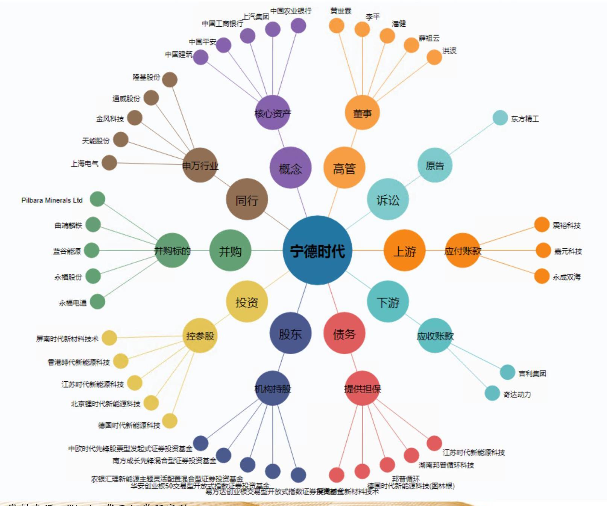

资料来源:Wind，华西证券研究所

### 1.3 基于Pearson相关系数构建股票连接网络

股票市场中不同股票之间存在互相影响, 每只股票的价格波动并非单一的受自身的基本面影响，同时也受到其他股票价格波动的影响。如果将股票市场看作一个复杂网络 ，那么不同股票可以视为网络中的节点，两只股票价格波动之间的相关性便是两者之间的连边。

本文中我们使用Pearson相关系数来衡量股票之间价格波动的相关性，进而构建股票连接网络。对于给定股票i和j,令 ${\rho }_{{ij}, t}\left( {\Delta t}\right)$ 表示两只股票的Pearson相关系数，

$$
{\rho }_{{ij}, t}\left( {\Delta t}\right)  = \frac{\operatorname{cov}\left( {{r}_{j},{r}_{j}}\right) }{\sqrt{\operatorname{Var}\left( {r}_{i}\right)  * \operatorname{Var}\left( {r}_{j}\right) }}
$$

将 $t$ 时刻整个样本空间内N只股票的相关系数构成邻接矩阵 ${W}_{t}\left( {\Delta t}\right)  = {\left\{  {\rho }_{{ij}, t}\left( \Delta t\right) \right\}  }_{N * N}$ 。

在此基础之上, 我们计算不同节点之间的距离

$$
{d}_{{ij}, t}\left( {\Delta t}\right)  = \sqrt{2 * \left( {1 - {\rho }_{{ij}, t}\left( {\Delta t}\right) }\right) }
$$

并得到距离矩阵 ${D}_{t}\left( {\Delta t}\right)  = {\left\{  {d}_{{ij}, t}\left( \Delta t\right) \right\}  }_{N * N}$ 。

> ${d}_{{ij}, t}\left( {\Delta t}\right)$ 与 ${\rho }_{{ij}, t}\left( {\Delta t}\right)$ 负相关，邻接矩阵 ${W}_{t}\left( {\Delta t}\right)$ 和距离矩阵 ${D}_{t}\left( {\Delta t}\right)$ 以不同的方式刻画了股票网络连接，将样本空间内的股票联系起来形成了一个全连接的无向加权网络。

### 1.4 基于平面最大过滤图(PMFG)简化网络

全连接网络显示了股票网络中所有节点的相关关系，但实际中有些节点相关性可能比较弱，存在较多的噪音和次要信息，我们可以通过最小生成树(MST)或平面最大过滤图 (PMFG) 等方法进行简化网络。

> 平面最大过滤图与最小生成树类似，要求连接网络为平面图，不同之处在于PMFG中可以形成闭环，可以最大限度的保留代表关键信息的子网络，并且可以将网络中关键节点信息勾勒出来。

图2:上证50指数股票网络平面最大过滤图(PMFG)

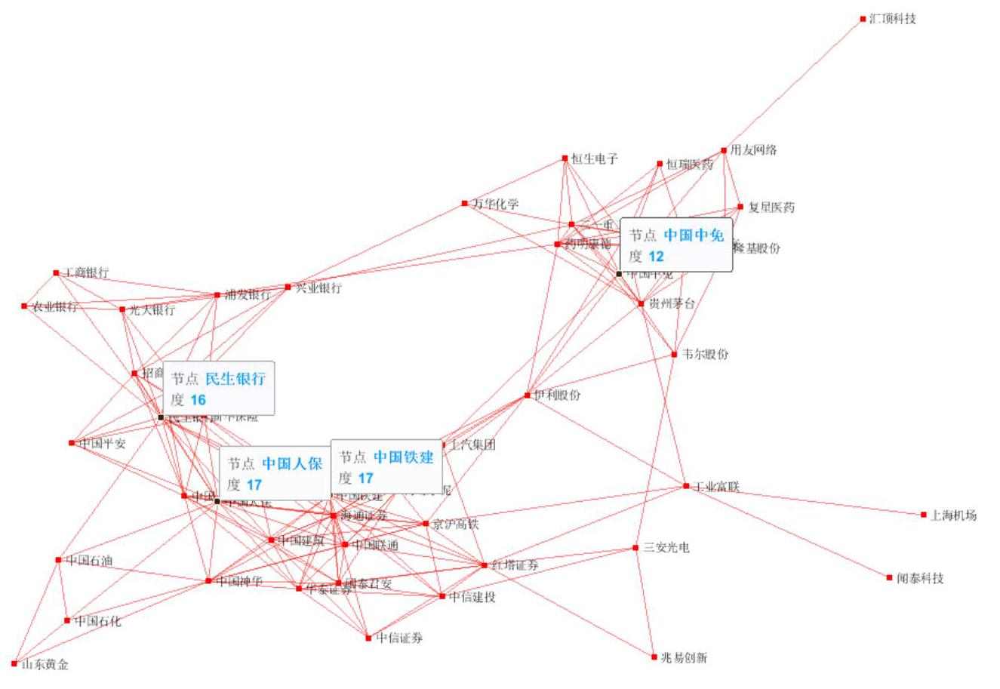

资料来源:Wind，华西证券研究所，截至2021年2月26日

### 1.5 PMFG可以显示出股票网络中的关键节点

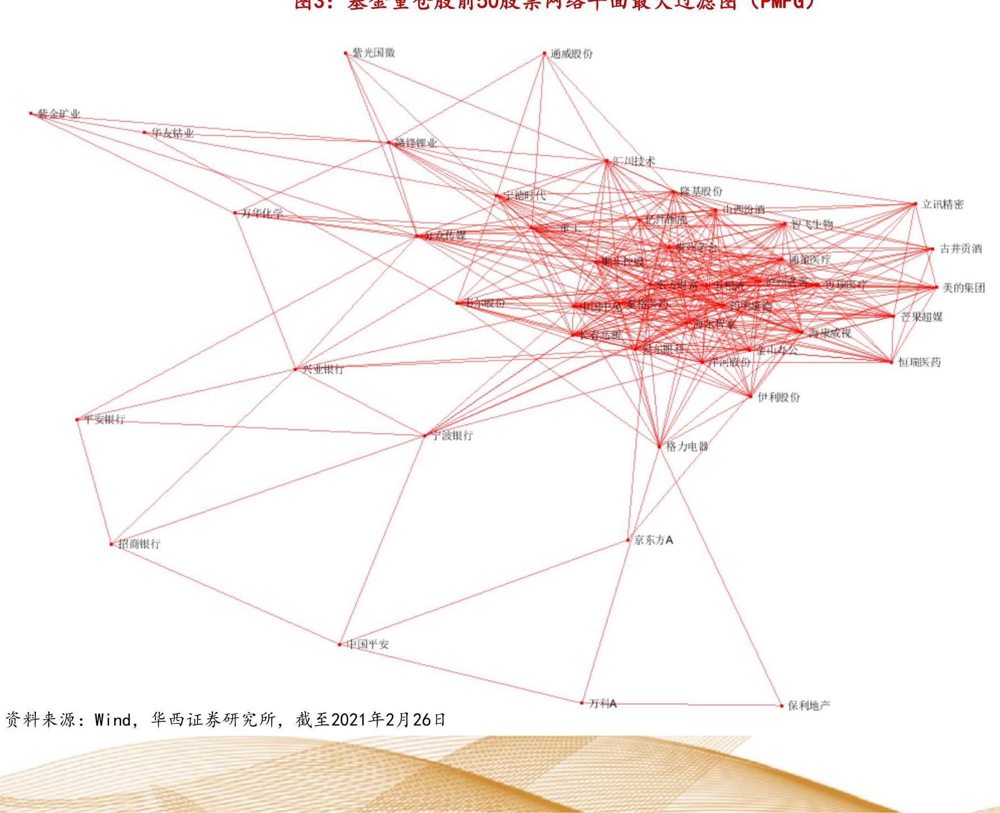

图3:基金重仓股前50股票网络平面最大过滤图(PMFG)

## 目录

1. 基于Pearson相关系数构建股票连接网络

2. 股票网络中心度选股因子构建及测试

3. 风险提示

### 2.1 基于网络视角的股票风险刻画:空间网络中心度因子

> 网络分析方法在金融领域中广泛用于分析系统性风险和描述金融体系稳定性，张自力等(2020)基于网络分析视角，利用股票回报的相关系数构建股票网络，描述股票市场的拓扑结构和系统性风险的传播路径。

> 本文中我们参考上述方法，基于股票平均相关系数来构建股票网络。计算股票i和股票市场组合中其他股票的平均Pearson相关系数:

$$
{\bar{p}}_{i, t} = \frac{1}{N - 1}\mathop{\sum }\limits_{{j = 1, j \neq  i}}^{{N - 1}}\operatorname{cov}\left( {{r}_{i, t},{r}_{j, t}}\right)
$$

由此, 根据前述股票距离的定义, 我们定义股票i和其他股票的平均距离为

$$
{\bar{d}}_{i, t} = \sqrt{2 * \left( {1 - {\bar{p}}_{i, t}}\right) }
$$

- ${\bar{d}}_{i, t}$ 反映了该股票与其他股票的平均距离，该值越小，说明t时刻股票与其他股票的距离越近, 与其他股票互相影响程度越高, 处在网络的相对中心位置。

我们定义空间网络相对中心度(SCC):

$$
{SCC}_{i, t} = \frac{1}{{\bar{d}}_{i, t}^{2}{}^{2}}
$$

2.2 基于网络视角的股票风险刻画: 时间网络中心度因子

，除空间网络中心度外，时间维度，定义股票i在t时刻相对于股票市场的平均收益的偏离程度

$$
{z}_{i, t} = \frac{{r}_{i, t} - {\bar{r}}_{m, t}}{{\sigma }_{m, t}}
$$

其中， ${\sigma }_{m, t}$ 表示t时刻全市场股票组合收益率的标准差， ${z}_{i, t}$ 越大说明股票i的收益与其他股票平均收益的偏离越大，从而相关性越不稳定，随时间的推移在网络中的位置变化越大。在t时刻考虑过去 ${\Delta t}$ 时间范围内的平均偏离程度

$$
{\bar{z}}_{i, t} = \sqrt{\frac{1}{\Delta t}\mathop{\sum }\limits_{{\tau  = 1}}^{{\Delta t}}{z}_{i, t - \tau }{}^{2}}
$$

${\bar{z}}_{i, t}$ 表示过去时间段内股票i对其他股票收益的平均偏离程度, ${\bar{z}}_{i, t}$ 越大,表示与网络中其他股票的偏离越大，位置越不稳定，因此我们定义时间维度的网络相对中心度( TCC)

$$
{TCC}_{i, t} = \frac{1}{{\bar{z}}_{i, t}^{2}{}^{2}}
$$

综合空间网络中心度和时间网络中心度，我们将SCC与TCC按照1:1合成，构建股票网络中心度指标:

$$
C{C}_{i, t} = {SC}{C}_{i, t} * {0.5} + {TC}{C}_{i, t} * {0.5}
$$

### 2.3 全部A股中SCC因子表现出色，多空组合年化收益达26.80%

我们选择最近一个月交易数据来计算股票空间网络中心度因子、时间网络中心度因子以及合成的股票网络中心度因子, 并测试其在截面上的选股能力。

空间网络中心度因子SCC表现出色，单调性较好，多空组合年化收益率达26.80%，信息比高达4.64，最大回撤1.79%，因子加权组合年化收益8.88%，信息比3.89。

全部A股空间中，SCC因子历史IC均值8.30%，年化IC_IR为3.97。

图4: 空间网络中心度因子分组单调性较好

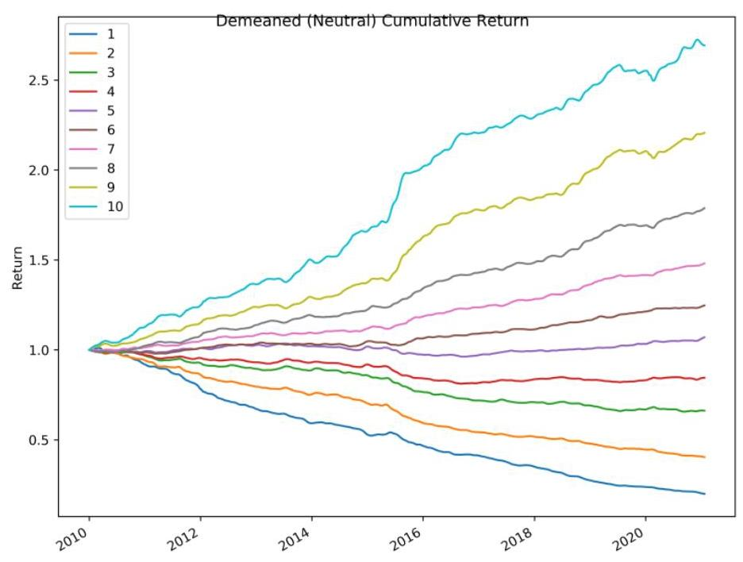

资料来源:Wind，华西证券研究所

表1:全部A股中空间网络中心度因子分组及多空表现

<table><tr><td>组别</td><td>年化收益率</td><td>年化波动率</td><td>累积收益率</td><td>信息比</td><td>最大回撤</td></tr><tr><td>第一组</td><td>-6.00%</td><td>26.98%</td><td>-48.60%</td><td>-0.22</td><td>-73.93%</td></tr><tr><td>第二组</td><td>0.58%</td><td>25.84%</td><td>6.40%</td><td>0.02</td><td>-63.34%</td></tr><tr><td>第三组</td><td>5.32%</td><td>25.59%</td><td>74.66%</td><td>0.21</td><td>-57.27%</td></tr><tr><td>第四组</td><td>7.69%</td><td>25.68%</td><td>121.73%</td><td>0.30</td><td>-52.62%</td></tr><tr><td>第五组</td><td>10.04%</td><td>25.66%</td><td>179.87%</td><td>0.39</td><td>-49.41%</td></tr><tr><td>第六组</td><td>11.55%</td><td>25.83%</td><td>224.01%</td><td>0.45</td><td>-43.55%</td></tr><tr><td>第七组</td><td>13.29%</td><td>25.95%</td><td>282.71%</td><td>0.51</td><td>-40.08%</td></tr><tr><td>第八组</td><td>15.23%</td><td>26.13%</td><td>359.32%</td><td>0.58</td><td>-36.86%</td></tr><tr><td>第九组</td><td>17.50%</td><td>26.14%</td><td>466.53%</td><td>0.67</td><td>-36.11%</td></tr><tr><td>第十组</td><td>19.64%</td><td>26.36%</td><td>587.59%</td><td>0.75</td><td>-36.44%</td></tr><tr><td>因子加权组合</td><td>8.88%</td><td>2.28%</td><td>149.53%</td><td>3.89</td><td>-0.86%</td></tr><tr><td>多空组合</td><td>26.80%</td><td>5.78%</td><td>1184.66%</td><td>4.64</td><td>-1.79%</td></tr></table>

资料来源:Wind，华西证券研究所

### 2.4 TCC表现同样较好，历史IC均值9.05%

时间网络中心度因子TCC表现也较好，多空组合年化收益率22.10%，信息比2.86%，最大回撤15.02%，因子加权组合年化收益6.54%，信息比2.19。

全部A股空间中，TCC因子历史IC均值9.05%，年化IC_IR为3.55。

图5:时间网络中心度因子分组单调性较好

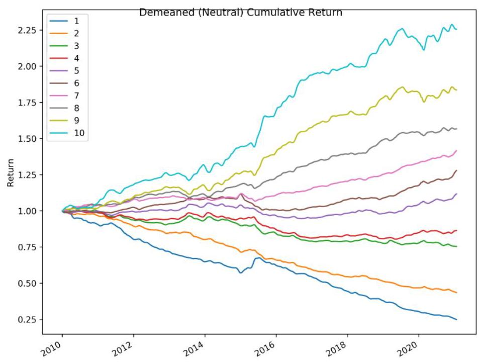

资料来源:Wind，华西证券研究所

表2:全部 $A$ 股中时间网络中心度因子分组及多空表现

<table><tr><td>组别</td><td>年化收益率</td><td>年化波动率</td><td>累积收益率</td><td>信息比</td><td>最大回撤</td></tr><tr><td>第一组</td><td>-4.34%</td><td>28.31%</td><td>-37.93%</td><td>-0.15</td><td>-72.30%</td></tr><tr><td>第二组</td><td>0.93%</td><td>27.36%</td><td>10.41%</td><td>0.03</td><td>-63.79%</td></tr><tr><td>第三组</td><td>6.27%</td><td>26.96%</td><td>92.34%</td><td>0.23</td><td>-56.27%</td></tr><tr><td>第四组</td><td>7.78%</td><td>26.40%</td><td>123.90%</td><td>0.29</td><td>-56.50%</td></tr><tr><td>第五组</td><td>10.43%</td><td>26.12%</td><td>190.71%</td><td>0.40</td><td>-50.84%</td></tr><tr><td>第六组</td><td>11.98%</td><td>25.55%</td><td>237.49%</td><td>0.47</td><td>-46.93%</td></tr><tr><td>第七组</td><td>13.11%</td><td>25.19%</td><td>276.12%</td><td>0.52</td><td>-41.27%</td></tr><tr><td>第八组</td><td>14.16%</td><td>25.28%</td><td>315.35%</td><td>0.56</td><td>-36.44%</td></tr><tr><td>第九组</td><td>15.94%</td><td>25.05%</td><td>390.55%</td><td>0.64</td><td>-34.93%</td></tr><tr><td>第十组</td><td>18.24%</td><td>24.94%</td><td>506.00%</td><td>0.73</td><td>-35.89%</td></tr><tr><td>因子加权组合</td><td>6.54%</td><td>2.98%</td><td>97.71%</td><td>2.19</td><td>-3.31%</td></tr><tr><td>多空组合</td><td>22.10%</td><td>7.74%</td><td>755.96%</td><td>2.86</td><td>-15.02%</td></tr></table>

资料来源:Wind，华西证券研究所

### 2.5 合成后的股票网络中心度因子表现出色，年化IC_IR为4.19

由SCC、TCC合成得到的股票网络中心度因子CC，各分组单调性理想，多空组合年化收益率24.86%，信息比3.62，最大回撤7.95%，因子加权组合年化收益8.18%，信息比 3.13 。

全部A股空间中，CC因子历史IC均值9.21%，年化IC_IR为4.19。

图6: 合成股票网络中心度因子分组单调性较好

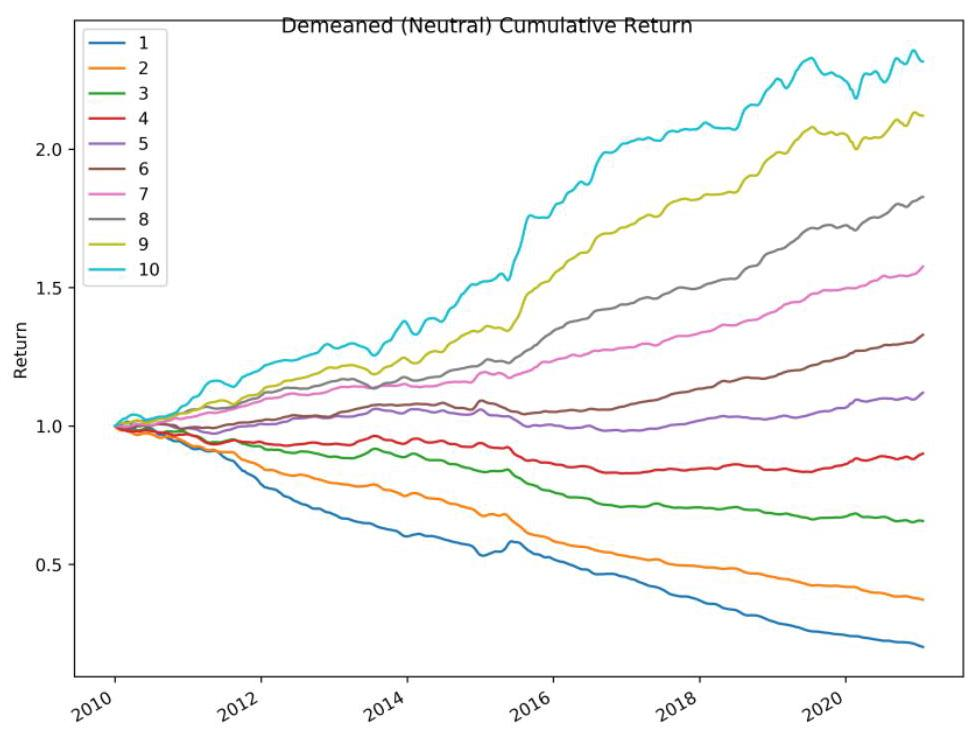

资料来源:Wind，华西证券研究所

表3:全部A股中合成CC因子分组及多空表现

<table><tr><td>组别</td><td>年化收益率</td><td>年化波动率</td><td>累积收益率</td><td>信息比</td><td>最大回撤</td></tr><tr><td>第一组</td><td>-6.00%</td><td>27.57%</td><td>-48.60%</td><td>-0.22</td><td>-74.15%</td></tr><tr><td>第二组</td><td>-0.30%</td><td>26.55%</td><td>-3.22%</td><td>-0.01</td><td>-64.86%</td></tr><tr><td>第三组</td><td>5.15%</td><td>26.15%</td><td>71.57%</td><td>0.20</td><td>-57.94%</td></tr><tr><td>第四组</td><td>8.29%</td><td>25.97%</td><td>135.54%</td><td>0.32</td><td>-53.07%</td></tr><tr><td>第五组</td><td>10.51%</td><td>25.89%</td><td>192.85%</td><td>0.41</td><td>-50.06%</td></tr><tr><td>第六组</td><td>12.29%</td><td>25.79%</td><td>247.63%</td><td>0.48</td><td>-43.98%</td></tr><tr><td>第七组</td><td>13.99%</td><td>26.02%</td><td>308.61%</td><td>0.54</td><td>-40.76%</td></tr><tr><td>第八组</td><td>15.61%</td><td>25.84%</td><td>375.64%</td><td>0.60</td><td>-35.43%</td></tr><tr><td>第九组</td><td>17.31%</td><td>25.58%</td><td>456.49%</td><td>0.68</td><td>-34.29%</td></tr><tr><td>第十组</td><td>18.41%</td><td>25.32%</td><td>515.40%</td><td>0.73</td><td>-36.55%</td></tr><tr><td>因子加权组合</td><td>8.18%</td><td>2.61%</td><td>132.89%</td><td>3.13</td><td>-2.05%</td></tr><tr><td>多空组合</td><td>24.86%</td><td>6.87%</td><td>988.38%</td><td>3.62</td><td>-7.95%</td></tr></table>

资料来源:Wind，华西证券研究所

### 2.6 网络中心度因子在不同样本空间下均表现较好

> SCC、TCC、CC三个因子在不同样本空间下均有较好的表现，其中合成因子CC在沪深300 、中证500、中证1000以及全市场IC_IR均较单个因子有一定程度提升。

表4:不同样本空间下股票网络中心度因子表现

<table><tr><td>因子</td><td>域</td><td>IC</td><td>IC_IR</td><td>多空组合年化收益率</td><td>多空组合年化波动率</td><td>多空组合信息比率</td><td>多空组合最大回撤</td></tr><tr><td rowspan="4">SCC</td><td>沪深300</td><td>3.38%</td><td>1.25</td><td>10.33%</td><td>7.53%</td><td>1.37</td><td>-6.70%</td></tr><tr><td>中证500</td><td>6.46%</td><td>2.95</td><td>20.11%</td><td>6.36%</td><td>3.16</td><td>-4.30%</td></tr><tr><td>中证1000</td><td>8.23%</td><td>3.87</td><td>29.20%</td><td>6.43%</td><td>4.54</td><td>-3.15%</td></tr><tr><td>全市场</td><td>8.30%</td><td>3.97</td><td>26.80%</td><td>5.78%</td><td>4.64</td><td>-1.79%</td></tr><tr><td rowspan="4">TCC</td><td>沪深300</td><td>4.47%</td><td>1.62</td><td>8.56%</td><td>7.49%</td><td>1.14</td><td>-13.77%</td></tr><tr><td>中证500</td><td>6.62%</td><td>2.75</td><td>15.44%</td><td>6.67%</td><td>2.32</td><td>-4.57%</td></tr><tr><td>中证1000</td><td>9.10%</td><td>3.51</td><td>21.04%</td><td>9.04%</td><td>2.33</td><td>-15.57%</td></tr><tr><td>全市场</td><td>9.05%</td><td>3.55</td><td>22.10%</td><td>7.74%</td><td>2.86</td><td>-15.02%</td></tr><tr><td rowspan="4">CC</td><td>沪深300</td><td>4.31%</td><td>1.65</td><td>9.75%</td><td>7.81%</td><td>1.25</td><td>-11.30%</td></tr><tr><td>中证500</td><td>7.04%</td><td>3.21</td><td>18.15%</td><td>6.38%</td><td>2.84</td><td>-4.13%</td></tr><tr><td>中证1000</td><td>9.25%</td><td>4.24</td><td>26.99%</td><td>8.13%</td><td>3.32</td><td>-11.37%</td></tr><tr><td>全市场</td><td>9.21%</td><td>4.19</td><td>24.86%</td><td>6.87%</td><td>3.62</td><td>-7.95%</td></tr></table>

资料来源:Wind，华西证券研究所

### 2.7 网络中心度因子与波动率、流动性等因子存在一定相关性

图7: CC因子与主要风格因子相关系数

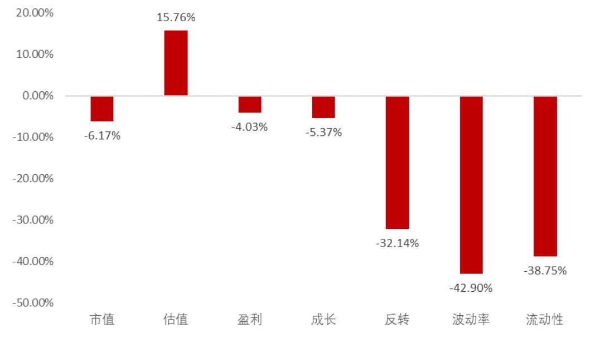

网络中心度因子与市场相关因子之间存在一定相关性，其中，与波动率、流动性、反转因子相关性较高。

具体来看, SCC因子与反转因子相关性最高，而TCC因子则与波动率、流动性因子相关性最明显。

图8: SCG因子与主要风格因子相关系数

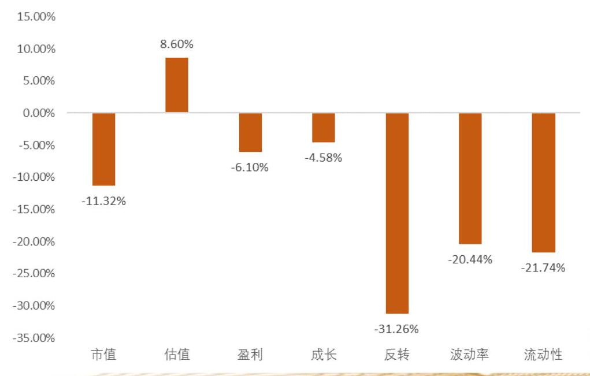

资料来源:Wind，华西证券研究所

图9:TCC因子与主要风格因子相关系数

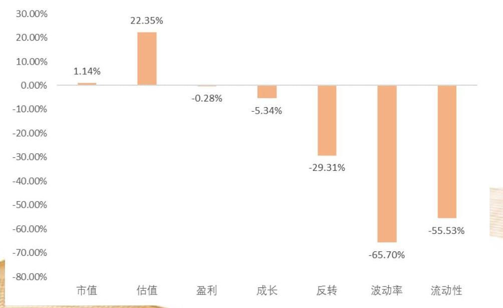

资料来源:Wind，华西证券研究所

### 2.8 正交化处理后空间网络中心度因子仍然表现较强

图10:正交化后CC因子分组表现

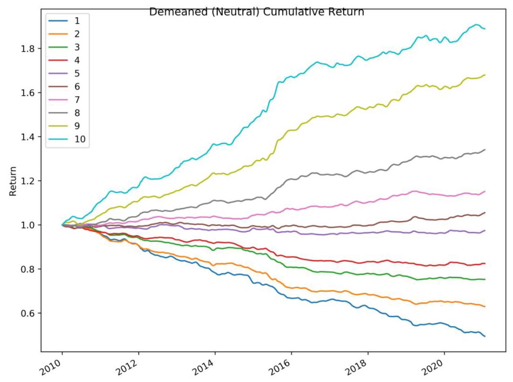

我们对股票网络中心度因子进行正交化处理，剥离市值、行业、反转 、波动率、流动性因子影响后，再进行因子测试。

从测试结果来看, 空间网络中心度因子在剥离相关性因子后仍表现出出色的选股能力，IC均值4.02%，年化IC_IR 2.27。而时间网络中心度因子在剥离动量、波动率、流动性影响后，选股能力下降较为明显。

表5:正交化后网络中心度因子表现仍较好

<table><tr><td>因子</td><td>IC</td><td>IC_IR</td><td>多空组合年化收益率</td><td>多空组合年化波动率</td><td>多空组合信息比率</td><td>多空组合最大回撤</td></tr><tr><td>SCC</td><td>4.02%</td><td>2.27</td><td>13.05%</td><td>4.73%</td><td>2.76</td><td>-3.51%</td></tr><tr><td>TCC</td><td>1.22%</td><td>0.87</td><td>5.81%</td><td>4.08%</td><td>1.42</td><td>-5.58%</td></tr><tr><td>CC</td><td>3.07%</td><td>1.88</td><td>10.36%</td><td>4.60%</td><td>2.25</td><td>-5.34%</td></tr></table>

资料来源:Wind，华西证券研究所

### 2.9 正交化后空间网络中心度因子在不同样本空间下均有效

图11:正交化后SCC因子分组表现

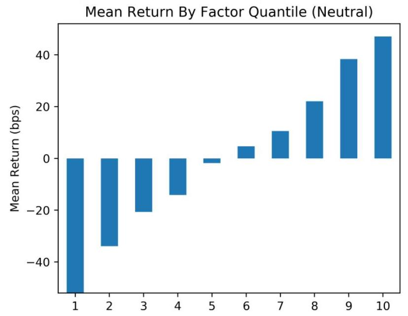

分样本空间来看，剥离行业、市值、反转、波动率、流动性等因子后，空间网络中心度因子SCC在沪深300、中证500、 中证1000指数成分股内均表现较好。历史IC均值分别为2.0%、3.3%、3.6%。而 TCC因子在正交化之后选股能力明显弱化

表6:不同样本空间下正交化后股票网络中心度因子表现

<table><tr><td rowspan="2">因子</td><td rowspan="2">域</td><td colspan="2">仅行业、市值中性化化</td><td colspan="6">行业、市值、反转、波动率、流动性因子中心化后因子表现</td></tr><tr><td>IC均值</td><td>IC_IR</td><td>IC均值</td><td>IC_IR</td><td>多空组合年化收益率</td><td>多空组合年化波动率</td><td>多空组合信息比率</td><td>多空组合最大回撤</td></tr><tr><td rowspan="4">SCC</td><td>沪深300</td><td>3.38%</td><td>1.25</td><td>2.00%</td><td>0.79</td><td>6.59%</td><td>6.62%</td><td>1.00</td><td>-7.56%</td></tr><tr><td>中证500</td><td>6.46%</td><td>2.95</td><td>3.33%</td><td>1.61</td><td>11.41%</td><td>6.42%</td><td>1.78</td><td>-9.67%</td></tr><tr><td>中证1000</td><td>8.23%</td><td>3.87</td><td>3.63%</td><td>1.93</td><td>14.49%</td><td>5.98%</td><td>2.42</td><td>-3.74%</td></tr><tr><td>全市场</td><td>8.30%</td><td>3.97</td><td>4.02%</td><td>2.27</td><td>13.05%</td><td>4.73%</td><td>2.76</td><td>-3.51%</td></tr><tr><td rowspan="4">TCC</td><td>沪深300</td><td>4.47%</td><td>1.62</td><td>1.11%</td><td>0.52</td><td>1.57%</td><td>5.75%</td><td>0.27</td><td>-14.04%</td></tr><tr><td>中证500</td><td>6.62%</td><td>2.75</td><td>0.71%</td><td>0.41</td><td>3.82%</td><td>5.30%</td><td>0.72</td><td>-16.58%</td></tr><tr><td>中证1000</td><td>9.10%</td><td>3.51</td><td>0.95%</td><td>0.64</td><td>4.00%</td><td>4.61%</td><td>0.87</td><td>-7.96%</td></tr><tr><td>全市场</td><td>9.05%</td><td>3.55</td><td>1.22%</td><td>0.87</td><td>5.81%</td><td>4.08%</td><td>1.42</td><td>-5.58%</td></tr><tr><td rowspan="4">CC</td><td>沪深300</td><td>4.31%</td><td>1.65</td><td>1.72%</td><td>0.72</td><td>4.79%</td><td>6.52%</td><td>0.73</td><td>-12.01%</td></tr><tr><td>中证500</td><td>7.04%</td><td>3.21</td><td>2.43%</td><td>1.24</td><td>8.75%</td><td>6.06%</td><td>1.44</td><td>-14.86%</td></tr><tr><td>中证1000</td><td>9.25%</td><td>4.24</td><td>2.66%</td><td>1.53</td><td>10.14%</td><td>5.48%</td><td>1.85</td><td>-5.40%</td></tr><tr><td>全市场</td><td>9.21%</td><td>4.19</td><td>3.07%</td><td>1.88</td><td>10.36%</td><td>4.60%</td><td>2.25</td><td>-5.34%</td></tr></table>

资料来源:Wind，华西证券研究所

### 2.10 SCC因子在反转、波动率、流动性等因子大幅回撤期间表现较好

从多空组合表现来看，空间网络中心度因子在最近两年反转、波动率、流动性等因子回撤期间, 整体表现仍相对较好, 并未出现明显回撤。

图12:沪深300成分内SCC因子在反转、波动率、流动性等因子大幅回撤期间表现较好

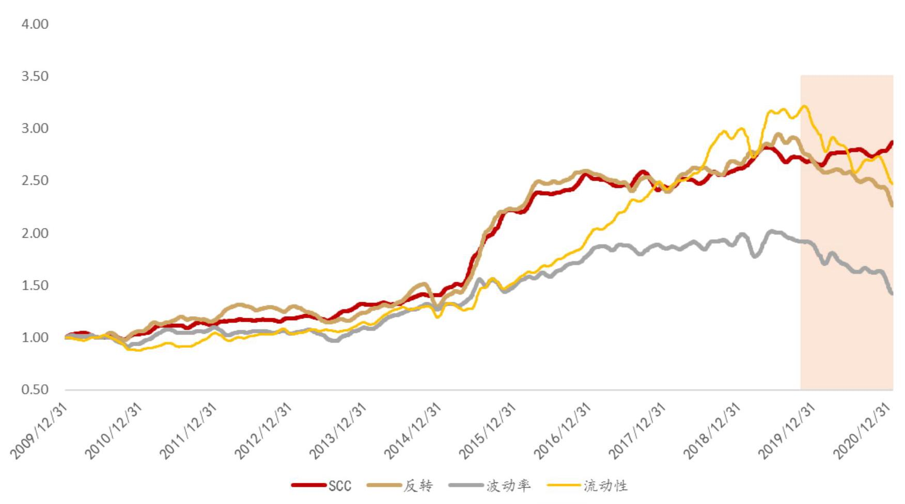

资料来源:Wind，华西证券研究所

### 2.11 全部A股中SCC因子能带来持续的超额收益

全部A股中，反转因子、波动率因子也存在较长的回撤期，期间空间网络中心度因子 SCC表现仍然较强，仅在2020年初回撤相对较为明显。

图13:全部A股中SCC因子多头组合在反转、波动率因子回撤期间仍表现较好

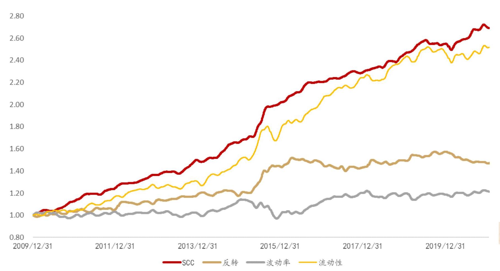

资料来源:Wind，华西证券研究所

### 2.12 中证500增强组合中加入SCC因子后增强收益提升较为稳定

我们将空间网络中心度因子加入华西金工中证500指数增强组合因子列表，重新追溯 500增强组合历史表现，新加入的SCC因子对组合贡献较为明显，且2015年以来相较原组合的增强效果较为稳定。

图14:中证500增强组合中加入SCC因子后增强收益提升较为稳定

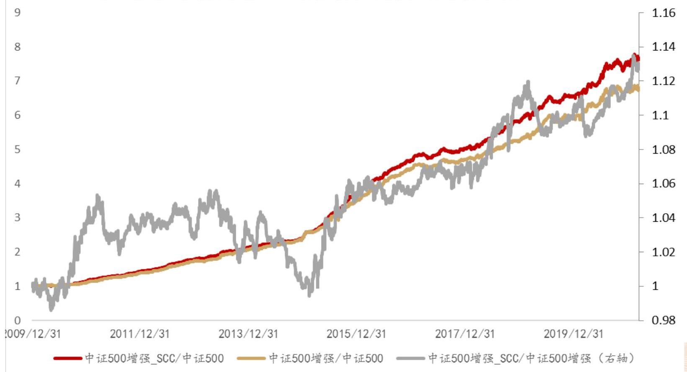

资料来源:Wind，华西证券研究所

## 目录

1. 基于Pearson相关系数构建股票连接网络

2. 股票网络中心度选股因子构建及测试

3. 风险提示

## 风险提示

量化模型基于历史数据计算，未来可能存在失效风险。

## 分析师承诺

作者具有中国证券业协会授予的证券投资咨询执业资格或相当的专业胜任能力，保证报告所采用的数据均来自合规渠道，分析逻辑基于作者的职业理解，通过合理判断并得出结论，力求客观、公正， 结论不受任何第三方的授意、影响，特此声明。

## 评级说明

<table><tr><td>公司评级标准</td><td>投资评级</td><td>说明</td></tr><tr><td>以报告发布日</td><td>买入</td><td>分析师预测在此期间股价相对强于上证指数达到或超过15%</td></tr><tr><td>后的6个月内</td><td>增持</td><td>分析师预测在此期间股价相对强于上证指数在5%-15%之间</td></tr><tr><td>公司股价相对</td><td>中性</td><td>分析师预测在此期间股价相对上证指数在-5%-5%之间</td></tr><tr><td>上证指数的涨</td><td>减持</td><td>分析师预测在此期间股价相对弱于上证指数5%—15%之间</td></tr><tr><td>跌幅为基准。</td><td>卖出</td><td>分析师预测在此期间股价相对弱于上证指数达到或超过15%</td></tr><tr><td colspan="3">行业评级标准</td></tr><tr><td rowspan="3">以报告发布日后的6个月内行业指数的涨跌幅为基准。</td><td>推荐</td><td>分析师预测在此期间行业指数相对强于上证指数达到或超过 10%</td></tr><tr><td>中性</td><td>分析师预测在此期间行业指数相对上证指数在-10%-10%之间</td></tr><tr><td>回避</td><td>分析师预测在此期间行业指数相对弱于上证指数达到或超过 10%</td></tr></table>

## 华西证券研究所:

地址:北京市西城区太平桥大街丰汇园11号丰汇时代大厦南座5层

网址:http://www.hx168.com.cn/hxzq/hxindex.html

## 免责声明

华西证券股份有限公司(以下简称“本公司”)具备证券投资咨询业务资格。本报告仅供本公司签约客户使用。 本公司不会因接收人收到或者经由其他渠道转发收到本报告而直接视其为本公司客户。

本报告基于本公司研究所及其研究人员认为的已经公开的资料或者研究人员的实地调研资料，但本公司对该等信息的准确性、完整性或可靠性不作任何保证。本报告所载资料、意见以及推测仅于本报告发布当日的判断，且这种判断受到研究方法、研究依据等多方面的制约。在不同时期，本公司可发出与本报告所载资料、意见及预测不一致的报告。本公司不保证本报告所含信息始终保持在最新状态。同时，本公司对本报告所含信息可在不发出通知的情形下做出修改，投资者需自行关注相应更新或修改。

在任何情况下, 本报告仅提供给签约客户参考使用, 任何信息或所表述的意见绝不构成对任何人的投资建议。 市场有风险，投资需谨慎。投资者不应将本报告视为做出投资决策的惟一参考因素，亦不应认为本报告可以取代自己的判断。在任何情况下，本报告均未考虑到个别客户的特殊投资目标、财务状况或需求，不能作为客户进行客户买卖、认购证券或者其他金融工具的保证或邀请。在任何情况下，本公司、本公司员工或者其他关联方均不承诺投资者一定获利，不与投资者分享投资收益，也不对任何人因使用本报告而导致的任何可能损失负有任何责任。投资者因使用本公司研究报告做出的任何投资决策均是独立行为，与本公司、本公司员工及其他关联方无关。

本公司建立起信息隔离墙制度、跨墙制度来规范管理跨部门、跨关联机构之间的信息流动。务请投资者注意， 在法律许可的前提下，本公司及其所属关联机构可能会持有报告中提到的公司所发行的证券或期权并进行证券或期权交易，也可能为这些公司提供或者争取提供投资银行、财务顾问或者金融产品等相关服务。在法律许可的前提下， 本公司的董事、高级职员或员工可能担任本报告所提到的公司的董事。

所有报告版权均归本公司所有。未经本公司事先书面授权，任何机构或个人不得以任何形式复制、转发或公开传播本报告的全部或部分内容，如需引用、刊发或转载本报告，需注明出处为华西证券研究所，且不得对本报告进行任何有悖原意的引用、删节和修改。