WISTERN 金工量化专题报告

# 相对旋转图 RRG 框架下的行业和 ETF 轮动策略 ——指数化配置系列研究(6)

## 核心结论

本文详细介绍了A股行业指数的相对旋转图 RRG，据此结合扩散指标构建行业轮动策略，并映射到 ETF 上得到行业/主题 ETF 的轮动组合。

【报告亮点】

1、构建相对旋转图 RRG，并根据中信一级行业指数在 RRG 中所处位置及行业扩散指标，构建行业轮动策略。

2、根据 ETF 的行业暴露打分，构建扩散指标+RRG ETF 轮动策略。

【主要结论】

## 主要结论一、处于 RRG 一、二象限的行业未来一个月平均表现更优。

参考 Julius de Kempenaer 思路, 构建相对旋转图 RRG。每月末, 等权配置第一象限中离原点最远的 6 个行业，表现明显优于等权配置其他象限行业。 每月末，等权配置 1+2 象限中离原点最远的 6 个行业， 2018.12.28-2026.03.31，年化收益率为 18.74%，优于等权配置第一象限 (18.34%) 或第二象限的行业 (5.81%)。

## 主要结论二、利用 RRG 改进扩散指标行业轮动，策略收益更高，回撤更小。

在扩散指标的基础上叠加 RRG，以改善扩散指标在震荡市或行业轮动速度较快的时期，策略反应较为滞后的问题。每月末，筛选扩散指标最高的 6 个中信一级行业，剔除在 RRG 中处于三、四象限的行业。 2018.12.28-2026.03.31，策略年化收益率为 20.60%，相对行业等权和沪深 300 的超额收益率分别为 9.49% 和 13.91%，且优于单独使用扩散指标。

## 主要结论三、将指数行业轮动策略映射至 ETF 轮动, 超额收益率同样显著。

根据 ETF 的行业暴露给每一个行业主题 ETF 打分, 并使用组合优化方式进行 ETF 轮动。2018.12.28-2026.03.31, ETF 轮动策略年化收益率为 21.51%, 最大回撤为 34.98%，相对中信一级行业等权和沪深 300 的年化超额收益率分别为 10.34% 和 14.86%。

## 主要结论四、行业偏离≤5%的沪深 300 轮动 “增强”策略超额收益率稳健。

在 5%的行业偏离约束下，2018.12.28-2026.03.31，ETF 轮动“增强”策略相对沪深 300 指数的年化超额收益率为 8.42%，跟踪误差为 7.22%，每年都能取得正超额收益。季度负超额的最大值低于 2.3%，均值为 1.99%，季度胜率 75.86%。

风险提示:数据来源第三方，或有遗漏、滞后、误差；本报告使用历史数据测算完成，存在模型失效风险。

证券研究报告

2026 年 05 月 25 日

---

分析师

冯佳睿 S0800524040008

13564917688

fengjiarui@research.xbmail.com.cn

陈曼莲 S0800525070005

15992376137

chenmanlian@research.xbmail.com.cn

## 相关研究

---

上周申报 6 只中证细分化工产业主题 ETF-ETF 市场扫描 (2026.05.24) 2026-05-24

微盘股扩散指数分歧缩小 一微盘周报 (2026.05.18-2026.05.22) 2026-05-24

本年 500 指增平均超额回撤逾 1%—量化基金业绩跟踪周报(2026.05.18-2026.05.22) 2026-05-24

RRG ETF 轮动 300 “指增”策略 YTD 超额近 12% — ETF 策略跟踪 ( 2026.05.22 ) 2026-05-24

公募基金持有微盘股市值持续走高一微盘风格基金分析及微盘基金池定期调整系列 2026-05-20

## 内容目录

一、相对旋转图 (RRG) .5

二、RRG 框架下的行业轮动策略 .7

2.1 RRG 行业轮动 .7

2.1.1 配置 RRG 单一象限 .7

2.1.2 配置 RRG 相邻 2 个象限 .8

2.2 扩散指标行业轮动 .9

2.3 叠加RRG的扩散指标升级 .11

2.3.1 扩散指标+RRG 中信一级行业轮动 11

2.3.2 扩散指标+RRG 中信二级行业轮动 .14

三、扩散指标+RRG ETF 轮动策略 .15

3.1 扩散指标+RRG ETF 轮动 .15

3.2 约束单个 ETF 权重不超过 20% .19

3.3 无单一行业权重约束 .21

3.4 用 ETF 轮动构建沪深 300“增强”策略 .23

四、总结 .26

五、风险提示 .27

## 图表目录

图 1: 相对旋转图 (RRG) 示例 .6

图 2: 中信一级行业相对旋转图 (2026.03.31) .6

图 3: RRG 单一象限行业轮动策略累计净值 (2018.12.28-2026.03.31) .7

图 4: RRG 相邻 2 个象限行业轮动策略累计净值 (2018.12.28-2026.03.31) .8

图 5: 配置 RRG 1+2 象限行业轮动策略参数敏感性 (2018.12.28-2026.03.31) .9

图 6: 扩散指标行业轮动策略累计净值 (2018.12.28-2026.03.31) 10

图 7: 扩散指标行业轮动策略参数敏感性 (2018.12.28-2026.03.31) .11

图 8: 扩散指标+RRG 行业轮动策略累计净值 (2018.12.28-2026.03.31) .12

图 9: 扩散指标+RRG 行业轮动策略累计净值对比 (2018.12.28-2026.03.31) .13

图 10: 扩散指标+RRG 行业轮动策略保留行业 vs. 剔除行业等权组合累计净值 (2018.12.28-2026.03.31) .14

图 11:扩散指标+RRG 中信二级行业轮动策略累计净值(2018.12.28-2026.03.31) .15

图 12: 扩散指标+RRG ETF 轮动策略累计净值 (2018.12.28-2026.03.31) .17

图 13: 不同市场环境下扩散指标+RRG ETF 轮动策略超额累计净值 (2018.12.28-2026.03.31 .18

图 14: 不同换仓频率下扩散指标+RRG ETF 轮动策略累计净值 (2018.12.28-2026.03.31) .19

图 15: 约束单个 ETF 权重的扩散指标+RRG ETF 轮动策略累计净值(2018.12.28-2026.03.31) .20

图 16: 无单一行业权重约束的扩散指标+RRG ETF 轮动策略累计净值 (2018.12.28-2026.03.31) .22

图 17: 各 ETF 轮动策略每期持有 ETF 数量 (2018.12.28-2026.03.31) .23

图 18: 扩散指标+RRG ETF 轮动“增强”策略累计净值 (2018.12.28-2026.03.31) .24

图 19: 3%行业偏离约束的扩散指标+RRG ETF 轮动“增强”策略季度收益率 (2018.12.28-2026.03.31) .25

图 20: 3%行业偏离约束的扩散指标+RRG ETF 轮动“增强”策略季度内最大回撤 (2018.12.28-2026.03.31) .25

图 21: 5%行业偏离约束的扩散指标+RRG ETF 轮动“增强”策略季度收益率 (2018.12.28-2026.03.31) .25

图 22: 5%行业偏离约束的扩散指标+RRG ETF 轮动“增强”策略季度内最大回撤 (2018.12.28-2026.03.31) .25

表 1: RRG 单一象限行业轮动策略收益风险特征 (2018.12.28-2026.03.31) .7

表 2:RRG 单一象限行业轮动策略分年度收益率(2018.12.28-2026.03.31) .8

表 3:RRG 相邻 2 个象限行业轮动策略收益风险特征(2018.12.28-2026.03.31) .8

表 4:RRG 相邻 2 个象限行业轮动策略分年度收益率 (2018.12.28-2026.03.31) .9

表 5:扩散指标行业轮动策略收益风险特征 (2018.12.28-2026.03.31) .10

表 6:扩散指标行业轮动策略分年度收益率 (2018.12.28-2026.03.31) .10

表 7:扩散指标+RRG 行业轮动策略收益风险特征 (2018.12.28-2026.03.31) 11

表 8:扩散指标+RRG 行业轮动策略分年度收益风险特征(2018.12.28-2026.03.31) .12

表 9:扩散指标+RRG 行业轮动策略收益风险特征对比(2018.12.28-2026.03.31) .12

表 10:扩散指标+RRG 行业轮动策略分年度收益率对比 (2018.12.28-2026.03.31) .13

表 11:扩散指标+RRG 中信二级行业轮动策略收益风险特征(2018.12.28-2026.03.31)...1

表 12:扩散指标+RRG 中信二级行业轮动策略分年度收益风险特征(2018.12.28-2026.03.31) .15

表 13:扩散指标+RRG ETF 轮动策略收益风险特征(2018.12.28-2026.03.31) .16

表 14:扩散指标+RRG ETF 轮动策略分年度收益风险特征(2018.12.28-2026.03.31) .17

表 15:扩散指标+RRG ETF 轮动策略持仓示例(2026.03.31) .17

表 16: 不同换仓频率下扩散指标+RRG ETF 轮动策略收益风险特征 (2018.12.28-2026.03.31) .18

表 17: 不同换仓频率下扩散指标+RRG ETF 轮动策略分年度收益率 (2018.12.28-2026.03.31) .19

表 18:约束单个 ETF 权重的扩散指标+RRG ETF 轮动策略收益风险特征

## 金工量化专题报告

(2018.12.28-2026.03.31) .20

表 19:约束单个 ETF 权重的扩散指标+RRG ETF 轮动策略分年度收益风险特征 (2018.12.28-2026.03.31) .21

表 20:无单一行业权重约束的扩散指标+RRG ETF 轮动策略收益风险特征 (2018.12.28-2026.03.31) .21

表 21:无单一行业权重约束的扩散指标+RRG ETF 轮动策略分年度收益风险特征 (2018.12.28-2026.03.31) .22

表 22: 扩散指标+RRG ETF 轮动“增强”策略收益风险特征 (2018.12.28-2026.03.31) .24

表 23:扩散指标+RRG ETF 轮动“增强”策略分年度收益风险特征(2018.12.28-2026.03.31) .24

表 24: 各 ETF 轮动策略的胜率和回撤统计 (2018.12.28-2026.03.31) .25

金工量化专题报告

## 一、相对旋转图 (RRG)

相对旋转图 (Relative Rotation Graphs, RRG) 由 Julius de Kempenaer 于 2004-2005 年开发, 用于直观表示证券的相对表现。RRG 的横轴和纵轴分别为 RS-Ratio 和 RS-Momentum，均依赖于相对强度(RS)计算。

## 相对强度 RS

相对强度也称相对价格、相对强弱, 通过对比两种证券的价格, 衡量证券走势的强弱。

$$
\text{ 相对强度 }\mathrm{{RS}} = \frac{\text{ 证券价格 }}{\text{ 基准价格 }} * {100}
$$

## RS-Ratio

RS-Ratio 是 RS 的变化率，衡量 RS 的趋势强度。

$$
{RSrati}{o}_{\text{ ori }} = {100} * \frac{R{S}_{t}}{R{S}_{t - T}}
$$

$$
\text{ RSratio } = {MA}\left( {{\text{ RSratio }}_{\text{ ori }}, T}\right)
$$

经标准化后, RS-Ratio 数值在 100 以上时, 表示相对强度处于上升趋势 (证券相对基准越来越强); 在 100 以下时, 表示相对强度处于下降趋势 (证券相对基准越来越弱)。

## RS-Momentum

RS-Momentum 是衡量 RS-Ratio 变化率的指标。

$$
{\text{ RSmon }}_{\text{ ori }} = {100} * \frac{{\text{ RSratio }}_{t}}{{\text{ RSratio }}_{t - T}}
$$

$$
{RSmom} = {MA}\left( {{RSmo}{n}_{ori}, T}\right)
$$

RS-Momentum 作为 RS-Ratio 的动量, 引导着 RS-Ratio 的变化, 可以用来预测 RS-Ratio 的转向。通常, 当 RS-Ratio 形成低谷并开始上升时, RS-Momentum 超过 100。 相反, 当 RS-Ratio 形成峰值并开始下降时, RS-Momentum 跌破 100 。理想情况下, RRG 图呈现顺时针旋转 (图 1)。

金工量化专题报告

图 1: 相对旋转图 (RRG) 示例

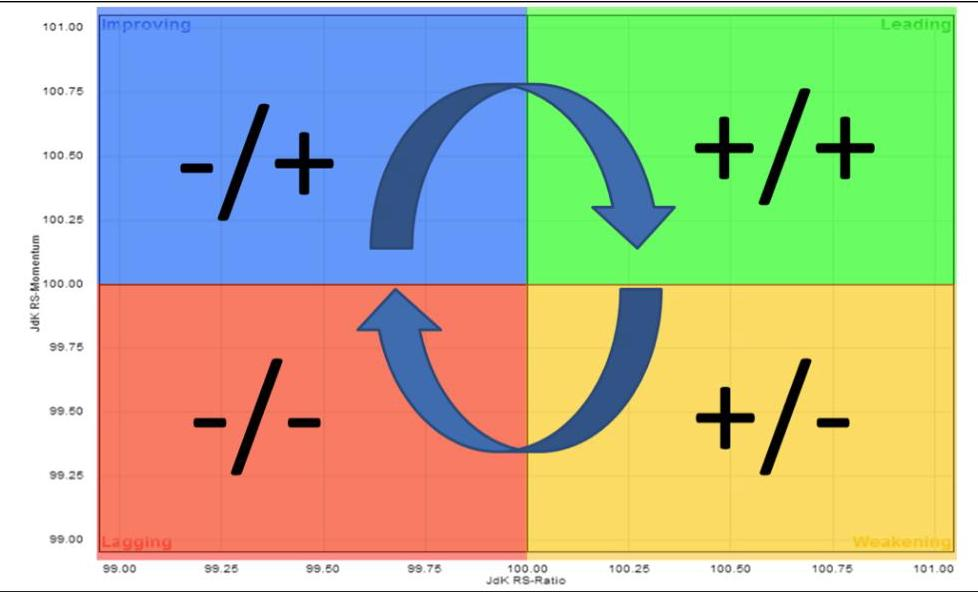

资料来源:stockchart 官网，西部证券研发中心

图 2 展示了各中信一级行业相较行业等权基准的日频相对旋转图, 行业处于各象限的指示意义如下。

-RS-Ratio>100 & RS-Mom>100 (+/+):行业处于领先的象限。正的 RS-Ratio 表示相对表现处于上升趋势，正的 RS-Mom 意味着这一趋势仍在强化。

-RS-Ratio<100 & RS-Mom>100 (-/+):行业处于改善的象限。负的 RS-Ratio 表示相对表现处于下降趋势，但正的 RS-Mom 意味着这个下降趋势正在减缓，甚至可能逆转。

-RS-Ratio<100 & RS-Mom<100 (-/-):行业处于滞后的象限。负的 RS-Ratio 表示相对表现处于下降趋势, 负的 RS-Mom 意味着这个下降趋势仍将延续, 甚至可能恶化。

・RS-Ratio>100 & RS-Mom<100 (+/-):行业处于疲软的象限。正的 RS-Ratio 表示相对表现处于上升趋势，负的 RS-Mom 意味着这个上升趋势正在衰减或失去动力。

图 2: 中信一级行业相对旋转图 (2026.03.31)

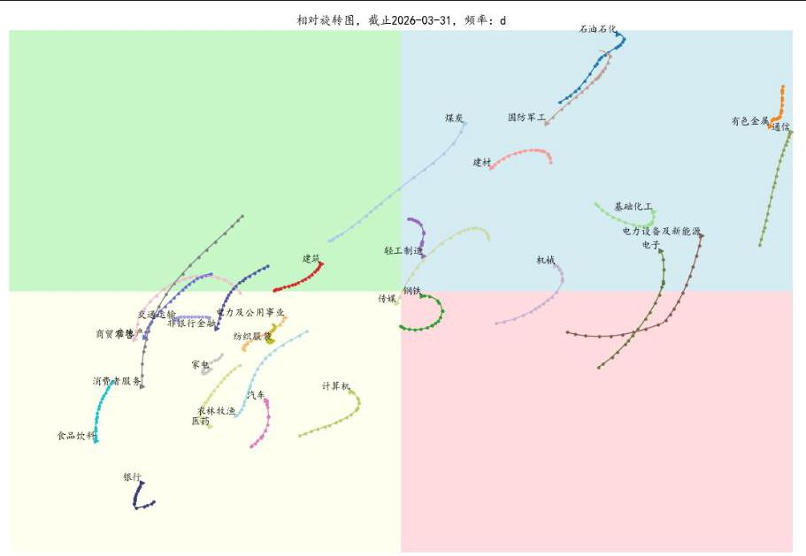

资料来源:Wind，西部证券研发中心

## 二、RRG框架下的行业轮动策略

### 2.1 RRG行业轮动

#### 2.1.1 配置RRG单一象限

以中信一级行业等权组合为基准(剔除综合、综合金融，下同)，计算各行业的日频 RRG。其中，RS-ratio 回看过去 220 日、RS-mom 回看过去 60 日，均使用 MA20 平滑。

每月末，等权配置处于第 1/2/3/4 象限的行业，若行业数超过 6 个，则仅配置当前距离原点最远的 6 个行业。

2018.12.28-2026.03.31，等权配置第一象限行业的年化收益率为 18.34%，明显优于等权配置其他象限的行业。截至 2026.03.31，等权配置第一象限行业的 YTD 收益率为 3.94%，相对中信一级行业等权和沪深 300 指数的超额收益率分别为 4.48% 和 7.83%。

表 1: RRG 单一象限行业轮动策略收益风险特征 (2018.12.28-2026.03.31)

<table><tr><td></td><td>1象限</td><td>2 象限</td><td>3 象限</td><td>4 象限</td><td>中信一级行业等权</td><td>沪深300</td></tr><tr><td>累计收益率</td><td>223.23%</td><td>48.21%</td><td>65.54%</td><td>71.82%</td><td>96.95%</td><td>47.81%</td></tr><tr><td>年化收益率</td><td>18.34%</td><td>5.81%</td><td>7.50%</td><td>8.08%</td><td>10.22%</td><td>5.77%</td></tr><tr><td>最大回撤</td><td>-36.67%</td><td>-45.63%</td><td>-28.94%</td><td>-35.86%</td><td>-31.61%</td><td>-45.60%</td></tr><tr><td>年化波动率</td><td>23.35%</td><td>21.20%</td><td>19.70%</td><td>22.44%</td><td>19.41%</td><td>18.98%</td></tr><tr><td>夏普比率</td><td>0.72</td><td>0.20</td><td>0.30</td><td>0.29</td><td>0.45</td><td>0.22</td></tr><tr><td>Calmar 比率</td><td>0.50</td><td>0.13</td><td>0.26</td><td>0.23</td><td>0.32</td><td>0.13</td></tr><tr><td>年化双边换手率(倍)</td><td>8.01</td><td>10.98</td><td>11.54</td><td>12.61</td><td>-</td><td>-</td></tr></table>

资料来源:Wind，西部证券研发中心

图 3: RRG 单一象限行业轮动策略累计净值 (2018.12.28-2026.03.31)

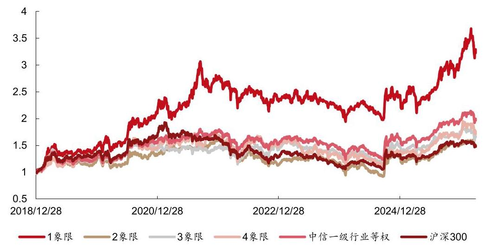

资料来源:Wind，西部证券研发中心

## 金工量化专题报告

表 2:RRG 单一象限行业轮动策略分年度收益率 (2018.12.28-2026.03.31)

<table><tr><td></td><td>1 象限</td><td>2 象限</td><td>3 象限</td><td>4 象限</td><td>中信一级行业等权</td><td>沪深300</td></tr><tr><td>2019</td><td>47.19%</td><td>22.40%</td><td>28.70%</td><td>29.30%</td><td>28.86%</td><td>36.07%</td></tr><tr><td>2020</td><td>49.10%</td><td>9.13%</td><td>12.13%</td><td>15.26%</td><td>23.11%</td><td>27.21%</td></tr><tr><td>2021</td><td>26.03%</td><td>22.00%</td><td>1.85%</td><td>13.14%</td><td>11.99%</td><td>-5.20%</td></tr><tr><td>2022</td><td>-15.54%</td><td>-30.26%</td><td>-3.32%</td><td>-10.59%</td><td>-13.79%</td><td>-21.63%</td></tr><tr><td>2023</td><td>-4.76%</td><td>3.77%</td><td>-4.39%</td><td>-13.92%</td><td>-4.18%</td><td>-11.38%</td></tr><tr><td>2024</td><td>6.50%</td><td>5.65%</td><td>8.24%</td><td>5.48%</td><td>9.03%</td><td>14.68%</td></tr><tr><td>2025</td><td>31.23%</td><td>21.40%</td><td>19.54%</td><td>25.41%</td><td>23.75%</td><td>17.66%</td></tr><tr><td>2026</td><td>3.94%</td><td>-2.02%</td><td>-5.82%</td><td>0.10%</td><td>-0.54%</td><td>-3.89%</td></tr></table>

资料来源:Wind，西部证券研发中心

#### 2.1.2 配置RRG相邻2个象限

每月末，等权配置处于相邻 2 个象限的行业。同样地，若行业数超过 6 个，则仅配置当前距离原点最远的 6 个行业。

2018.12.28-2026.03.31, 配置 1+2 象限的策略表现最好, 年化收益率为 18.74%，优于等权配置第一象限(18.34%)或第二象限的行业(5.81%)。

表 3: RRG 相邻 2 个象限行业轮动策略收益风险特征 (2018.12.28-2026.03.31)

<table><tr><td></td><td>1+2 象限</td><td>1+4 象限</td><td>3+4 象限</td><td>2+3 象限</td><td>中信一级行业等权</td><td>沪深300</td></tr><tr><td>累计收益率</td><td>231.02%</td><td>183.19%</td><td>75.11%</td><td>42.61%</td><td>96.95%</td><td>47.81%</td></tr><tr><td>年化收益率</td><td>18.74%</td><td>16.11%</td><td>8.37%</td><td>5.23%</td><td>10.22%</td><td>5.77%</td></tr><tr><td>最大回撤</td><td>-32.82%</td><td>-41.86%</td><td>-31.26%</td><td>-45.59%</td><td>-31.61%</td><td>-45.60%</td></tr><tr><td>年化波动率</td><td>23.30%</td><td>23.30%</td><td>20.43%</td><td>20.85%</td><td>19.41%</td><td>18.98%</td></tr><tr><td>夏普比率</td><td>0.74</td><td>0.63</td><td>0.34</td><td>0.18</td><td>0.45</td><td>0.22</td></tr><tr><td>Calmar 比率</td><td>0.57</td><td>0.38</td><td>0.27</td><td>0.11</td><td>0.32</td><td>0.13</td></tr><tr><td>年化双边换手率(倍)</td><td>7.78</td><td>6.62</td><td>11.57</td><td>10.33</td><td>-</td><td>-</td></tr></table>

资料来源:Wind，西部证券研发中心

图 4: RRG 相邻 2 个象限行业轮动策略累计净值 (2018.12.28-2026.03.31)

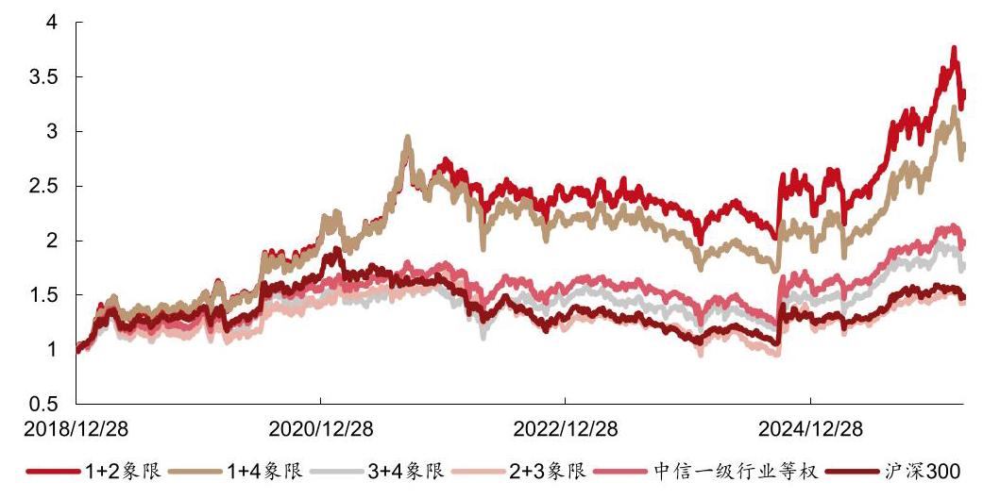

资料来源:Wind，西部证券研发中心

金工量化专题报告

截至 2026.03.31，配置 1+2 象限行业的 YTD 收益率为 3.94%，相对中信一级行业等权和沪深 300 指数的超额收益率分别为 4.48% 和 7.83%。

表 4:RRG 相邻 2 个象限行业轮动策略分年度收益率 (2018.12.28-2026.03.31)

<table><tr><td></td><td>1+2 象限</td><td>1+4 象限</td><td>3+4 象限</td><td>2+3 象限</td><td>中信一级行业等权</td><td>沪深300</td></tr><tr><td>2019</td><td>44.06%</td><td>43.79%</td><td>22.28%</td><td>20.93%</td><td>28.86%</td><td>36.07%</td></tr><tr><td>2020</td><td>44.41%</td><td>44.76%</td><td>20.57%</td><td>17.62%</td><td>23.11%</td><td>27.21%</td></tr><tr><td>2021</td><td>28.61%</td><td>22.28%</td><td>4.69%</td><td>18.36%</td><td>11.99%</td><td>-5.20%</td></tr><tr><td>2022</td><td>-11.28%</td><td>-15.59%</td><td>-6.96%</td><td>-29.12%</td><td>-13.79%</td><td>-21.63%</td></tr><tr><td>2023</td><td>-4.94%</td><td>-6.68%</td><td>-7.30%</td><td>-2.47%</td><td>-4.18%</td><td>-11.38%</td></tr><tr><td>2024</td><td>7.20%</td><td>2.85%</td><td>9.63%</td><td>8.07%</td><td>9.03%</td><td>14.68%</td></tr><tr><td>2025</td><td>31.65%</td><td>33.01%</td><td>24.61%</td><td>16.44%</td><td>23.75%</td><td>17.66%</td></tr><tr><td>2026</td><td>3.94%</td><td>3.24%</td><td>-3.72%</td><td>-2.63%</td><td>-0.54%</td><td>-3.89%</td></tr></table>

资料来源:Wind，西部证券研发中心

下图展示了在不同的回看天数下, 配置 RRG 1+2 象限行业的年化收益率。当 RS-ratio 回看过去 200-250 日、RS-mom 回看过去 60-100 日时，策略表现较好，稳定性也较强。 相对而言，本文选择的参数组(220, 60)，回测期的业绩较为突出。

图 5: 配置 RRG 1+2 象限行业轮动策略参数敏感性 (2018.12.28-2026.03.31)

<table><tr><td></td><td colspan="14">RS-Mom回看天数</td></tr><tr><td></td><td></td><td>20</td><td>40</td><td>60</td><td>80</td><td>100</td><td>120</td><td>180</td><td>200</td><td>220</td><td>240</td><td>250</td><td>500</td><td>750</td></tr><tr><td rowspan="13">RS-Ratio 回看天数</td><td>20</td><td>7.93%</td><td>5.59%</td><td>3.91%</td><td>7.38%</td><td>8.27%</td><td>4.84%</td><td>7.82%</td><td>9.31%</td><td>8.41%</td><td>8.62%</td><td>9.28%</td><td>10.11%</td><td>8.21%</td></tr><tr><td>40</td><td>7.29%</td><td>5.69%</td><td>5.84%</td><td>10.99%</td><td>7.39%</td><td>10.42%</td><td>6.00%</td><td>10.01%</td><td>11.84%</td><td>10.05%</td><td>10.81%</td><td>9.35%</td><td>8.33%</td></tr><tr><td>60</td><td>3.06%</td><td>7.34%</td><td>9.14%</td><td>8.10%</td><td>7.85%</td><td>7.67%</td><td>7.78%</td><td>10.07%</td><td>12.51%</td><td>9.92%</td><td>9.66%</td><td>11.19%</td><td>10.78%</td></tr><tr><td>80</td><td>8.35%</td><td>10.83%</td><td>11.85%</td><td>12.65%</td><td>10.26%</td><td>9.29%</td><td>11.22%</td><td>13.53%</td><td>14.84%</td><td>14.22%</td><td>13.61%</td><td>14.18%</td><td>12.84%</td></tr><tr><td>100</td><td>10.53%</td><td>7.53%</td><td>8.40%</td><td>10.83%</td><td>14.65%</td><td>12.05%</td><td>13.78%</td><td>13.59%</td><td>13.82%</td><td>12.03%</td><td>13.18%</td><td>17.53%</td><td>11.40%</td></tr><tr><td>120</td><td>8.42%</td><td>11.34%</td><td>10.62%</td><td>11.72%</td><td>14.01%</td><td>15.31%</td><td>15.09%</td><td>13.32%</td><td>15.24%</td><td>13.12%</td><td>12.64%</td><td>14.79%</td><td>13.33%</td></tr><tr><td>180</td><td>6.56%</td><td>9.16%</td><td>12.89%</td><td>12.34%</td><td>14.84%</td><td>13.97%</td><td>13.75%</td><td>12.73%</td><td>12.77%</td><td>11.98%</td><td>11.96%</td><td>15.90%</td><td>16.24%</td></tr><tr><td>200</td><td>9.34%</td><td>10.93%</td><td>15.33%</td><td>14.95%</td><td>14.29%</td><td>14.01%</td><td>13.09%</td><td>12.75%</td><td>13.93%</td><td>10.29%</td><td>11.81%</td><td>17.59%</td><td>16.96%</td></tr><tr><td>220</td><td>15.25%</td><td>16.88%</td><td>18.74%</td><td>16.41%</td><td>16.43%</td><td>14.95%</td><td>14.47%</td><td>13.82%</td><td>14.89%</td><td>13.09%</td><td>13.03%</td><td>18.83%</td><td>18.33%</td></tr><tr><td>240</td><td>13.21%</td><td>12.82%</td><td>15.27%</td><td>15.85%</td><td>15.80%</td><td>14.22%</td><td>11.86%</td><td>12.33%</td><td>12.55%</td><td>13.63%</td><td>14.49%</td><td>17.39%</td><td>15.41%</td></tr><tr><td>250</td><td>12.14%</td><td>13.11%</td><td>14.84%</td><td>14.98%</td><td>14.06%</td><td>14.18%</td><td>13.40%</td><td>11.91%</td><td>13.34%</td><td>13.50%</td><td>12.77%</td><td>15.43%</td><td>13.73%</td></tr><tr><td>500</td><td>6.99%</td><td>13.29%</td><td>11.65%</td><td>12.01%</td><td>11.97%</td><td>14.46%</td><td>13.97%</td><td>13.50%</td><td>15.15%</td><td>12.26%</td><td>12.33%</td><td>12.96%</td><td>9.56%</td></tr><tr><td>750</td><td>8.77%</td><td>6.45%</td><td>7.11%</td><td>8.20%</td><td>10.32%</td><td>8.97%</td><td>10.00%</td><td>10.92%</td><td>12.68%</td><td>11.42%</td><td>12.14%</td><td>6.93%</td><td>5.79%</td></tr></table>

资料来源:Wind，西部证券研发中心

### 2.2 扩散指标行业轮动

扩散指标作为衡量市场广度的经典指标，也常用于行业轮动。其定义为，指数成分股过去一段时间处于上涨状态的数量占比。类似地, 自由流通市值加权扩散指标可定义为, 过去一段时间处于上涨状态的成分股自由流通市值占比。

在回看过去 220 天, 并使用 MA20 平滑的参数下, 每月末筛选自由流通市值加权扩散指标最高的 6 个中信一级行业等权配置。

2018.12.28-2026.03.31，扩散指标行业轮动策略年化收益率为 16.87%，表现优于中信一级行业等权组合 (10.22%)，但超额净值在 2021.09-2024.03 期间持续回撤(图 6 和表 6)。我们推断，这可能是因为扩散指标只考虑成分股 T 日与 T-220 日收盘价的相对大小，捕捉的是以年为观察窗口的长期趋势，忽略了近期的边际变化。导致在震荡市或行业轮动速度较快的时期，策略的反应较为滞后，超额收益表现不佳。

## 金工量化专题报告

表 5:扩散指标行业轮动策略收益风险特征 (2018.12.28-2026.03.31)

<table><tr><td></td><td>扩散指标</td><td>中信一级行业等权</td><td>沪深300</td><td>超额收益率 (vs. 中信一级行业等权)</td><td>超额收益率 (vs. 沪深300)</td></tr><tr><td>累计收益率</td><td>196.38%</td><td>96.95%</td><td>47.81%</td><td>50.13%</td><td>98.50%</td></tr><tr><td>年化收益率</td><td>16.87%</td><td>10.22%</td><td>5.77%</td><td>6.00%</td><td>10.34%</td></tr><tr><td>最大回撤</td><td>-36.63%</td><td>-31.61%</td><td>-45.60%</td><td>-19.31%</td><td>-19.82%</td></tr><tr><td>年化波动率</td><td>22.08%</td><td>19.41%</td><td>18.98%</td><td>10.94%</td><td>12.63%</td></tr><tr><td>夏普比率</td><td>0.70</td><td>0.45</td><td>0.22</td><td>0.41</td><td>0.70</td></tr><tr><td>Calmar 比率</td><td>0.46</td><td>0.32</td><td>0.13</td><td>0.31</td><td>0.52</td></tr><tr><td>年化双边换手率(倍)</td><td>5.56</td><td>-</td><td>-</td><td>-</td><td>-</td></tr></table>

资料来源:Wind，西部证券研发中心

图 6: 扩散指标行业轮动策略累计净值 (2018.12.28-2026.03.31)

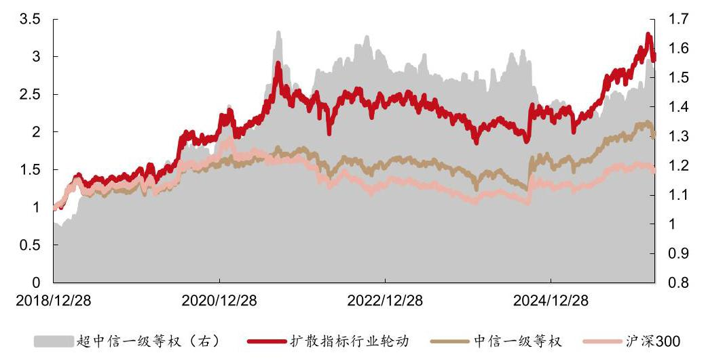

资料来源:Wind，西部证券研发中心

表 6:扩散指标行业轮动策略分年度收益率 (2018.12.28-2026.03.31)

<table><tr><td></td><td>扩散指标行业轮动</td><td>中信一级行业等权</td><td>沪深300</td><td>超额收益率   (vs. 中信一级行业等权)</td><td>超额收益率   (vs. 沪深300)</td></tr><tr><td>2019</td><td>45.63%</td><td>28.86%</td><td>36.07%</td><td>16.77%</td><td>9.56%</td></tr><tr><td>2020</td><td>43.21%</td><td>23.11%</td><td>27.21%</td><td>20.10%</td><td>16.00%</td></tr><tr><td>2021</td><td>18.76%</td><td>11.99%</td><td>-5.20%</td><td>6.78%</td><td>23.96%</td></tr><tr><td>2022</td><td>-5.27%</td><td>-13.79%</td><td>-21.63%</td><td>8.51%</td><td>16.36%</td></tr><tr><td>2023</td><td>-9.11%</td><td>-4.18%</td><td>-11.38%</td><td>-4.93%</td><td>2.27%</td></tr><tr><td>2024</td><td>5.37%</td><td>9.03%</td><td>14.68%</td><td>-3.66%</td><td>-9.31%</td></tr><tr><td>2025</td><td>28.24%</td><td>23.75%</td><td>17.66%</td><td>4.49%</td><td>10.58%</td></tr><tr><td>2026</td><td>2.86%</td><td>-0.54%</td><td>-3.89%</td><td>3.39%</td><td>6.74%</td></tr></table>

资料来源:Wind，西部证券研发中心

## 金工量化专题报告

图 7: 扩散指标行业轮动策略参数敏感性 (2018.12.28-2026.03.31)

<table><tr><td></td><td>20</td><td>40</td><td>60</td><td>80</td><td>100</td><td>120</td><td>180</td><td>190</td></tr><tr><td>累计收益率</td><td>58.93%</td><td>41.44%</td><td>79.23%</td><td>103.07%</td><td>102.24%</td><td>120.77%</td><td>127.64%</td><td>146.43%</td></tr><tr><td>年化收益率</td><td>6.87%</td><td>5.10%</td><td>8.73%</td><td>10.70%</td><td>10.64%</td><td>12.04%</td><td>12.53%</td><td>13.82%</td></tr><tr><td>最大回撤</td><td>-50.88%</td><td>-44.21%</td><td>-44.34%</td><td>-48.58%</td><td>-38.59%</td><td>-32.33%</td><td>-34.74%</td><td>-39.90%</td></tr><tr><td>年化波动率</td><td>22.64%</td><td>22.74%</td><td>22.05%</td><td>22.11%</td><td>21.80%</td><td>21.87%</td><td>21.53%</td><td>21.77%</td></tr><tr><td>夏普比率</td><td>0.24</td><td>0.16</td><td>0.33</td><td>0.42</td><td>0.42</td><td>0.48</td><td>0.51</td><td>0.57</td></tr><tr><td>Calmar比率</td><td>0.14</td><td>0.12</td><td>0.20</td><td>0.22</td><td>0.28</td><td>0.37</td><td>0.36</td><td>0.35</td></tr><tr><td></td><td>200</td><td>210</td><td>220</td><td>230</td><td>240</td><td>250</td><td>500</td><td>750</td></tr><tr><td>累计收益率</td><td>138.85%</td><td>173.99%</td><td>196.38%</td><td>200.27%</td><td>159.29%</td><td>172.23%</td><td>178.02%</td><td>112.57%</td></tr><tr><td>年化收益率</td><td>13.31%</td><td>15.56%</td><td>16.87%</td><td>17.09%</td><td>14.65%</td><td>15.46%</td><td>15.81%</td><td>11.43%</td></tr><tr><td>最大回撤</td><td>-38.73%</td><td>-37.73%</td><td>-36.63%</td><td>-37.51%</td><td>-41.33%</td><td>-44.32%</td><td>-35.82%</td><td>-32.73%</td></tr><tr><td>年化波动率</td><td>21.49%</td><td>21.72%</td><td>22.08%</td><td>21.97%</td><td>21.92%</td><td>21.74%</td><td>20.88%</td><td>20.23%</td></tr><tr><td>夏普比率</td><td>0.55</td><td>0.65</td><td>0.70</td><td>0.71</td><td>0.60</td><td>0.64</td><td>0.69</td><td>0.49</td></tr><tr><td>Calmar比率</td><td>0.34</td><td>0.41</td><td>0.46</td><td>0.46</td><td>0.35</td><td>0.35</td><td>0.44</td><td>0.35</td></tr></table>

资料来源:Wind，西部证券研发中心

### 2.3 叠加RRG的扩散指标升级

#### 2.3.1 扩散指标+RRG中信一级行业轮动

为了更好地识别那些长期有动量，但短期趋势已走弱的行业，我们在扩散指标的基础上叠加 RRG，要求行业短期内依旧保持向上的动能。具体地，每月末，选择扩散指标最高的 6 个行业后, 进一步剔除在 RRG 中处于三、四象限的行业。

2018.12.28-2026.03.31，扩散指标+RRG 行业轮动策略年化收益率为 20.60%，相对中信一级行业等权和沪深 300 的年化超额收益率分别为 9.49% 和 13.91%。

表 7:扩散指标+RRG 行业轮动策略收益风险特征 (2018.12.28-2026.03.31)

<table><tr><td></td><td>扩散指标+RRG</td><td>中信一级行业等权</td><td>沪深300</td><td>超额收益率 (vs. 中信一级行业等权)</td><td>超额收益率 (vs. 沪深300)</td></tr><tr><td>累计收益率</td><td>268.82%</td><td>96.95%</td><td>47.81%</td><td>88.12%</td><td>147.87%</td></tr><tr><td>年化收益率</td><td>20.60%</td><td>10.22%</td><td>5.77%</td><td>9.49%</td><td>13.91%</td></tr><tr><td>最大回撤</td><td>-29.82%</td><td>-31.61%</td><td>-45.60%</td><td>-21.83%</td><td>-20.26%</td></tr><tr><td>年化波动率</td><td>24.17%</td><td>19.41%</td><td>18.98%</td><td>14.05%</td><td>15.73%</td></tr><tr><td>夏普比率</td><td>0.79</td><td>0.45</td><td>0.22</td><td>0.57</td><td>0.79</td></tr><tr><td>Calmar 比率</td><td>0.69</td><td>0.32</td><td>0.13</td><td>0.43</td><td>0.69</td></tr><tr><td>年化双边换手率(倍)</td><td>9.36</td><td>-</td><td>-</td><td>-</td><td>-</td></tr></table>

资料来源:Wind，西部证券研发中心

金工量化专题报告

图 8: 扩散指标+RRG 行业轮动策略累计净值 (2018.12.28-2026.03.31)

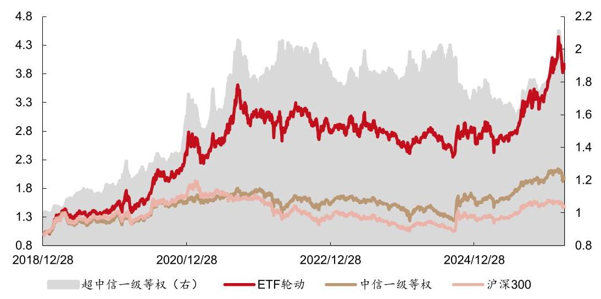

资料来源:Wind，西部证券研发中心

截至 2026.03.31，轮动策略 YTD 收益率为 3.88%，相对中信一级行业等权和沪深 300 指数的超额收益率分别为 4.42% 和 7.77%。

表 8:扩散指标+RRG 行业轮动策略分年度收益风险特征 (2018.12.28-2026.03.31)

<table><tr><td></td><td>累计收益率</td><td>年化波动率</td><td>收益风险比</td><td>最大回撤</td><td>中信一级行业等权</td><td>超额收益率 (vs. 中信一级行业等权)</td><td>沪深300</td><td>超额收益率 (vs. 沪深300)</td></tr><tr><td>2019</td><td>50.27%</td><td>22.27%</td><td>2.27</td><td>-12.29%</td><td>28.86%</td><td>21.42%</td><td>36.07%</td><td>14.21%</td></tr><tr><td>2020</td><td>53.12%</td><td>27.47%</td><td>1.96</td><td>-16.06%</td><td>23.11%</td><td>30.01%</td><td>27.21%</td><td>25.91%</td></tr><tr><td>2021</td><td>24.65%</td><td>27.43%</td><td>0.88</td><td>-20.20%</td><td>11.99%</td><td>12.67%</td><td>-5.20%</td><td>29.85%</td></tr><tr><td>2022</td><td>-4.29%</td><td>23.70%</td><td>-0.25</td><td>-17.59%</td><td>-13.79%</td><td>9.49%</td><td>-21.63%</td><td>17.34%</td></tr><tr><td>2023</td><td>-5.52%</td><td>18.86%</td><td>-0.38</td><td>-17.62%</td><td>-4.18%</td><td>-1.34%</td><td>-11.38%</td><td>5.86%</td></tr><tr><td>2024</td><td>6.33%</td><td>21.32%</td><td>0.24</td><td>-16.17%</td><td>9.03%</td><td>-2.70%</td><td>14.68%</td><td>-8.36%</td></tr><tr><td>2025</td><td>28.75%</td><td>26.79%</td><td>1.06</td><td>-21.50%</td><td>23.75%</td><td>5.00%</td><td>17.66%</td><td>11.08%</td></tr><tr><td>2026</td><td>3.88%</td><td>24.36%</td><td>0.69</td><td>-13.13%</td><td>-0.54%</td><td>4.42%</td><td>-3.89%</td><td>7.77%</td></tr></table>

资料来源:Wind，西部证券研发中心

在扩散指标基础上叠加 RRG 后, 轮动策略的年化收益率和最大回撤均优于单独使用扩散指标 (表 9 和图 9)，且每个自然年的收益率都获得提升 (表 10)。

表 9:扩散指标+RRG 行业轮动策略收益风险特征对比 (2018.12.28-2026.03.31)

<table><tr><td></td><td>扩散指标+RRG</td><td>扩散指标</td><td>RRG 1+2 象限</td><td>中信一级行业等权</td><td>沪深300</td></tr><tr><td>累计收益率</td><td>268.82%</td><td>186.17%</td><td>231.02%</td><td>96.95%</td><td>47.81%</td></tr><tr><td>年化收益率</td><td>20.60%</td><td>16.29%</td><td>18.74%</td><td>10.22%</td><td>5.77%</td></tr><tr><td>最大回撤</td><td>-29.82%</td><td>-38.79%</td><td>-32.82%</td><td>-31.61%</td><td>-45.60%</td></tr><tr><td>年化波动率</td><td>24.17%</td><td>22.25%</td><td>23.30%</td><td>19.41%</td><td>18.98%</td></tr><tr><td>夏普比率</td><td>0.79</td><td>0.66</td><td>0.74</td><td>0.45</td><td>0.22</td></tr><tr><td>Calmar 比率</td><td>0.69</td><td>0.42</td><td>0.57</td><td>0.32</td><td>0.13</td></tr><tr><td>年化双边换手率(倍)</td><td>9.36</td><td>5.56</td><td>7.78</td><td>-</td><td>-</td></tr></table>

资料来源:Wind，西部证券研发中心

金工量化专题报告

图 9: 扩散指标+RRG 行业轮动策略累计净值对比 (2018.12.28-2026.03.31)

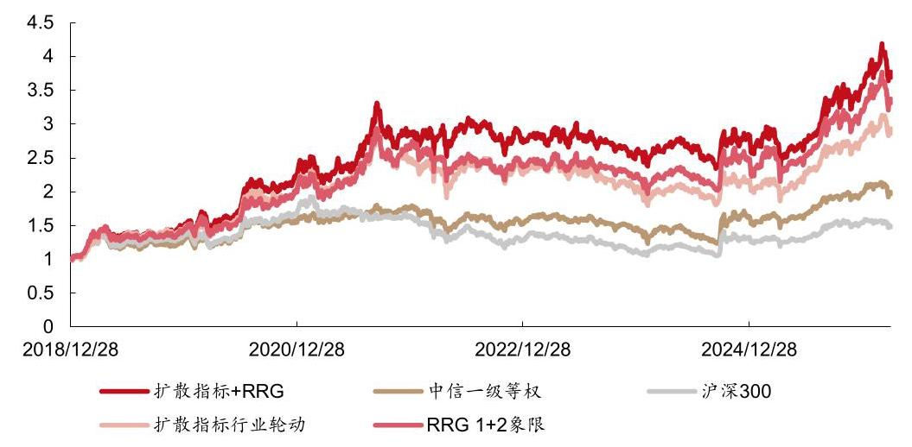

资料来源:Wind，西部证券研发中心

表 10:扩散指标+RRG 行业轮动策略分年度收益率对比 (2018.12.28-2026.03.31)

<table><tr><td></td><td>扩散指标+RRG</td><td>扩散指标</td><td>RRG 1+2 象限</td><td>超额收益率 (vs. 扩散指标)</td><td>超额收益率 (vs. RRG 1+2 象限行业)</td></tr><tr><td>2019</td><td>50.27%</td><td>45.63%</td><td>44.06%</td><td>4.64%</td><td>6.22%</td></tr><tr><td>2020</td><td>53.12%</td><td>43.21%</td><td>44.41%</td><td>9.91%</td><td>8.71%</td></tr><tr><td>2021</td><td>24.65%</td><td>18.76%</td><td>28.61%</td><td>5.89%</td><td>-3.96%</td></tr><tr><td>2022</td><td>-4.29%</td><td>-5.27%</td><td>-11.28%</td><td>0.98%</td><td>6.99%</td></tr><tr><td>2023</td><td>-5.52%</td><td>-9.11%</td><td>-4.94%</td><td>3.59%</td><td>-0.58%</td></tr><tr><td>2024</td><td>6.33%</td><td>5.37%</td><td>7.20%</td><td>0.96%</td><td>-0.87%</td></tr><tr><td>2025</td><td>28.75%</td><td>28.24%</td><td>31.65%</td><td>0.51%</td><td>-2.91%</td></tr><tr><td>2026</td><td>3.88%</td><td>2.86%</td><td>3.94%</td><td>1.03%</td><td>-0.06%</td></tr></table>

资料来源:Wind，西部证券研发中心

图 11 对比了扩散指标选出的 6 个行业中, 经 RRG 保留 (一、二象限) 和剔除 (三、 四象限)行业等权组合的业绩表现。从中可见，保留行业(红)显著优于剔除行业(金)。 这意味着, 引入对长期趋势边际变化的评估, 可以有效提升传统动量策略的效果。

## 金工量化专题报告

图 10: 扩散指标+RRG 行业轮动策略保留行业 vs. 剔除行业等权组合累计净值 (2018.12.28-2026.03.31)

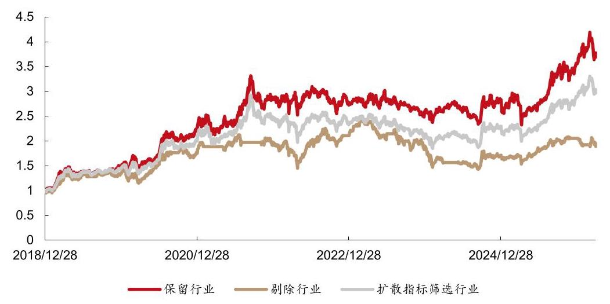

资料来源:Wind，西部证券研发中心

#### 2.3.2 扩散指标+RRG中信二级行业轮动

近两年, 主题和赛道投资越来越精细化, 这就要求轮动策略下沉至二级乃至三级行业。 为此，我们将扩散指标+RRG 轮动策略应用于 109 个中信二级行业。每月末，选择扩散指标最高的 20 个行业，再剔除 RRG 中处于三、四象限的行业。

2018.12.28-2026.03.31，中信二级行业轮动策略年化收益率为 20.49%(表 11)，与一级行业轮动策略接近 (20.60%)。但 2024-2025 年，二级行业轮动的收益率显著优于一级行业轮动 (表 12)。截至 2026.03.31，二级行业轮动策略 YTD 收益率为 3.87%，相对中信二级行业等权和沪深 300 指数的超额收益率分别为 5.05% 和 7.76%(表 12)。

表 11:扩散指标+RRG 中信二级行业轮动策略收益风险特征 (2018.12.28-2026.03.31)

<table><tr><td></td><td>扩散指标+RRG   二级行业轮动</td><td>中信二级行业   等权</td><td>沪深300</td><td>超额收益率 (vs. 中信二级行业等权)</td><td>超额收益率 (vs. 沪深300)</td><td>扩散指标+RRG 一级行业轮动</td></tr><tr><td>累计收益率</td><td>266.58%</td><td>91.48%</td><td>47.81%</td><td>82.98%</td><td>141.01%</td><td>268.82%</td></tr><tr><td>年化收益率</td><td>20.49%</td><td>9.77%</td><td>5.77%</td><td>9.06%</td><td>13.46%</td><td>20.60%</td></tr><tr><td>最大回撤</td><td>-32.13%</td><td>-34.86%</td><td>-45.60%</td><td>-23.97%</td><td>-26.92%</td><td>-29.82%</td></tr><tr><td>年化波动率</td><td>23.25%</td><td>20.43%</td><td>18.98%</td><td>15.95%</td><td>16.29%</td><td>24.17%</td></tr><tr><td>夏普比率</td><td>0.82</td><td>0.40</td><td>0.22</td><td>0.47</td><td>0.73</td><td>0.79</td></tr><tr><td>Calmar 比率</td><td>0.64</td><td>0.28</td><td>0.13</td><td>0.38</td><td>0.50</td><td>0.69</td></tr><tr><td>年化双边换手率(倍)</td><td>9.67</td><td>-</td><td>-</td><td>-</td><td>-</td><td>9.36</td></tr></table>

资料来源:Wind，西部证券研发中心

金工量化专题报告

图 11:扩散指标+RRG 中信二级行业轮动策略累计净值 (2018.12.28-2026.03.31)

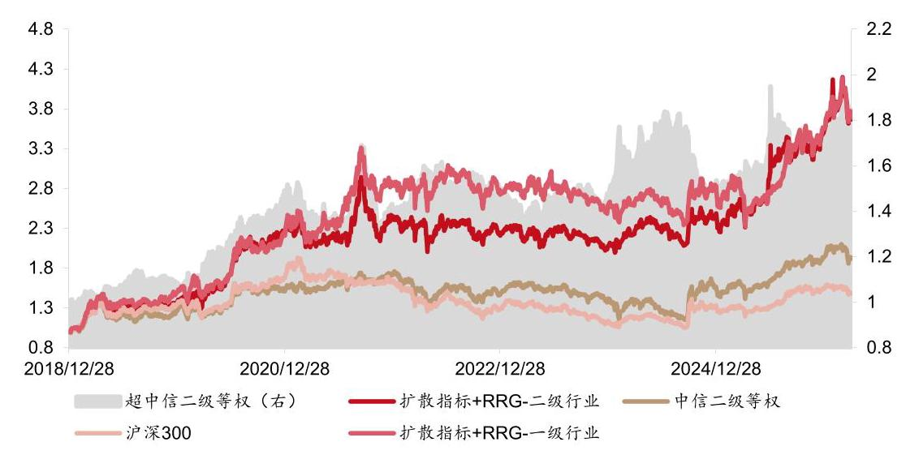

资料来源:Wind，西部证券研发中心

表 12:扩散指标+RRG 中信二级行业轮动策略分年度收益风险特征(2018.12.28-2026.03.31)

<table><tr><td></td><td>累计收益率</td><td>年化波动率</td><td>收益风险比</td><td>最大回撤</td><td>中信二级行业等权</td><td>超额收益率 (vs. 中信二级行业等权)</td><td>沪深300</td><td>超额收益率   (vs. 沪深 300)</td><td>一级行业轮动</td><td>超额收益率 (vs. 一级行业轮动)</td></tr><tr><td>2019</td><td>38.56%</td><td>21.38%</td><td>1.79</td><td>-14.81%</td><td>27.49%</td><td>11.07%</td><td>36.07%</td><td>2.49%</td><td>50.27%</td><td>-11.72%</td></tr><tr><td>2020</td><td>65.37%</td><td>25.93%</td><td>2.57</td><td>-14.53%</td><td>21.52%</td><td>43.85%</td><td>27.21%</td><td>38.16%</td><td>53.12%</td><td>12.25%</td></tr><tr><td>2021</td><td>5.48%</td><td>26.52%</td><td>0.16</td><td>-27.25%</td><td>12.31%</td><td>-6.84%</td><td>-5.20%</td><td>10.68%</td><td>24.65%</td><td>-19.18%</td></tr><tr><td>2022</td><td>-7.73%</td><td>22.12%</td><td>-0.43</td><td>-17.94%</td><td>-15.27%</td><td>7.54%</td><td>-21.63%</td><td>13.90%</td><td>-4.29%</td><td>-3.44%</td></tr><tr><td>2023</td><td>-6.96%</td><td>15.93%</td><td>-0.55</td><td>-13.55%</td><td>-3.94%</td><td>-3.02%</td><td>-11.38%</td><td>4.41%</td><td>-5.52%</td><td>-1.44%</td></tr><tr><td>2024</td><td>18.20%</td><td>20.77%</td><td>0.84</td><td>-14.59%</td><td>8.04%</td><td>10.17%</td><td>14.68%</td><td>3.52%</td><td>6.33%</td><td>11.88%</td></tr><tr><td>2025</td><td>43.91%</td><td>26.33%</td><td>1.68</td><td>-13.23%</td><td>26.65%</td><td>17.27%</td><td>17.66%</td><td>26.25%</td><td>28.75%</td><td>15.17%</td></tr><tr><td>2026</td><td>3.87%</td><td>30.22%</td><td>0.56</td><td>-13.86%</td><td>-1.18%</td><td>5.05%</td><td>-3.89%</td><td>7.76%</td><td>3.88%</td><td>-0.01%</td></tr></table>

资料来源:Wind，西部证券研发中心

## 三、扩散指标+RRG ETF轮动策略

### 3.1 扩散指标+RRG ETF轮动

ETF 是落地上述行业轮动策略的天然工具, 但考虑到现有 ETF 并不和中信一级行业一一对应，本文采用如下方式将策略转化为 ETF 组合。

## 1. 行业打分

每月末，选出扩散指标最高的 6 个中信一级行业(剔除综合、综合金融，共 28 个)； 随后, 剔除 RRG 中处于三、四象限的行业。选中行业总数记为 k, 选中的行业打分为 1, 其他行业打分为 0 , 记为Score ${e}_{i}$ 。 金工量化专题报告

### 2.ETF 配置

1)配置对象为已上市的所有行业和主题 ETF。若有多个 ETF 跟踪同一指数，只保留过去 20 日日均成交额最高的那个。最终，样本池内的 ETF 总数记为 n。

2)根据每只 ETF 的全部持仓计算行业 i 的权重 ${w}_{f, i}$ ，使用如下的组合优化方法确定 ETF 的配置权重 ${w}_{f}$ 。

$$
\max \mathop{\sum }\limits_{{f = 1}}^{n}{w}_{f} * \mathop{\sum }\limits_{{i = 1}}^{k}{w}_{f, i} * {\text{ Score }}_{i}
$$

$$
\text{ s.t. }0 < {w}_{f} \leq  1,\;f = 1,\cdots , n
$$

$$
\mathop{\sum }\limits_{{f = 1}}^{n}{w}_{f} = 1
$$

$$
\mathop{\sum }\limits_{{f = 1}}^{n}{w}_{f} * {w}_{f, i} \leq  1/k,\;i = 1,\cdots , k
$$

最后一个约束条件要求 ETF 组合在单个行业上的持仓不超过 1/k，目的是为了让组合在行业上倾向于等权配置。

2018.12.28-2026.03.31，扩散指标+RRG ETF 轮动(下简称 “ETF 轮动”)策略年化收益率为 21.51%，最大回撤为 34.98%，相对中信一级行业等权和沪深 300 的年化超额收益率分别为 10.34% 和 14.86%。

表 13: 扩散指标+RRG ETF 轮动策略收益风险特征 (2018.12.28-2026.03.31)

<table><tr><td></td><td>ETF 轮动</td><td>中信一级行业等权</td><td>沪深300</td><td>超额收益率 (vs. 中信一级行业等权)</td><td>超额收益率 (vs. 沪深300)</td></tr><tr><td>累计收益率</td><td>288.77%</td><td>96.95%</td><td>47.81%</td><td>98.49%</td><td>162.63%</td></tr><tr><td>年化收益率</td><td>21.51%</td><td>10.22%</td><td>5.77%</td><td>10.34%</td><td>14.86%</td></tr><tr><td>最大回撤</td><td>-34.98%</td><td>-31.61%</td><td>-45.60%</td><td>-23.59%</td><td>-19.74%</td></tr><tr><td>年化波动率</td><td>24.93%</td><td>19.41%</td><td>18.98%</td><td>15.19%</td><td>16.40%</td></tr><tr><td>夏普比率</td><td>0.80</td><td>0.45</td><td>0.22</td><td>0.58</td><td>0.81</td></tr><tr><td>Calmar 比率</td><td>0.62</td><td>0.32</td><td>0.13</td><td>0.44</td><td>0.75</td></tr><tr><td>年化双边换手率(倍)</td><td>13.26</td><td>-</td><td>-</td><td>-</td><td>-</td></tr></table>

资料来源:Wind，聚源，西部证券研发中心

金工量化专题报告

图 12:扩散指标+RRG ETF 轮动策略累计净值 (2018.12.28-2026.03.31)

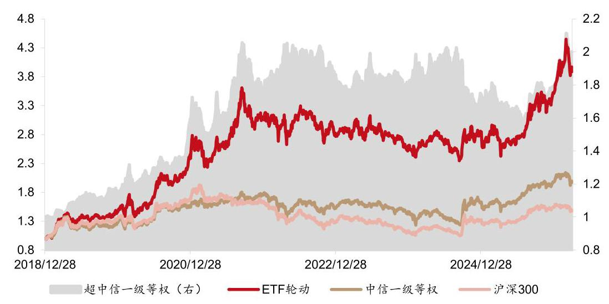

资料来源:Wind，聚源，西部证券研发中心

截至 2026.03.31，策略 YTD 收益率为 10.41%，相对中信一级行业等权和沪深 300 指数的超额收益率分别为 10.95% 和 14.30%。

表 14:扩散指标+RRG ETF 轮动策略分年度收益风险特征(2018.12.28-2026.03.31)

<table><tr><td></td><td>累计收益率</td><td>年化波动率</td><td>收益风险比</td><td>最大回撤</td><td>中信一级行业等权</td><td>超额收益率 (vs. 中信一级行业等权)</td><td>沪深300</td><td>超额收益率 (vs. 沪深300)</td></tr><tr><td>2019</td><td>48.09%</td><td>22.70%</td><td>2.13</td><td>-12.61%</td><td>28.86%</td><td>19.23%</td><td>36.07%</td><td>12.02%</td></tr><tr><td>2020</td><td>69.31%</td><td>29.02%</td><td>2.44</td><td>-21.66%</td><td>23.11%</td><td>46.20%</td><td>27.21%</td><td>42.10%</td></tr><tr><td>2021</td><td>23.43%</td><td>29.25%</td><td>0.78</td><td>-19.78%</td><td>11.99%</td><td>11.44%</td><td>-5.20%</td><td>28.63%</td></tr><tr><td>2022</td><td>-10.13%</td><td>24.32%</td><td>-0.49</td><td>-19.41%</td><td>-13.79%</td><td>3.66%</td><td>-21.63%</td><td>11.50%</td></tr><tr><td>2023</td><td>-6.30%</td><td>19.48%</td><td>-0.41</td><td>-19.52%</td><td>-4.18%</td><td>-2.11%</td><td>-11.38%</td><td>5.08%</td></tr><tr><td>2024</td><td>6.29%</td><td>21.25%</td><td>0.24</td><td>-17.98%</td><td>9.03%</td><td>-2.74%</td><td>14.68%</td><td>-8.39%</td></tr><tr><td>2025</td><td>27.11%</td><td>26.42%</td><td>1.01</td><td>-18.11%</td><td>23.75%</td><td>3.36%</td><td>17.66%</td><td>9.44%</td></tr><tr><td>2026</td><td>10.41%</td><td>26.47%</td><td>2.02</td><td>-14.10%</td><td>-0.54%</td><td>10.95%</td><td>-3.89%</td><td>14.30%</td></tr></table>

资料来源:Wind，聚源，西部证券研发中心

2026.03.31，策略持仓如表 15 所示。

表 15:扩散指标+RRG ETF 轮动策略持仓示例 (2026.03.31)

<table><tr><td>基金代码</td><td>基金简称</td><td>跟踪指数代码</td><td>跟踪指数名称</td><td>基金管理人</td><td>基金规模 (亿元)</td><td>权重</td></tr><tr><td>159731.SZ</td><td>石化 ETF 华夏</td><td>h11057.CSI</td><td>石化产业</td><td>华夏基金</td><td>2.45</td><td>25.53%</td></tr><tr><td>561980.SH</td><td>半导体设备 ETF 招商</td><td>931865.CSI</td><td>中证半导</td><td>招商基金</td><td>25.43</td><td>17.26%</td></tr><tr><td>561330.SH</td><td>矿业 ETF 国泰</td><td>931892.CSI</td><td>有色矿业</td><td>国泰基金</td><td>12.30</td><td>16.61%</td></tr><tr><td>159930.SZ</td><td>能源 ETF 汇添富</td><td>000928.SH</td><td>800 能源</td><td>汇添富基金</td><td>4.27</td><td>16.27%</td></tr><tr><td>159326.SZ</td><td>电网设备ETF华夏</td><td>931994.CSI</td><td>电网设备主题</td><td>华夏基金</td><td>38.88</td><td>16.06%</td></tr><tr><td>515220.SH</td><td>煤炭 ETF 国泰</td><td>399998.SZ</td><td>中证煤炭</td><td>国泰基金</td><td>86.40</td><td>8.27%</td></tr></table>

资料来源:Wind，聚源，西部证券研发中心

## 金工量化专题报告

和其他动量类策略相似，扩散指标+RRG 轮动策略的业绩表现与市场状态密切相关。 如图 13 所示, 当市场上涨时 (如, 2019-2021.09, 2025.04 至今), 策略超额收益突出, 且展现出较大的弹性; 在市场下跌期间 (如, 2023.04-2024.09), 超额收益同样能保持稳健；但在市场大幅震荡期间，热点切换较快且难以持续，策略易出现较为明显的回撤。

图 13: 不同市场环境下扩散指标+RRG ETF 轮动策略超额累计净值 (2018.12.28-2026.03.31)

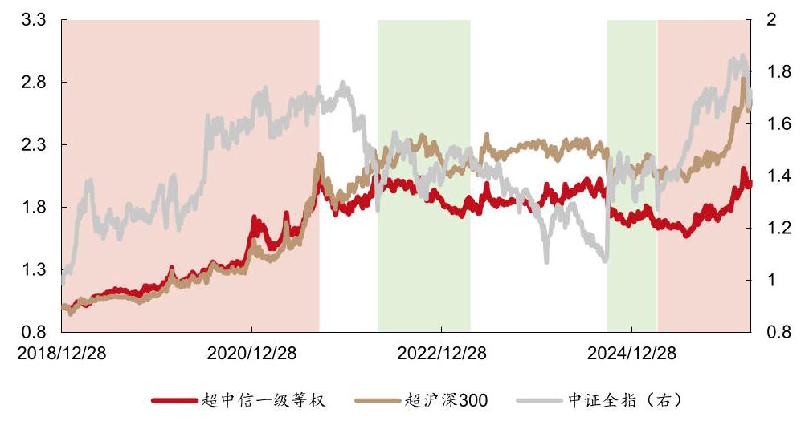

资料来源:Wind，聚源，西部证券研发中心

那么，倘若将策略的换仓频率提高，是否能改善震荡市中的表现呢？如表 16 所示， 在单边万 3 的费率假设下, 周频、双周频和月频调仓下的策略表现较为接近, 年化收益率在 21%-23% 之间, 夏普比率和 Calmar 比率分别为 0.78-0.84 和 0.59-0.63。由图 14 可见, 不同换仓频率下的累计净值曲线走势十分相似。根据这些结果, 我们认为, 增加换手率带来的收益几乎都被交易费用侵蚀，因而无法稳定地提升策略的最终绩效。

表 16:不同换仓频率下扩散指标+RRG ETF 轮动策略收益风险特征(2018.12.28-2026.03.31)

<table><tr><td></td><td>周顿</td><td>双周频</td><td>月频</td><td>中信一级行业等权</td><td>沪深300</td></tr><tr><td>累计收益率</td><td>296.37%</td><td>318.74%</td><td>277.70%</td><td>96.95%</td><td>47.81%</td></tr><tr><td>年化收益率</td><td>21.85%</td><td>22.82%</td><td>21.01%</td><td>10.22%</td><td>5.77%</td></tr><tr><td>最大回撤</td><td>-34.51%</td><td>-38.51%</td><td>-35.68%</td><td>-31.61%</td><td>-45.60%</td></tr><tr><td>年化波动率</td><td>25.19%</td><td>25.37%</td><td>24.93%</td><td>19.41%</td><td>18.98%</td></tr><tr><td>夏普比率</td><td>0.81</td><td>0.84</td><td>0.78</td><td>0.45</td><td>0.22</td></tr><tr><td>Calmar 比率</td><td>0.63</td><td>0.59</td><td>0.59</td><td>0.32</td><td>0.13</td></tr><tr><td>年化双边换手率(倍)</td><td>22.37</td><td>18.16</td><td>13.26</td><td>-</td><td>-</td></tr></table>

资料来源:Wind，聚源，西部证券研发中心

## 金工量化专题报告

图 14: 不同换仓频率下扩散指标+RRG ETF 轮动策略累计净值 (2018.12.28-2026.03.31)

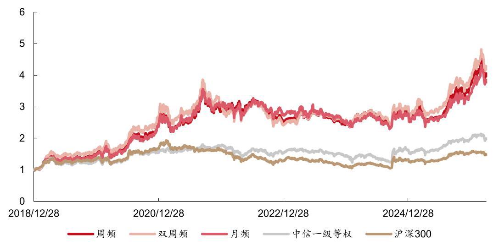

资料来源:Wind，聚源，西部证券研发中心

表 17:不同换仓频率下扩散指标+RRG ETF 轮动策略分年度收益率 (2018.12.28-2026.03.31)

<table><tr><td rowspan="2"></td><td rowspan="2">周频</td><td rowspan="2">双周频</td><td rowspan="2">月频</td><td>中信一级行业</td><td rowspan="2">沪深300</td><td></td><td colspan="2">超额收益率(vs.中信一级行业等权)</td><td colspan="3">超额收益率(vs.沪深300)</td></tr><tr><td>等权</td><td>周频</td><td>双周频</td><td>月频</td><td>周频</td><td>双周频</td><td>月频</td></tr><tr><td>2019</td><td>49.32%</td><td>62.74%</td><td>47.58%</td><td>28.86%</td><td>36.07%</td><td>20.46%</td><td>33.88%</td><td>18.72%</td><td>13.25%</td><td>26.67%</td><td>11.51%</td></tr><tr><td>2020</td><td>70.51%</td><td>71.05%</td><td>68.28%</td><td>23.11%</td><td>27.21%</td><td>47.40%</td><td>47.94%</td><td>45.17%</td><td>43.30%</td><td>43.84%</td><td>41.07%</td></tr><tr><td>2021</td><td>15.77%</td><td>13.40%</td><td>22.92%</td><td>11.99%</td><td>-5.20%</td><td>3.78%</td><td>1.41%</td><td>10.93%</td><td>20.97%</td><td>18.60%</td><td>28.12%</td></tr><tr><td>2022</td><td>-14.10%</td><td>-23.12%</td><td>-10.39%</td><td>-13.79%</td><td>-21.63%</td><td>-0.31%</td><td>-9.33%</td><td>3.39%</td><td>7.54%</td><td>-1.49%</td><td>11.24%</td></tr><tr><td>2023</td><td>-0.84%</td><td>6.64%</td><td>-6.66%</td><td>-4.18%</td><td>-11.38%</td><td>3.34%</td><td>10.82%</td><td>-2.48%</td><td>10.54%</td><td>18.01%</td><td>4.71%</td></tr><tr><td>2024</td><td>12.74%</td><td>12.03%</td><td>5.95%</td><td>9.03%</td><td>14.68%</td><td>3.71%</td><td>3.00%</td><td>-3.08%</td><td>-1.95%</td><td>-2.66%</td><td>-8.73%</td></tr><tr><td>2025</td><td>31.23%</td><td>34.65%</td><td>26.57%</td><td>23.75%</td><td>17.66%</td><td>7.48%</td><td>10.90%</td><td>2.82%</td><td>13.56%</td><td>16.99%</td><td>8.91%</td></tr><tr><td>2026</td><td>6.72%</td><td>7.27%</td><td>10.32%</td><td>-0.54%</td><td>-3.89%</td><td>7.26%</td><td>7.81%</td><td>10.85%</td><td>10.60%</td><td>11.15%</td><td>14.20%</td></tr></table>

资料来源:Wind，聚源，西部证券研发中心

### 3.2 约束单个ETF权重不超过20%

上一节的 ETF 组合要求时刻满仓 $\left( {\mathop{\sum }\limits_{{f = 1}}^{n}{w}_{f} = 1}\right)$ ,但这在实际投资中并不合理。例如, 市场整体回调时，扩散指标选出的 6 个行业中，处于一、二象限的行业可能不足 3 个。此时，强行保持满仓会使单个行业的权重过高，反而加大风险。另一方面，若上涨速度边际改善的行业较少，或许正说明当前市场较为弱势，更应该降低仓位，保持谨慎。基于以上两点考量,我们将单个 ETF 及整个组合的权重上限加以约束。具体地,约束单个 ETF 的权重不超过 20%，组合仓位 (ETF 权重之和) 不超过选中行业数量 k*20%，即，允许不满仓。

调整后的优化模型如下,

$$
\max \mathop{\sum }\limits_{{f = 1}}^{n}{w}_{f} * \mathop{\sum }\limits_{{i = 1}}^{k}{w}_{f, i} * {\text{ Score }}_{i}
$$

$$
\text{ s.t. }0 < {w}_{f} \leq  {0.2},\;f = 1,\cdots , n
$$

$$
\mathop{\sum }\limits_{{f = 1}}^{n}{w}_{f} = \min \left( {1,{0.2} * k}\right)
$$

$$
\mathop{\sum }\limits_{{f = 1}}^{n}{w}_{f} * {w}_{f, i} \leq  1/k,\;i = 1,\cdots , k
$$

2018.12.28-2026.03.31, 加入单个 ETF 权重及组合仓位约束的轮动策略年化波动率和最大回撤分别为 19.89% 和 29.09%(表 18)，均显著小于满仓的结果(表 18 最后一列)。 但也付出了向上弹性的代价，年化收益率下降 3 个百分点至 18.51%。因而, 夏普比率和 Calmar 比率仅有小幅提升。

表 18: 约束单个 ETF 权重的扩散指标+RRG ETF 轮动策略收益风险特征 (2018.12.28-2026.03.31)

<table><tr><td></td><td>ETF 轮动 (约束单个ETF权重)</td><td>中信一级行业等权</td><td>沪深300</td><td>超额 (vs. 中信一级行业等权)</td><td>超额 (vs. 沪深300)</td><td>ETF 轮动</td></tr><tr><td>累计收益率</td><td>226.64%</td><td>96.95%</td><td>47.81%</td><td>55.93%</td><td>107.49%</td><td>288.77%</td></tr><tr><td>年化收益率</td><td>18.51%</td><td>10.22%</td><td>5.77%</td><td>6.58%</td><td>11.04%</td><td>21.51%</td></tr><tr><td>最大回撤</td><td>-29.09%</td><td>-31.61%</td><td>-45.60%</td><td>-25.94%</td><td>-22.67%</td><td>-34.98%</td></tr><tr><td>年化波动率</td><td>19.89%</td><td>19.41%</td><td>18.98%</td><td>13.99%</td><td>14.75%</td><td>24.93%</td></tr><tr><td>夏普比率</td><td>0.86</td><td>0.45</td><td>0.22</td><td>0.36</td><td>0.65</td><td>0.80</td></tr><tr><td>Calmar 比率</td><td>0.64</td><td>0.32</td><td>0.13</td><td>0.25</td><td>0.49</td><td>0.62</td></tr><tr><td>年化双边换手率(倍)</td><td>11.26</td><td>-</td><td>-</td><td>-</td><td>-</td><td>13.26</td></tr></table>

资料来源:Wind，聚源，西部证券研发中心

图 15:约束单个 ETF 权重的扩散指标+RRG ETF 轮动策略累计净值 (2018.12.28-2026.03.31)

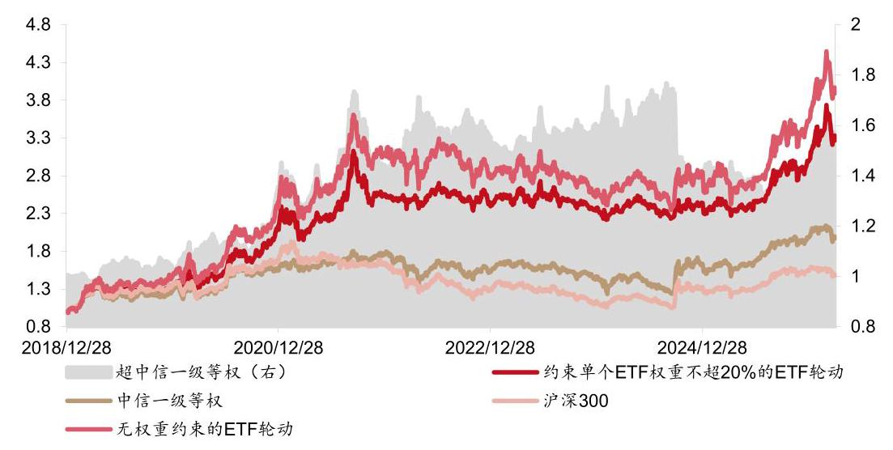

资料来源:Wind，聚源，西部证券研发中心

分年度看, 约束单个 ETF 权重的策略在沪深 300 下跌幅度较大的 2022 和 2023 年优于原始的满仓策略，展现出一定的防御能力。我们认为，如果投资者对未来的 A 股市场保持乐观的态度，那么不做权重和仓位的约束以积累更多收益，或是更优的选择。

金工量化专题报告

表 19:约束单个 ETF 权重的扩散指标+RRG ETF 轮动策略分年度收益风险特征 (2018.12.28-2026.03.31)

<table><tr><td></td><td>累计收益率</td><td>年化波动率</td><td>收益风险比</td><td>最大回撤</td><td>中信一级行业等权</td><td>超额收益率 (vs. 中信一级行业等权)</td><td>沪深300</td><td>超额收益率 (vs. 沪深 300)</td><td>ETF 轮动</td><td>超额收益率 (vs.ETF 轮动)</td></tr><tr><td>2019</td><td>33.54%</td><td>17.05%</td><td>1.94</td><td>-10.22%</td><td>28.86%</td><td>4.68%</td><td>36.07%</td><td>-2.53%</td><td>48.09%</td><td>-14.55%</td></tr><tr><td>2020</td><td>62.60%</td><td>24.19%</td><td>2.63</td><td>-14.61%</td><td>23.11%</td><td>39.49%</td><td>27.21%</td><td>35.39%</td><td>69.31%</td><td>-6.71%</td></tr><tr><td>2021</td><td>17.51%</td><td>27.77%</td><td>0.60</td><td>-23.07%</td><td>11.99%</td><td>5.52%</td><td>-5.20%</td><td>22.71%</td><td>23.43%</td><td>-5.92%</td></tr><tr><td>2022</td><td>-5.47%</td><td>14.88%</td><td>-0.48</td><td>-13.48%</td><td>-13.79%</td><td>8.32%</td><td>-21.63%</td><td>16.16%</td><td>-10.13%</td><td>4.66%</td></tr><tr><td>2023</td><td>-1.73%</td><td>16.47%</td><td>-0.20</td><td>-14.37%</td><td>-4.18%</td><td>2.46%</td><td>-11.38%</td><td>9.65%</td><td>-6.30%</td><td>4.57%</td></tr><tr><td>2024</td><td>1.11%</td><td>15.23%</td><td>-0.02</td><td>-12.00%</td><td>9.03%</td><td>-7.92%</td><td>14.68%</td><td>-13.57%</td><td>6.29%</td><td>-5.18%</td></tr><tr><td>2025</td><td>24.85%</td><td>18.02%</td><td>1.35</td><td>-9.13%</td><td>23.75%</td><td>1.10%</td><td>17.66%</td><td>7.19%</td><td>27.11%</td><td>-2.26%</td></tr><tr><td>2026</td><td>9.17%</td><td>26.75%</td><td>1.71</td><td>-14.04%</td><td>-0.54%</td><td>9.70%</td><td>-3.89%</td><td>13.05%</td><td>10.41%</td><td>-1.25%</td></tr></table>

资料来源:Wind，聚源，西部证券研发中心

### 3.3 无单一行业权重约束

倘若我们对轮动策略较有信心，可以再放开单个行业的权重约束，将优化问题调整为如下形式, 进一步释放策略弹性。

$$
\max \mathop{\sum }\limits_{{f = 1}}^{n}{w}_{f} * \mathop{\sum }\limits_{{i = 1}}^{k}{w}_{f, i} * {\text{ Score }}_{i}
$$

$$
\text{ s.t. }0 < {w}_{f} \leq  1,\;f = 1,\cdots , n
$$

$$
\mathop{\sum }\limits_{{f = 1}}^{n}{w}_{f} \leq  1
$$

如表 20 所示, 2018.12.28-2026.03.31, 无单一行业权重约束的策略年化收益率为 31.53%，年化波动率为 32.81%，最大回撤 33.33%。与原始轮动策略相比，风险虽显著放大, 但得益于较高的弹性, 最大回撤反而有所降低, 收益率则大幅提升, 夏普比率和 Calmar 比率接近于 1 。 金工量化专题报告

表 20:无单一行业权重约束的扩散指标+RRG ETF 轮动策略收益风险特征 (2018.12.28-2026.03.31)

<table><tr><td></td><td>ETF 轮动 (无单一行业权重约束)</td><td>中信一级行业等权</td><td>沪深300</td><td>超额   (vs. 中信一级行业等权)</td><td>超额 (vs. 沪深300)</td><td>ETF 轮动</td></tr><tr><td>累计收益率</td><td>575.21%</td><td>96.95%</td><td>47.81%</td><td>244.07%</td><td>360.57%</td><td>288.77%</td></tr><tr><td>年化收益率</td><td>31.53%</td><td>10.22%</td><td>5.77%</td><td>19.40%</td><td>24.51%</td><td>21.51%</td></tr><tr><td>最大回撤</td><td>-33.33%</td><td>-31.61%</td><td>-45.60%</td><td>-29.17%</td><td>-32.86%</td><td>-34.98%</td></tr><tr><td>年化波动率</td><td>32.81%</td><td>19.41%</td><td>18.98%</td><td>26.30%</td><td>26.38%</td><td>24.93%</td></tr><tr><td>夏普比率</td><td>0.92</td><td>0.45</td><td>0.22</td><td>0.68</td><td>0.87</td><td>0.80</td></tr><tr><td>Calmar 比率</td><td>0.95</td><td>0.32</td><td>0.13</td><td>0.67</td><td>0.75</td><td>0.62</td></tr><tr><td>年化双边换手率(倍)</td><td>10.65</td><td>-</td><td>-</td><td>-</td><td>-</td><td>13.26</td></tr></table>

资料来源:Wind，聚源，西部证券研发中心

图 16: 无单一行业权重约束的扩散指标+RRG ETF 轮动策略累计净值 (2018.12.28-2026.03.31)

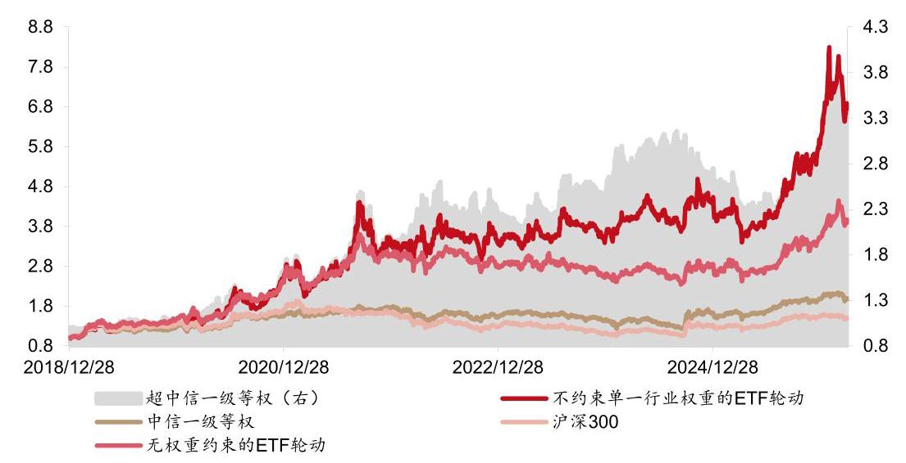

资料来源:Wind，聚源，西部证券研发中心

2019 年以来, 无单一行业权重约束的轮动策略, 每一个自然年均能取得正收益。除 2019 年外, 每年都能战胜原始策略 (表 21)。截至 2026.03.31, 策略 YTD 收益率为 12.16%, 相对中信一级行业等权和沪深 300 指数的超额收益率分别为 12.70% 和 16.05%。

表 21:无单一行业权重约束的扩散指标+RRG ETF 轮动策略分年度收益风险特征 (2018.12.28-2026.03.31)

<table><tr><td></td><td>累计收益率</td><td>年化波动率</td><td>收益风险比</td><td>最大回撤</td><td>中信一级行业等权</td><td>超额收益率 (vs. 中信一级行业等权)</td><td>沪深300</td><td>超额收益率 (vs. 沪深 300)</td><td>ETF 轮动</td><td>超额收益率 (vs. ETF 轮动)</td></tr><tr><td>2019</td><td>34.88%</td><td>25.51%</td><td>1.35</td><td>-15.20%</td><td>28.86%</td><td>6.02%</td><td>36.07%</td><td>-1.19%</td><td>48.09%</td><td>-13.21%</td></tr><tr><td>2020</td><td>91.65%</td><td>34.84%</td><td>2.71</td><td>-23.40%</td><td>23.11%</td><td>68.54%</td><td>27.21%</td><td>64.44%</td><td>69.31%</td><td>22.34%</td></tr><tr><td>2021</td><td>27.57%</td><td>43.41%</td><td>0.62</td><td>-32.97%</td><td>11.99%</td><td>15.58%</td><td>-5.20%</td><td>32.77%</td><td>23.43%</td><td>4.14%</td></tr><tr><td>2022</td><td>2.12%</td><td>36.49%</td><td>0.02</td><td>-27.64%</td><td>-13.79%</td><td>15.91%</td><td>-21.63%</td><td>23.76%</td><td>-10.13%</td><td>12.25%</td></tr><tr><td>2023</td><td>4.81%</td><td>25.24%</td><td>0.14</td><td>-20.22%</td><td>-4.18%</td><td>8.99%</td><td>-11.38%</td><td>16.19%</td><td>-6.30%</td><td>11.11%</td></tr><tr><td>2024</td><td>22.88%</td><td>25.57%</td><td>0.87</td><td>-19.94%</td><td>9.03%</td><td>13.85%</td><td>14.68%</td><td>8.20%</td><td>6.29%</td><td>16.59%</td></tr><tr><td>2025</td><td>38.80%</td><td>31.25%</td><td>1.24</td><td>-24.19%</td><td>23.75%</td><td>15.05%</td><td>17.66%</td><td>21.13%</td><td>27.11%</td><td>11.69%</td></tr><tr><td>2026</td><td>12.16%</td><td>44.43%</td><td>1.45</td><td>-22.43%</td><td>-0.54%</td><td>12.70%</td><td>-3.89%</td><td>16.05%</td><td>10.41%</td><td>1.75%</td></tr></table>

资料来源:Wind，聚源，西部证券研发中心

我们认为，放开单个行业的权重约束后，轮动策略收益率显著提升的主因是，持仓集中度大幅升高。如图 17 所示，尽管每月末扩散指标+RRG 选出的行业为 2-6 个(灰色)， 但由于没有限制行业和单个ETF的权重，策略倾向于配置在选中行业上暴露最高的ETF。 因此, 多数时期仅持有 1-2 个 ETF, 较大程度利用了轮动策略的弹性。 金工量化专题报告

图 17: 各 ETF 轮动策略每期持有 ETF 数量 (2018.12.28-2026.03.31)

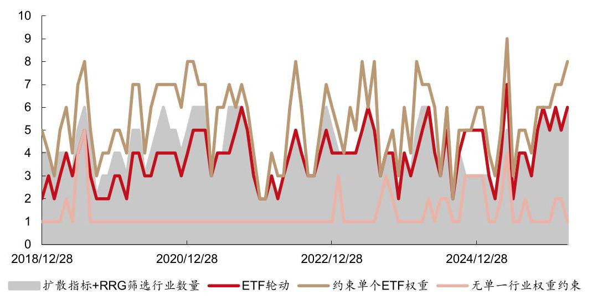

资料来源:Wind，聚源，西部证券研发中心

### 3.4 用ETF轮动构建沪深300 “增强”策略

当前 A 股市场的 ETF 较为丰富，涵盖大部分行业，这就给以沪深 300 为业绩基准的机构投资者，提供了利用行业的轮动或超低配，获取稳健超额收益的可能。具体地，我们约束 ETF 组合相对沪深 300 的行业偏离在某一阈值范围内，求解如下的优化问题。

$$
\max \mathop{\sum }\limits_{{f = 1}}^{n}{w}_{f} * \mathop{\sum }\limits_{{i = 1}}^{k}{w}_{f, i} * {\text{ Score }}_{i}
$$

$$
\text{ s.t. }0 < {w}_{f} \leq  1,\;f = 1,\cdots , n
$$

$$
\mathop{\sum }\limits_{{f = 1}}^{n}{w}_{f} = 1
$$

$$
\left| {\mathop{\sum }\limits_{{f = 1}}^{n}{w}_{f} * {w}_{f, i} - {w}_{{HS300}, i}}\right|  \leq  3\% \text{ 或 }5\% ,\;i = 1,\cdots , k
$$

如表 22 所示, 2018.12.28-2026.03.31, 在 3%和 5%的行业偏离约束下, ETF 轮动 “增强”策略相对沪深 300 指数的年化超额收益率分别为 6.24%和 8.42%，跟踪误差分别为 6.06% 和 7.22%，每年都能取得正超额收益。截止 2026.03.31，策略的 YTD 超额收益率分别为 6.78%和 6.01%。

相对而言，尽管 5%的行业偏离约束放大了跟踪误差，但最大回撤更小，叠加较高的超额收益率, 使得信息比率和 Calmar 比率都能来到 1 左右。此外, 分年度的超额收益率也更为稳健 (表 23)。

## 金工量化专题报告

表 22: 扩散指标+RRG ETF 轮动 “增强” 策略收益风险特征 (2018.12.28-2026.03.31)

<table><tr><td></td><td>行业偏离≤3%</td><td>超额(3%约束)</td><td>行业偏离\$5%</td><td>超额(5%约束)</td><td>沪深300</td></tr><tr><td>累计收益率</td><td>124.71%</td><td>52.51%</td><td>158.83%</td><td>75.64%</td><td>47.81%</td></tr><tr><td>年化收益率</td><td>12.32%</td><td>6.24%</td><td>14.62%</td><td>8.42%</td><td>5.77%</td></tr><tr><td>最大回撤</td><td>-38.34%</td><td>-8.76%</td><td>-32.62%</td><td>-7.94%</td><td>-45.60%</td></tr><tr><td>年化波动率</td><td>20.11%</td><td>6.06%</td><td>20.48%</td><td>7.22%</td><td>18.98%</td></tr><tr><td>夏普比率</td><td>0.54</td><td>0.78</td><td>0.64</td><td>0.96</td><td>0.22</td></tr><tr><td>Calmar 比率</td><td>0.32</td><td>0.71</td><td>0.45</td><td>1.06</td><td>0.13</td></tr><tr><td>年化双边换手率(倍)</td><td>11.77</td><td>-</td><td>11.64</td><td>-</td><td>-</td></tr></table>

资料来源:Wind，聚源，西部证券研发中心

图 18: 扩散指标+RRG ETF 轮动 “增强” 策略累计净值 (2018.12.28-2026.03.31)

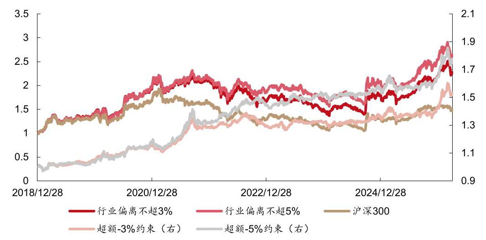

资料来源:Wind，聚源，西部证券研发中心

表 23:扩散指标+RRG ETF 轮动 “增强” 策略分年度收益风险特征 (2018.12.28-2026.03.31)

<table><tr><td></td><td>累计收益率</td><td>年化波动率</td><td>收益风险比</td><td>最大回撤</td><td>沪深300收益率</td><td>超额收益率</td><td>累计收益率</td><td>年化波动率</td><td>收益风险比</td><td>最大回撤</td><td>沪深300收益率</td><td>超额收益率</td></tr><tr><td colspan="7">3%行业偏离约束</td><td colspan="6">5%行业偏离约束</td></tr><tr><td>2019</td><td>42.07%</td><td>20.50%</td><td>2.05</td><td>-13.54%</td><td>36.07%</td><td>6.00%</td><td>40.21%</td><td>20.56%</td><td>1.95</td><td>-13.20%</td><td>36.07%</td><td>4.14%</td></tr><tr><td>2020</td><td>40.65%</td><td>24.03%</td><td>1.70</td><td>-16.25%</td><td>27.21%</td><td>13.44%</td><td>44.69%</td><td>24.57%</td><td>1.83</td><td>-16.62%</td><td>27.21%</td><td>17.48%</td></tr><tr><td>2021</td><td>5.65%</td><td>18.43%</td><td>0.24</td><td>-16.02%</td><td>-5.20%</td><td>10.85%</td><td>6.67%</td><td>20.09%</td><td>0.27</td><td>-16.32%</td><td>-5.20%</td><td>11.87%</td></tr><tr><td>2022</td><td>-21.07%</td><td>20.32%</td><td>-1.14</td><td>-26.47%</td><td>-21.63%</td><td>0.56%</td><td>-14.16%</td><td>20.11%</td><td>-0.80</td><td>-21.14%</td><td>-21.63%</td><td>7.47%</td></tr><tr><td>2023</td><td>-9.65%</td><td>13.92%</td><td>-0.83</td><td>-19.76%</td><td>-11.38%</td><td>1.73%</td><td>-6.89%</td><td>14.19%</td><td>-0.61</td><td>-17.35%</td><td>-11.38%</td><td>4.49%</td></tr><tr><td>2024</td><td>17.99%</td><td>22.23%</td><td>0.77</td><td>-14.14%</td><td>14.68%</td><td>3.31%</td><td>17.89%</td><td>21.93%</td><td>0.78</td><td>-14.44%</td><td>14.68%</td><td>3.21%</td></tr><tr><td>2025</td><td>22.93%</td><td>19.46%</td><td>1.14</td><td>-14.68%</td><td>17.66%</td><td>5.27%</td><td>24.28%</td><td>20.11%</td><td>1.18</td><td>-15.81%</td><td>17.66%</td><td>6.62%</td></tr><tr><td>2026</td><td>2.89%</td><td>21.53%</td><td>0.55</td><td>-11.82%</td><td>-3.89%</td><td>6.78%</td><td>2.13%</td><td>22.15%</td><td>0.37</td><td>-12.63%</td><td>-3.89%</td><td>6.01%</td></tr></table>

资料来源:Wind，聚源，西部证券研发中心

金工量化专题报告

图 19-22 展示了 ETF 轮动 “增强” 策略逐季的超额收益率与季度内超额最大回撤。 依然是 5% 行业偏离约束下，策略的表现更为稳定。与沪深 300 相比，季度负超额的最大值低于 2.3%，均值为 1.99%，季度胜率 75.86%(表 24)。

图 19: 3%行业偏离约束的扩散指标+RRG ETF 轮动 “增强” 策略季度收益率 (2018.12.28-2026.03.31)

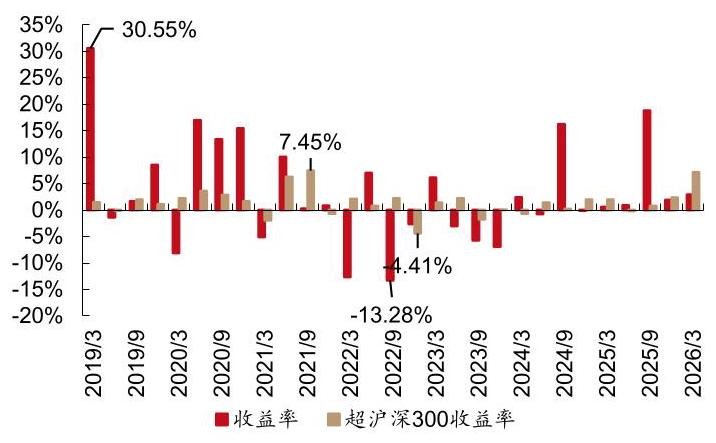

资料来源:Wind，聚源，西部证券研发中心

图 20: 3%行业偏离约束的扩散指标+RRG ETF 轮动 “增强” 策略季度内最大回撤(2018.12.28-2026.03.31)

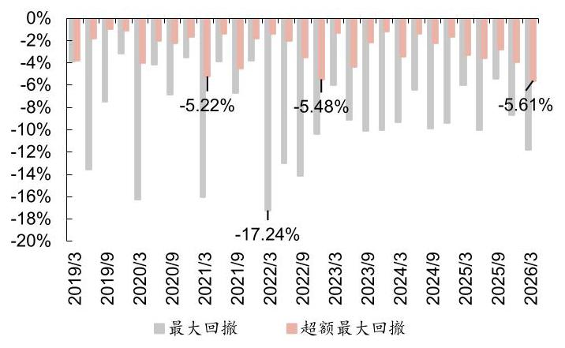

资料来源:Wind，聚源，西部证券研发中心

图 21: 5%行业偏离约束的扩散指标+RRG ETF 轮动 “增强” 策略季度收益率 (2018.12.28-2026.03.31)

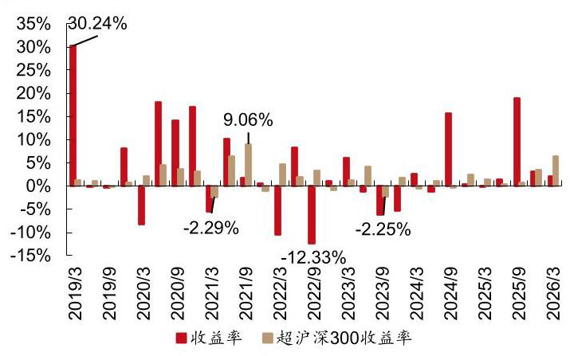

资料来源:Wind，聚源，西部证券研发中心

图 22: 5%行业偏离约束的扩散指标+RRG ETF 轮动 “增强” 策略季度内最大回撤(2018.12.28-2026.03.31)

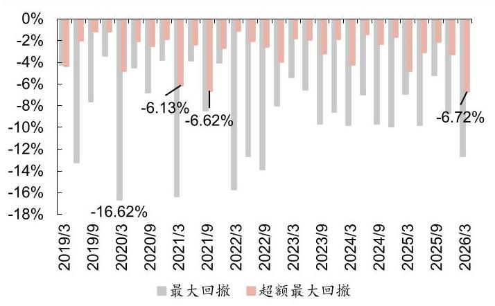

资料来源:Wind，聚源，西部证券研发中心

表 24: 各 ETF 轮动策略的胜率和回撤统计 (2018.12.28-2026.03.31)

<table><tr><td></td><td></td><td>月度胜率</td><td>月度最大跌幅</td><td>月度最大回撤</td><td>季度胜率</td><td>季度最大跌幅</td><td>季度最大回撤</td><td>年度胜率</td><td>年度最大跌幅</td><td>区间最大回撤</td></tr><tr><td rowspan="5">绝对收益</td><td>ETF 轮动</td><td>57.47%</td><td>-10.84%</td><td>-17.12%</td><td>65.52%</td><td>-9.73%</td><td>-21.66%</td><td>75.00%</td><td>-10.13%</td><td>-34.98%</td></tr><tr><td>约束单个 ETF 权重</td><td>58.62%</td><td>-8.91%</td><td>-14.04%</td><td>58.62%</td><td>-8.40%</td><td>-18.56%</td><td>75.00%</td><td>-5.47%</td><td>-29.09%</td></tr><tr><td>无单一行业权重约束</td><td>57.47%</td><td>-16.70%</td><td>-20.23%</td><td>68.97%</td><td>-15.07%</td><td>-30.42%</td><td>100.00%</td><td>2.12%</td><td>-33.33%</td></tr><tr><td>行业偏离不超过 3%</td><td>55.17%</td><td>-9.30%</td><td>-15.74%</td><td>62.07%</td><td>-13.28%</td><td>-17.24%</td><td>75.00%</td><td>-21.07%</td><td>-38.34%</td></tr><tr><td>行业偏离不超过 5%</td><td>51.72%</td><td>-9.84%</td><td>-15.51%</td><td>62.07%</td><td>-12.33%</td><td>-16.62%</td><td>75.00%</td><td>-14.16%</td><td>-32.62%</td></tr><tr><td rowspan="2">相对中信   一级等权</td><td>ETF 轮动</td><td>57.47%</td><td>-10.56%</td><td>-12.01%</td><td>62.07%</td><td>-11.43%</td><td>-14.81%</td><td>75.00%</td><td>-4.50%</td><td>-23.59%</td></tr><tr><td>约束单个 ETF 权重</td><td>57.47%</td><td>-15.76%</td><td>-17.64%</td><td>51.72%</td><td>-15.33%</td><td>-18.69%</td><td>87.50%</td><td>-10.32%</td><td>-25.94%</td></tr></table>

25 | 请务必仔细阅读报告尾部的投资评级说明和声明

金工量化专题报告

表 24: 各 ETF 轮动策略的胜率和回撤统计 (2018.12.28-2026.03.31)

<table><tr><td></td><td></td><td>月度胜率</td><td>月度最大跌幅</td><td>月度最大回撤</td><td>季度胜率</td><td>季度最大跌幅</td><td>季度最大回撤</td><td>年度胜率</td><td>年度最大跌幅</td><td>区间最大回撤</td></tr><tr><td rowspan="3"></td><td>无单一行业权重约束</td><td>54.02%</td><td>-14.81%</td><td>-18.00%</td><td>62.07%</td><td>-18.54%</td><td>-25.77%</td><td>100.00%</td><td>4.73%</td><td>-29.17%</td></tr><tr><td>行业偏离不超过 3%</td><td>50.57%</td><td>-5.90%</td><td>-7.25%</td><td>51.72%</td><td>-5.90%</td><td>-10.62%</td><td>50.00%</td><td>-8.63%</td><td>-23.86%</td></tr><tr><td>行业偏离不超过 5%</td><td>56.32%</td><td>-3.77%</td><td>-7.53%</td><td>55.17%</td><td>-4.52%</td><td>-10.99%</td><td>62.50%</td><td>-4.40%</td><td>-13.92%</td></tr><tr><td rowspan="5">相对沪深 300</td><td>ETF 轮动</td><td>65.52%</td><td>-9.80%</td><td>-12.26%</td><td>68.97%</td><td>-11.23%</td><td>-12.92%</td><td>87.50%</td><td>-8.19%</td><td>-19.74%</td></tr><tr><td>约束单个 ETF 权重</td><td>64.37%</td><td>-15.04%</td><td>-17.19%</td><td>62.07%</td><td>-15.10%</td><td>-17.19%</td><td>75.00%</td><td>-13.66%</td><td>-22.67%</td></tr><tr><td>无单一行业权重约束</td><td>63.22%</td><td>-16.72%</td><td>-17.71%</td><td>62.07%</td><td>-16.45%</td><td>-25.17%</td><td>87.50%</td><td>-0.38%</td><td>-32.86%</td></tr><tr><td>行业偏离不超过 3%</td><td>57.47%</td><td>-3.97%</td><td>-5.61%</td><td>75.86%</td><td>-4.41%</td><td>-5.61%</td><td>100.00%</td><td>0.57%</td><td>-8.76%</td></tr><tr><td>行业偏离不超过 5%</td><td>62.07%</td><td>-4.55%</td><td>-6.72%</td><td>75.86%</td><td>-2.29%</td><td>-6.72%</td><td>100.00%</td><td>2.74%</td><td>-7.94%</td></tr></table>

资料来源:Wind，聚源，西部证券研发中心

## 四、总结

本文详细介绍了 $\mathrm{A}$ 股行业指数的相对旋转图 RRG，据此结合扩散指标构建行业轮动策略, 并映射到 ETF 上得到行业/主题 ETF 的轮动组合。

参考 Julius de Kempenaer 思路, 构建相对旋转图 RRG, 并根据中信一级行业指数在 RRG 中所处位置设计策略, 以验证 RRG 的预测作用。每月末, 等权配置第一象限中离原点最远的 6 个行业, 2018.12.28-2026.03.31，年化收益率为 18.34%，明显优于等权配置其他象限的行业。每月末，等权配置 1+2 象限中离原点最远的 6 个行业，年化收益率为 18.74%，优于等权配置第一象限(18.34%)或第二象限的行业(5.81%)。

扩散指标行业轮动策略回看周期相对较长 (220 天)，捕捉的是以年为观察窗口的长期趋势，忽略了近期的边际变化。导致在震荡市或行业轮动速度较快的时期，策略的反应较为滞后，超额收益表现不佳。因此，我们在扩散指标的基础上叠加 RRG，要求行业短期内依旧保持向上的动能。每月末，选择扩散指标最高的 6 个行业后，进一步剔除在 RRG 中处于三、四象限的行业。2018.12.28-2026.03.31，扩散指标+RRG 行业轮动策略年化收益率为 20.60%，相对中信一级行业等权和沪深 300 的超额年化收益率分别为 9.49% 和 13.91%，且优于单独使用扩散指标。

根据 ETF 的行业暴露给每一个行业主题 ETF 打分, 并使用组合优化方式进行 ETF 轮动。2018.12.28-2026.03.31, ETF 轮动策略年化收益率为 21.51%，最大回撤为 34.98%， 相对中信一级行业等权和沪深 300 的年化超额收益率分别为 10.34%和 14.86%。截至 2026.03.31，策略 YTD 收益率为 10.41%，相对中信一级行业等权和沪深 300 指数的累计超额收益分别为 10.95% 和 14.30%。

约束单个 ETF 权重不超过 20%，ETF 权重之和不超过最终选出的行业数量 k*20%， 即, 允许不满仓。轮动策略年化波动率和最大回撤分别为 19.89% 和 29.09%, 均显著小于满仓的结果，展现出一定的防御能力。但也付出了向上弹性的代价，年化收益率下降 3 个百分点至 18.51%。

若进一步释放策略弹性, 不约束单一行业权重, 2018.12.28-2026.03.31，策略年化收益率为 31.53%，年化波动率为 32.81%，最大回撤为 33.33%，每一个自然年均能取得正收益。与原始轮动策略相比，波动虽显著放大，但得益于较高的弹性，最大回撤有所降低，收益率则大幅提升，夏普比率和 Calmar 比率接近于 1。

金工量化专题报告

约束 ETF 组合相对沪深 300 的行业偏离在某一阈值范围内，构建沪深 300 “增强” ETF 组合。在 3%和 5% 的行业偏离约束下，2018.12.28-2026.03.31，策略年化超额收益率分别为 6.24% 和 8.42%，跟踪误差分别为 6.06% 和 7.22%，每年都能取得正超额收益。 其中，5%行业偏离约束策略超额较为稳定，季度负超额的最大值低于 2.3%，均值为 1.99%， 季度胜率 75.86%。

## 五、风险提示

1. 数据来源第三方，或有遗漏、滞后、误差；

2. 本报告使用历史数据测算完成，存在模型失效风险。

## 西部证券一投资评级说明

<table><tr><td rowspan="3">行业评级</td><td>超配: 行业预期未来 6-12 个月内的涨幅超过市场基准指数 10%以上</td></tr><tr><td>中配: 行业预期未来 6-12 个月内的波动幅度介于市场基准指数-10%到 10%之间</td></tr><tr><td>低配: 行业预期未来 6-12 个月内的跌幅超过市场基准指数 10% 以上</td></tr><tr><td rowspan="4">公司评级</td><td>买入: 公司未来 6-12 个月的投资收益率领先市场基准指数 20% 以上</td></tr><tr><td>增持: 公司未来 6-12 个月的投资收益率领先市场基准指数 5%到 20%之间</td></tr><tr><td>中性: 公司未来 6-12 个月的投资收益率与市场基准指数变动幅度相差-5%到 5%</td></tr><tr><td>卖出: 公司未来 6-12 个月的投资收益率落后市场基准指数大于 5%</td></tr></table>

报告中所涉及的投资评级采用相对评级体系，基于报告发布日后 6-12 个月内公司股价(或行业指数)相对同期当地市场基准指数的市场表现预期。其中, A 股市场以沪深 300 指数为基准; 香港市场以恒生指数为基准; 美国市场以标普 500 指数为基准。

## 分析师声明

本人具有中国证券业协会授予的证券投资咨询执业资格并注册为证券分析师，以勤勉的职业态度、专业审慎的研究方法，使用合法合规的信息，独立、客观地出具本报告。本报告清晰准确地反映了本人的研究观点。本人不曾因，不因，也将不会因本报告中的具体推荐意见或观点而直接或间接收到任何形式的补偿。

## 联系地址

联系地址:上海市浦东新区耀体路 276 号 12 层

北京市西城区丰盛胡同 28 号太平洋保险大厦 513 室

深圳市福田区深南大道 6008 号深圳特区报业大厦 10C

联系电话:021-38584209

## 免责声明

本报告由西部证券股份有限公司(已具备中国证监会批复的证券投资咨询业务资格)制作。本报告仅供西部证券股份有限公司(以下简称“本公司”) 机构客户使用。本报告在未经本公司公开披露或者同意披露前，系本公司机密材料，如非收件人(或收到的电子邮件含错误信息)，请立即通知发件人， 及时删除该邮件及所附报告并予以保密。发送本报告的电子邮件可能含有保密信息、版权专有信息或私人信息，未经授权者请勿针对邮件内容进行任何更改或以任何方式传播、复制、转发或以其他任何形式使用，发件人保留与该邮件相关的一切权利。同时本公司无法保证互联网传送本报告的及时、安全、无遗漏、无错误或无病毒，敬请谅解。

本报告基于已公开的信息编制，但本公司对该等信息的真实性、准确性及完整性不作任何保证。本报告所载的意见、评估及预测仅为本报告出具日的观点和判断，该等意见、评估及预测在出具日外无需通知即可随时更改。在不同时期，本公司可能会发出与本报告所载意见、评估及预测不一致的研究报告。同时，本报告所指的证券或投资标的的价格、价值及投资收入可能会波动。本公司不保证本报告所含信息保持在最新状态。对于本公司其他专业人士(包括但不限于销售人员、交易人员)根据不同假设、研究方法、即时动态信息及市场表现，发表的与本报告不一致的分析评论或交易观点，本公司没有义务向本报告所有接收者进行更新。本公司对本报告所含信息可在不发出通知的情形下做出修改，投资者应当自行关注相应的更新或修改。

本公司力求报告内容客观、公正，但本报告所载的观点、结论和建议仅供投资者参考之用，并非作为购买或出售证券或其他投资标的的邀请或保证。客户不应以本报告取代其独立判断或根据本报告做出决策。该等观点、建议并未考虑到获取本报告人员的具体投资目的、财务状况以及特定需求，在任何时候均不构成对客户私人投资建议。投资者应当充分考虑自身特定状况，并完整理解和使用本报告内容，不应视本报告为做出投资决策的唯一因素，必要时应就法律、商业、财务、税收等方面咨询专业财务顾问的意见。本公司以往相关研究报告预测与分析的准确，不预示与担保本报告及本公司今后相关研究报告的表现。对依据或者使用本报告及本公司其他相关研究报告所造成的一切后果，本公司及作者不承担任何法律责任。

在法律许可的情况下，本公司可能与本报告中提及公司正在建立或争取建立业务关系或服务关系。因此，投资者应当考虑到本公司及/或其相关人员可能存在影响本报告观点客观性的潜在利益冲突。对于本报告可能附带的其它网站地址或超级链接，本公司不对其内容负责，链接内容不构成本报告的任何部分, 仅为方便客户查阅所用, 浏览这些网站可能产生的费用和风险由使用者自行承担。

本公司关于本报告的提示(包括但不限于本公司工作人员通过电话、短信、邮件、微信、微博、博客、QQ、视频网站、百度官方贴吧、论坛、BBS) 仅为研究观点的简要沟通，投资者对本报告的参考使用须以本报告的完整版本为准。

本报告版权仅为本公司所有。未经本公司书面许可，任何机构或个人不得以翻版、复制、发表、引用或再次分发他人等任何形式侵犯本公司版权。如征得本公司同意进行引用、刊发的，需在允许的范围内使用，并注明出处为“西部证券研究发展中心”，且不得对本报告进行任何有悖原意的引用、删节和修改。如未经西部证券授权，私自转载或者转发本报告，所引起的一切后果及法律责任由私自转载或转发者承担。本公司保留追究相关责任的权力。 所有本报告中使用的商标、服务标记及标记均为本公司的商标、服务标记及标记。

本公司具有中国证监会核准的“证券投资咨询”业务资格，经营许可证编号为:91610000719782242D。